# AT89C51 + ESP32-S3 单片机与嵌入式系统及开发（MESP）

> 适用资料：第 1、2、3、5、6、7、8、11 章 PPT，两张课堂/考试安排截图，`ESP32-S3技术与应用.pptx`，以及 `单片机与嵌入式系统.pptx`。  
> 核心目标：能做选择、判断、填空，能把简答题写完整，能把综合题里的 C51 程序补出来；同时能说清现代嵌入式、ESP32-S3、FreeRTOS、边缘 AI 与 MCP 的核心概念。

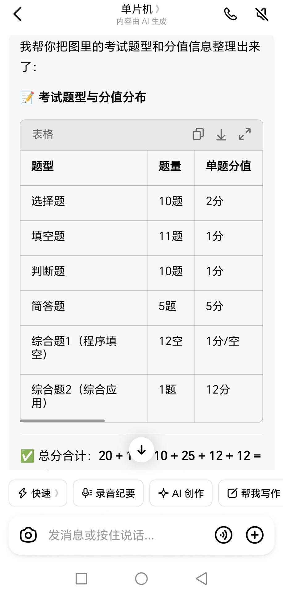


## 0. 考试怎么拿分

### 0.1 题型与分值

| 题型 | 数量 | 单题分值 | 总分 | 复习策略 |
|---|---:|---:|---:|---|
| 选择题 | 10 题 | 2 分 | 20 分 | 背概念、寄存器位、端口特点、公式 |
| 填空题 | 11 题 | 1 分 | 11 分 | 背寄存器名、位名、初值、引脚号、函数格式 |
| 判断题 | 10 题 | 1 分 | 10 分 | 抓“绝对化说法”和易混概念 |
| 简答题 | 5 题 | 5 分 | 25 分 | 用“是什么-为什么-怎么用-注意点”答 |
| 综合题 1：程序填空 | 12 空 | 1 分/空 | 12 分 | 背 C51 模板，尤其定时器、中断、串口、键盘显示 |
| 综合题 2：综合应用 | 1 题 | 12 分 | 12 分 | 画流程、写初始化、写主循环/中断/接口读写 |
| 合计 |  |  | 90 分 | 期末卷按 90 分计 |

### 0.2 最优先背什么

| 优先级 | 内容 | 为什么 |
|---|---|---|
| S 级 | P0-P3 端口特点、EA 引脚、存储器结构、SFR、机器周期 | 选择/填空/判断都爱考 |
| S 级 | C51 的 `sfr`、`sbit`、`data/idata/xdata/code`、中断函数格式 | 程序填空高频 |
| S 级 | IE/IP/TCON/TMOD/SCON/PCON 各位含义 | 填空、判断、程序初始化都要用 |
| S 级 | 定时器初值公式、12MHz 下 1 机器周期 = 1us | 计算题和综合题核心 |
| A 级 | LED、数码管动态显示、键盘扫描、LCD1602 初始化 | 综合应用常见 |
| A 级 | UART 方式 1、波特率、SBUF/TI/RI | 程序填空和简答常见 |
| A 级 | ADC/DAC 分辨率、ADC0809、DAC0832 控制流程 | 第 11 章重点 |
| A 级 | 嵌入式系统组成、MCU/MPU、BSP/驱动/RTOS/应用层 | 第二份 PPT 的总览类简答题 |
| A 级 | ESP32-S3 的双核 LX7、Wi-Fi/BLE、GPIO、ADC、USB OTG、I2S/I2C/SPI/UART | ESP32-S3 PPT 的核心硬件题 |
| B 级 | FreeRTOS 任务、队列、信号量、互斥锁、软件定时器 | 现代嵌入式系统进阶题 |
| B 级 | 边缘计算、TinyML、小智 AI、MCP 协议 | 前沿应用题，适合简答题扩展 |

> 易错提醒：PPT 或课堂截图里个别数字可能有口误。以 51 标准结论为准：若晶振 12MHz，1 个机器周期为 1us，16 位定时器最大计数 65536us = 65.536ms，不是 5.536ms。

> ESP32-S3 纠错提醒：ESP32-S3 官方规格是 2.4GHz 802.11 b/g/n Wi-Fi，也就是 Wi-Fi 4，不是 Wi-Fi 6；蓝牙是 Bluetooth 5 LE。ESP32-S3 有 2 个 12 位 SAR ADC、触摸传感、USB OTG、I2S/I2C/SPI/UART 等外设，但不要把普通片内 DAC 当成必备资源，模拟输出常用 PWM/外接 DAC/I2S 音频器件实现。

## 1. 第 1 章：单片机概述

### 1.1 单片机到底是什么

人话版：单片机就是一块芯片里的“小电脑”。它把 CPU、存储器、I/O 口、定时器、串口、中断系统等放在一块硅片上，用来控制外部设备。

标准答法：

> 单片机是把中央处理器 CPU、存储器 RAM/ROM、I/O 接口、定时器/计数器、中断系统、串行接口、时钟电路等集成在一块芯片上的微型计算机，也称微控制器 MCU。

为什么它适合控制？因为它便宜、小、抗干扰、功耗低，能嵌进洗衣机、仪表、车载电子、工业控制板里，实时读传感器、控制电机/LED/继电器。

### 1.2 8051、MCS-51、AT89S51 的关系

| 名称 | 人话解释 |
|---|---|
| MCS-51 | Intel 早期推出的一套 51 系列单片机架构 |
| 8051 | MCS-51 的典型基本型号，也常泛指 51 内核单片机 |
| AT89S51 | ATMEL 公司做的 8051 兼容单片机，片内带 Flash，可在线编程 |
| AT89S52 | AT89S51 的增强版，资源更多，通常多一个 T2 |

考试里如果问“本课程主要学什么型号”，答 AT89S51，属于 8051 内核的 8 位单片机。

### 1.3 单片机应用领域

简答题可以这样写：

> 单片机常用于工业检测与控制、智能仪表、消费电子、通信设备、汽车电子、计算机外设、分布式测控系统等。原因是单片机体积小、价格低、控制能力强、易嵌入设备，并且可通过软件实现复杂控制逻辑。

## 2. 第 2 章：AT89S51 硬件结构

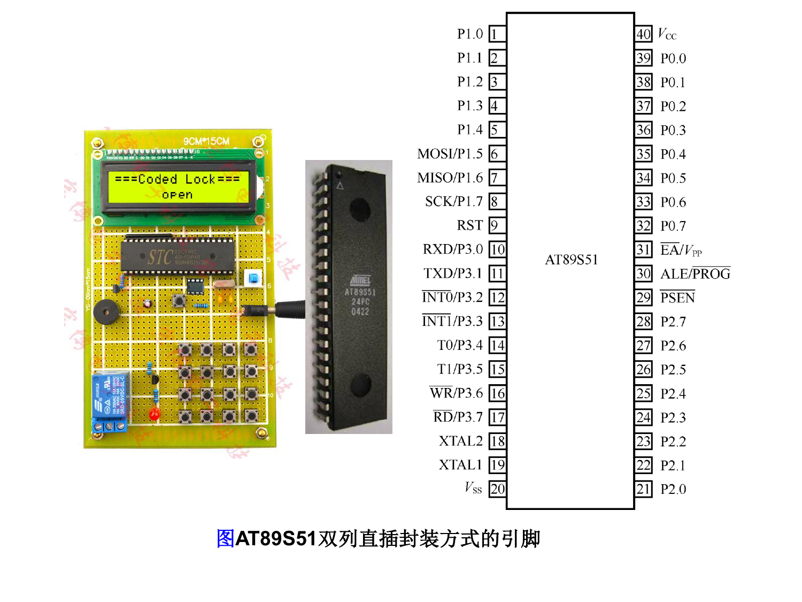

### 2.1 片内结构一眼看懂

AT89S51 片内主要有：

| 模块 | 作用 |
|---|---|
| CPU | 取指令、译码、执行运算和控制 |
| 4KB Flash 程序存储器 | 存程序代码 |
| 128B 片内 RAM | 存变量、堆栈、工作寄存器 |
| P0-P3 四个 8 位 I/O 口 | 和外部电路交换数据 |
| 2 个 16 位定时器/计数器 T0、T1 | 定时、计数、产生波特率 |
| 5 个中断源 | 外部中断、定时器中断、串口中断 |
| 1 个全双工串行口 | 串行通信 |
| SFR 特殊功能寄存器 | 控制定时器、中断、串口、I/O 等硬件 |

### 2.2 引脚必背

| 引脚/端口 | 功能 | 必背点 |
|---|---|---|
| VCC、VSS | 电源、地 | 一般 +5V |
| XTAL1、XTAL2 | 外接晶振 | 决定时钟频率 |
| RST | 复位输入 | 高电平保持一定时间复位 |
| EA/VPP | 片内/片外程序选择 | EA=1 优先片内，EA=0 全部片外 |
| ALE/PROG | 地址锁存允许 | 扩展外部存储器时锁存 P0 低 8 位地址 |
| PSEN | 外部程序存储器读选通 | 读片外程序存储器 |
| P3.0/RXD | 串口接收 | 串行口 |
| P3.1/TXD | 串口发送 | 串行口 |
| P3.2/INT0 | 外部中断 0 | interrupt 0 |
| P3.3/INT1 | 外部中断 1 | interrupt 2 |
| P3.4/T0 | 定时/计数器 0 外部计数输入 | 计数模式 |
| P3.5/T1 | 定时/计数器 1 外部计数输入 | 计数模式 |
| P3.6/WR | 外部数据存储器写 | 扩展 RAM |
| P3.7/RD | 外部数据存储器读 | 扩展 RAM |

> 易错：第 31 脚 EA 不是中断允许总开关。EA 引脚控制程序存储器选择；IE 寄存器里的 EA 位才是中断总允许位。

### 2.3 P0-P3 四个 I/O 口

| 端口 | 普通 I/O 特点 | 第二功能/特殊点 |
|---|---|---|
| P0 | 无内部上拉，作普通 I/O 输出高电平时需外接上拉电阻 | 扩展存储器时复用为低 8 位地址/数据总线 AD0-AD7 |
| P1 | 准双向口，有内部上拉 | P1.5/P1.6/P1.7 可作 ISP 相关功能 |
| P2 | 准双向口，有内部上拉 | 扩展存储器时输出高 8 位地址 A8-A15 |
| P3 | 准双向口，有内部上拉 | 每一位都有第二功能：串口、中断、计数、RD/WR |

输入端口口诀：

> 51 的准双向 I/O 作输入前，通常要先向端口锁存器写 1，相当于“释放端口”，再读取外部电平。

示例：

```c
#include <reg51.h>

void main(void)
{
    unsigned char key;
    P1 = 0xff;     // 先写 1，让 P1 作为输入
    key = P1;      // 再读外部按键状态
    while (1);
}
```

### 2.4 存储器结构：哈佛结构

51 单片机把程序存储器和数据存储器分开，这叫哈佛结构。

| 空间 | 地址范围 | 用来放什么 | C51 关键词/指令特点 |
|---|---|---|---|
| 程序存储器 | 最大 64KB | 程序代码、常量表 | `code`，用 `MOVC` 读 |
| 片内数据 RAM | 00H-7FH | 工作寄存器、位寻址区、普通 RAM | `data/idata/bdata` |
| SFR 区 | 80H-FFH | P0、TMOD、SCON、IE 等寄存器 | `sfr/sbit` |
| 片外数据 RAM | 最大 64KB | 扩展 RAM、外设地址映射 | `xdata/pdata`，用 `MOVX` |

> 易错：程序存储器和数据存储器可以有相同地址编号，但不是同一个东西。CPU 靠不同指令和控制信号区分它们。

### 2.5 SFR 特殊功能寄存器

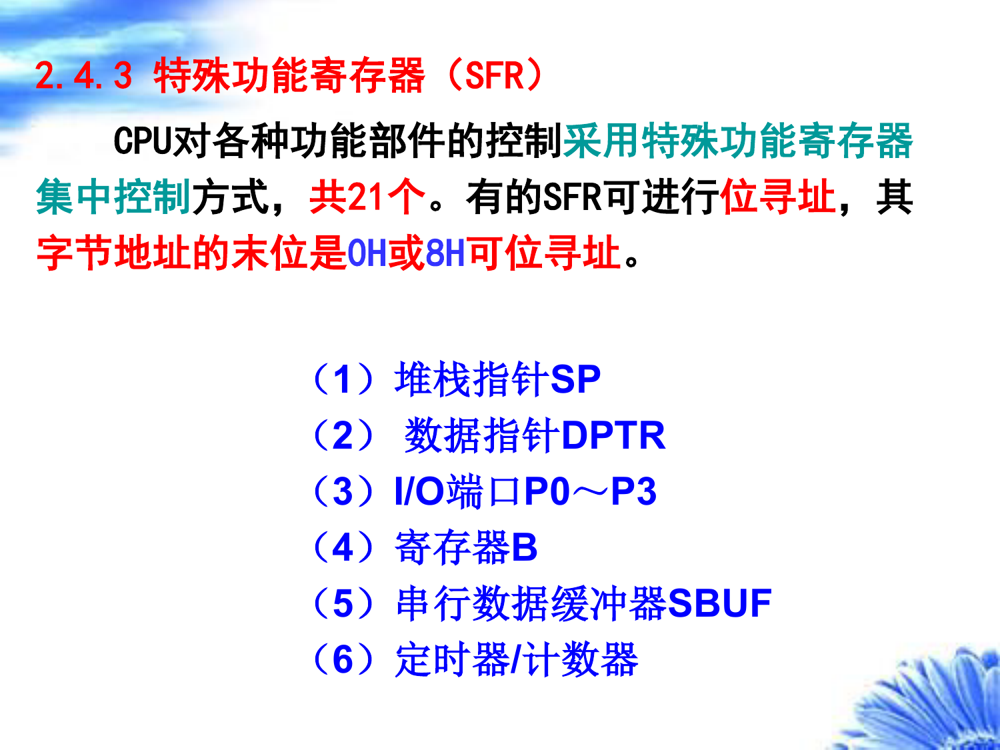

SFR 就是“硬件控制面板”。例如：

| SFR | 地址 | 作用 |
|---|---:|---|
| P0 | 80H | P0 口 |
| SP | 81H | 堆栈指针 |
| DPL/DPH | 82H/83H | 数据指针低/高字节 |
| TCON | 88H | 定时器/外中断控制 |
| TMOD | 89H | 定时器工作方式 |
| TL0/TH0 | 8AH/8CH | T0 低/高字节 |
| TL1/TH1 | 8BH/8DH | T1 低/高字节 |
| P1 | 90H | P1 口 |
| SCON | 98H | 串口控制 |
| SBUF | 99H | 串口缓冲寄存器 |
| P2 | A0H | P2 口 |
| IE | A8H | 中断允许 |
| P3 | B0H | P3 口 |
| IP | B8H | 中断优先级 |
| PSW | D0H | 程序状态字 |
| ACC | E0H | 累加器 |
| B | F0H | B 寄存器 |

C51 访问方式：

```c
sfr P1 = 0x90;
sfr TMOD = 0x89;
sbit P1_0 = P1^0;
```

### 2.6 时钟周期、机器周期、指令周期

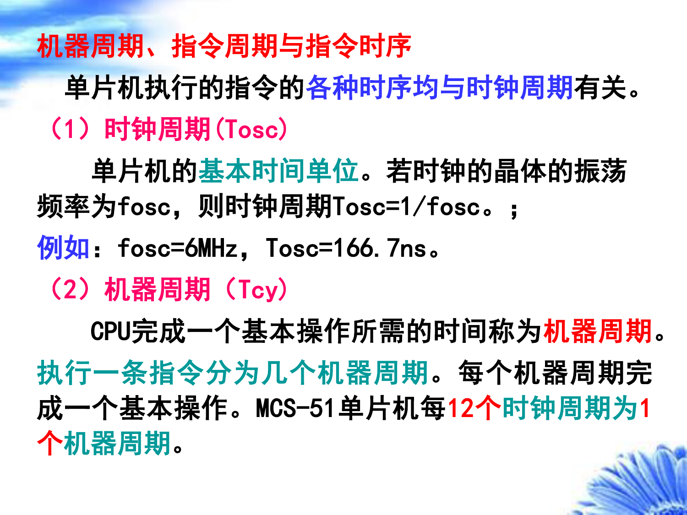

| 名称 | 人话解释 | 公式 |
|---|---|---|
| 时钟周期 | 晶振振一下的时间 | `Tosc = 1 / fosc` |
| 机器周期 | CPU 完成一个基本操作的时间 | 传统 8051：`Tcy = 12 / fosc` |
| 指令周期 | 执行一条指令的时间 | 1 个或多个机器周期 |

常考换算：

| 晶振频率 | 1 个机器周期 |
|---:|---:|
| 12MHz | 1us |
| 11.0592MHz | 约 1.085us |
| 6MHz | 2us |

### 2.7 复位

复位后常见状态：

| 项目 | 复位值 |
|---|---|
| PC | 0000H |
| SP | 07H |
| P0-P3 | FFH |
| IE | 00H，所有中断关 |
| IP | 00H，默认低优先级 |
| TMOD/TCON | 多数清 0 |

简答模板：

> 复位的作用是让单片机从确定状态重新开始运行。复位后 PC=0000H，CPU 从程序存储器 0000H 处取第一条指令执行；同时 SP、I/O 口、控制寄存器等恢复默认状态，保证程序能从固定入口启动。

## 3. 第 3 章：C51 编程基础

### 3.1 C51 和标准 C 最大区别

C51 是为 8051 单片机改造过的 C 语言。它比标准 C 多了硬件相关关键词：

| 关键词 | 作用 | 示例 |
|---|---|---|
| `sfr` | 定义 8 位特殊功能寄存器 | `sfr P1 = 0x90;` |
| `sfr16` | 定义 16 位 SFR | `sfr16 DPTR = 0x82;` |
| `sbit` | 定义可位寻址 SFR 的某一位 | `sbit LED = P1^0;` |
| `bit` | 定义普通位变量 | `bit flag;` |
| `data` | 片内低 128B RAM | `uchar data x;` |
| `idata` | 片内间接寻址 RAM | `uchar idata buf[16];` |
| `bdata` | 可位寻址 RAM 区 | `uchar bdata status;` |
| `xdata` | 片外 64KB 数据空间 | `uchar xdata arr[100];` |
| `pdata` | 片外一页 256B 空间 | `uchar pdata pagebuf[20];` |
| `code` | 程序存储器常量区 | `uchar code table[] = {...};` |

> 易错：`bit` 是普通位变量；`sbit` 是把 SFR 或可位寻址空间中的某一位起名字。

### 3.2 最常用类型重命名

```c
typedef unsigned char uchar;
typedef unsigned int uint;
```

PPT 和很多 C51 例程都喜欢这么写。考试程序填空里看到 `uchar`，它就是 `unsigned char`。

### 3.3 头文件

```c
#include <reg51.h>  // 8051/AT89S51 常用
#include <reg52.h>  // 8052/AT89S52 常用，多了 T2 等定义
```

`reg51.h` 里已经定义了常见 SFR 和位名，如 `P0`、`P1`、`TMOD`、`TH0`、`EA`、`ET0`、`TR0`、`RI`、`TI`。

### 3.4 中断函数格式

```c
void 函数名(void) interrupt 中断号 using 寄存器组
{
    // 中断服务程序
}
```

示例：

```c
void timer0_isr(void) interrupt 1 using 1
{
    // T0 中断
}
```

必背规则：

| 规则 | 原因 |
|---|---|
| 中断函数一般写 `void` | 中断不是普通函数调用 |
| 中断函数不能带参数 | 由硬件自动调用，没人给它传参 |
| 中断函数不能直接调用 | 返回靠 `RETI`，会影响中断系统状态 |
| 串口中断里 TI/RI 要软件清 0 | 硬件不会自动清 |

### 3.5 Keil 基本操作

1. 新建工程：`Project -> New uVision Project`。
2. 选择芯片：选择 `Atmel -> AT89S51` 或兼容 8051 芯片。
3. 新建 C 文件，例如 `main.c`，加入工程。
4. 写代码，包含 `#include <reg51.h>`。
5. 设置晶振频率：`Options for Target -> Target -> Xtal`，常用 `12.0000` 或 `11.0592`。
6. 生成 HEX：`Options for Target -> Output -> Create HEX File`。
7. 编译：`Build`，得到 `.hex`。
8. Proteus 中双击单片机，把 `.hex` 加到 `Program File`，设置 Clock Frequency，与 Keil 晶振一致。

> 程序填空常见入口：`TMOD`、`TH0/TL0`、`EA`、`ET0`、`TR0`、`SCON`、`SBUF`、`RI/TI`、`P1=0xff`。

## 4. 第 5 章：LED、数码管、键盘、LCD 接口

### 4.1 LED 发光二极管

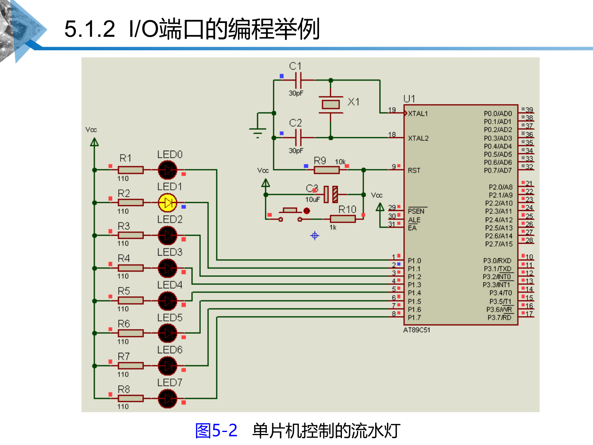

LED 要点：

| 点 | 解释 |
|---|---|
| 必须限流 | LED 不能直接接电源，否则电流过大烧坏 |
| 常见限流电阻 | +5V 系统中常用 1k-3k，实际看亮度和电流 |
| 低电平点亮 | 如果 LED 阳极接 +5V、阴极接单片机端口，则端口输出 0 点亮 |
| 高电平点亮 | 如果 LED 阴极接地、阳极接端口，则端口输出 1 点亮 |

流水灯模板：

```c
#include <reg51.h>
typedef unsigned char uchar;
typedef unsigned int uint;

void delay_ms(uint ms)
{
    uint i, j;
    for (i = 0; i < ms; i++)
        for (j = 0; j < 120; j++);
}

void main(void)
{
    uchar i;
    uchar code led_tab[] = {
        0xfe, 0xfd, 0xfb, 0xf7,
        0xef, 0xdf, 0xbf, 0x7f
    }; // 低电平点亮

    while (1) {
        for (i = 0; i < 8; i++) {
            P1 = led_tab[i];
            delay_ms(200);
        }
    }
}
```

### 4.1.1 老师重点题：P2 口按位控制 LED

题目：

如下图所示，若要求图中 8 个 LED 灯间隔点亮（D2、D4、D6、D8 亮，其它不亮），其二进制与十六进制代码应分别赋值多少？`P2 = 0x0F` 时，哪些灯亮，哪些灯不亮？此时若继续赋值（在 `P2 = 0x0F` 基础上），令 `P2 = P2 & 0x87`，此时 P2 值是多少，LED 灯的状态怎样？

拆成 4 个小问：

1. 若要求 8 个 LED 间隔点亮，即 D2、D4、D6、D8 亮，其它不亮，二进制与十六进制代码分别是多少？
2. 若 `P2 = 0x0F`，哪些 LED 亮，哪些 LED 不亮？
3. 在 `P2 = 0x0F` 的基础上继续执行 `P2 = P2 & 0x87`，此时 P2 的值是多少？
4. 执行 `P2 = P2 & 0x87` 后，LED 状态怎样？

单片机示意图：

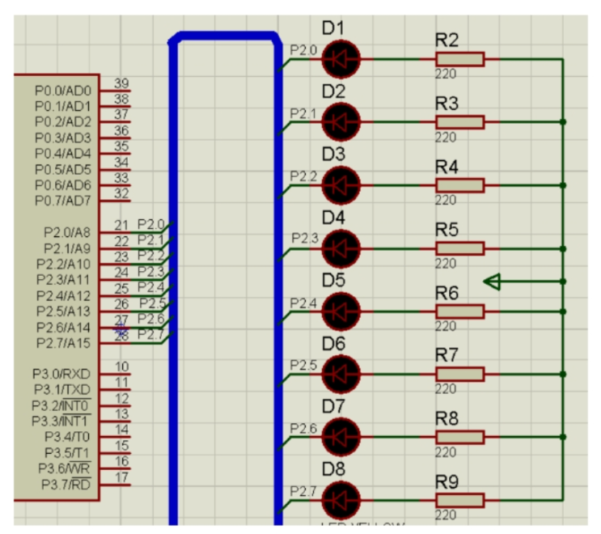

答案解析：

先看电路连接：D1-D8 分别接在 P2.0-P2.7 上。

| LED | 连接端口位 |
|---|---|
| D1 | P2.0 |
| D2 | P2.1 |
| D3 | P2.2 |
| D4 | P2.3 |
| D5 | P2.4 |
| D6 | P2.5 |
| D7 | P2.6 |
| D8 | P2.7 |

第 1 问：D2、D4、D6、D8 亮，其它不亮。按 D1 到 D8 的显示顺序写状态：

```text
D1 D2 D3 D4 D5 D6 D7 D8
 0  1  0  1  0  1  0  1
```

所以按题目显示顺序：

```text
二进制：01010101B
十六进制：0x55
```

如果程序里要真正赋给 P2 寄存器，要按 P2.7-P2.0 的标准位序写。此时 P2.1、P2.3、P2.5、P2.7 为 1：

```text
P2.7 P2.6 P2.5 P2.4 P2.3 P2.2 P2.1 P2.0
  1    0    1    0    1    0    1    0
```

所以程序赋值应写：

```c
P2 = 0xaa;
```

第 2 问：`P2 = 0x0F`。

```text
0x0F = 00001111B
```

按 P2.0-P2.7 对应 D1-D8：

| 位 | 值 | LED |
|---|---:|---|
| P2.0 | 1 | D1 亮 |
| P2.1 | 1 | D2 亮 |
| P2.2 | 1 | D3 亮 |
| P2.3 | 1 | D4 亮 |
| P2.4 | 0 | D5 不亮 |
| P2.5 | 0 | D6 不亮 |
| P2.6 | 0 | D7 不亮 |
| P2.7 | 0 | D8 不亮 |

答案：

```text
D1、D2、D3、D4 亮；
D5、D6、D7、D8 不亮。
```

第 3 问：`P2 = P2 & 0x87`，且原来 `P2 = 0x0F`。

```text
  0x0F = 00001111B
& 0x87 = 10000111B
------------------
  0x07 = 00000111B
```

所以：

```text
P2 = 0x07
```

第 4 问：`0x07 = 00000111B`，P2.0、P2.1、P2.2 为 1。

答案：

```text
D1、D2、D3 亮；
D4、D5、D6、D7、D8 不亮。
```

> 易错：`01010101B = 0x55` 是按 D1-D8 的显示顺序写出来的灯状态；C51 里写 `P2 = 数值` 时，寄存器显示通常按 P2.7-P2.0 读，所以真正让 D2、D4、D6、D8 亮应赋 `P2 = 0xaa`。考试遇到这类题，先确认老师问的是“显示顺序代码”还是“端口寄存器赋值”。

### 4.2 数码管：段码和位选

数码管分共阳极和共阴极：

| 类型 | 公共端 | 点亮条件 | 常见段码特点 |
|---|---|---|---|
| 共阴极 | 公共端接地 | 段线给 1 点亮 | 数字 0 常为 `0x3f` |
| 共阳极 | 公共端接 +5V | 段线给 0 点亮 | 数字 0 常为 `0xc0` |

共阳极段码表常见写法：

```c
uchar code seg_ca[] = {
    0xc0, 0xf9, 0xa4, 0xb0, 0x99,
    0x92, 0x82, 0xf8, 0x80, 0x90,
    0x88, 0x83, 0xc6, 0xa1, 0x86, 0x8e
};
```

### 4.3 静态显示 vs 动态显示

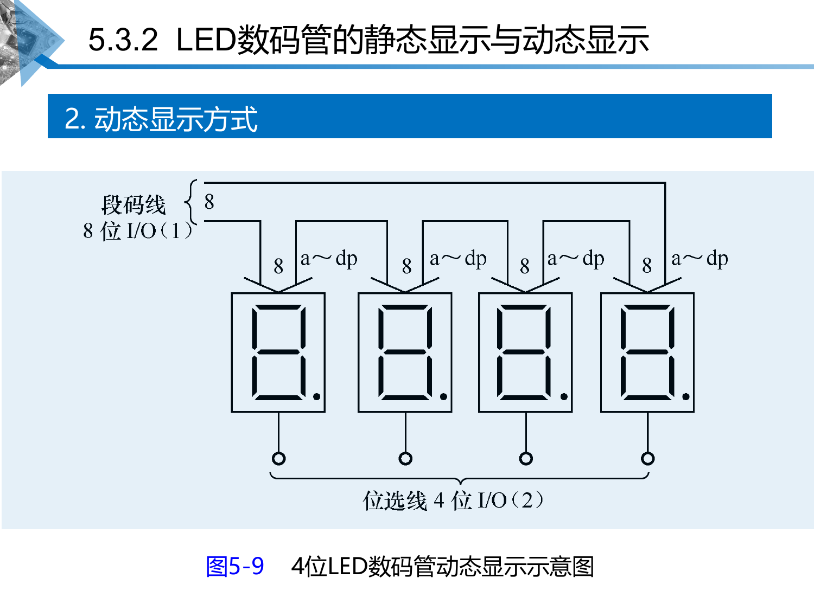

| 显示方式 | 人话解释 | 优点 | 缺点 |
|---|---|---|---|
| 静态显示 | 每位数码管都有自己的段码输出，持续点亮 | 亮、稳定、程序简单 | 占 I/O 多 |
| 动态显示 | 所有位共用段码线，轮流点亮每一位 | 省 I/O | 需要不断扫描，占 CPU 时间 |

动态显示原理：

> 某一瞬间只点亮一位数码管，但扫描足够快时，人眼视觉暂留会觉得多位同时亮。

4 位动态显示模板：

```c
#include <reg51.h>
typedef unsigned char uchar;
typedef unsigned int uint;

uchar code seg_ca[] = {0xc0,0xf9,0xa4,0xb0,0x99,0x92,0x82,0xf8,0x80,0x90};
uchar code pos_tab[] = {0x01, 0x02, 0x04, 0x08}; // 低位到高位，按电路改
uchar disp_buf[4] = {1, 2, 3, 4};

void delay_short(void)
{
    uchar i;
    for (i = 0; i < 100; i++);
}

void display_scan(void)
{
    uchar i;
    for (i = 0; i < 4; i++) {
        P2 = 0x00;                 // 先关位选，防止重影
        P0 = seg_ca[disp_buf[i]];  // 送段码
        P2 = pos_tab[i];           // 打开当前位
        delay_short();
    }
}

void main(void)
{
    while (1) {
        display_scan();
    }
}
```

### 4.4 点阵显示

点阵本质：很多 LED 按行列排成矩阵。显示一个字符，就是让特定行列的 LED 亮。

| 点阵 | 一个字符常用数据量 |
|---|---:|
| 8x8 点阵 | 8 字节 |
| 16x16 点阵 | 32 字节 |

扫描方法：

1. 选中第 1 行，输出这一行的列码。
2. 延时很短。
3. 选中第 2 行，输出第二行列码。
4. 依次扫完所有行。
5. 不断重复，人眼看到完整字符。

### 4.5 LCD1602

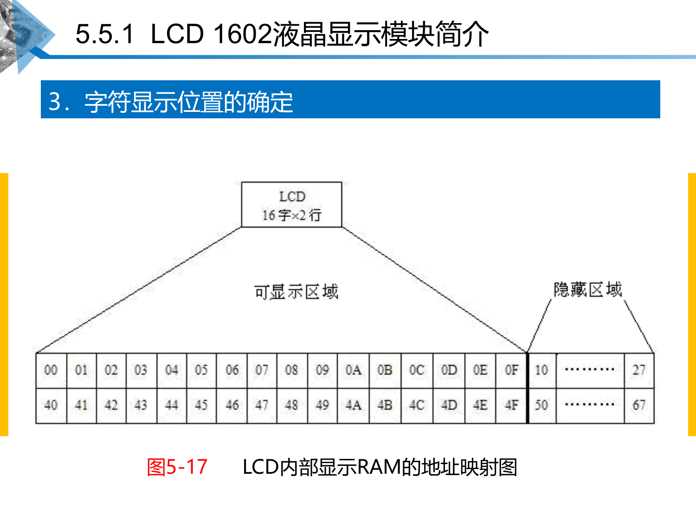

LCD1602 名字含义：一行 16 个字符，共 2 行。

常见引脚：

| 引脚 | 作用 |
|---|---|
| RS | 0 写命令，1 写数据 |
| RW | 0 写，1 读 |
| E | 使能信号，常用下降沿/脉冲锁存 |
| D0-D7 | 8 位数据线 |

常用命令：

| 命令 | 作用 |
|---:|---|
| `0x38` | 8 位数据，2 行显示，5x7 点阵 |
| `0x0c` | 显示开，光标关 |
| `0x06` | 写入后地址自动加 1 |
| `0x01` | 清屏 |
| `0x80 + addr` | 设置 DDRAM 地址 |

LCD1602 写命令/写数据模板：

```c
#include <reg51.h>
typedef unsigned char uchar;
typedef unsigned int uint;

sbit LCD_RS = P2^0;
sbit LCD_RW = P2^1;
sbit LCD_E  = P2^2;

void delay_ms(uint ms)
{
    uint i, j;
    for (i = 0; i < ms; i++)
        for (j = 0; j < 120; j++);
}

void lcd_write_cmd(uchar cmd)
{
    LCD_RS = 0;
    LCD_RW = 0;
    P0 = cmd;
    LCD_E = 1;
    delay_ms(1);
    LCD_E = 0;
}

void lcd_write_data(uchar dat)
{
    LCD_RS = 1;
    LCD_RW = 0;
    P0 = dat;
    LCD_E = 1;
    delay_ms(1);
    LCD_E = 0;
}

void lcd_init(void)
{
    lcd_write_cmd(0x38);
    lcd_write_cmd(0x0c);
    lcd_write_cmd(0x06);
    lcd_write_cmd(0x01);
    delay_ms(5);
}

void lcd_show_string(uchar addr, uchar *s)
{
    lcd_write_cmd(0x80 + addr);
    while (*s) {
        lcd_write_data(*s++);
    }
}
```

### 4.6 键盘：独立按键和矩阵键盘

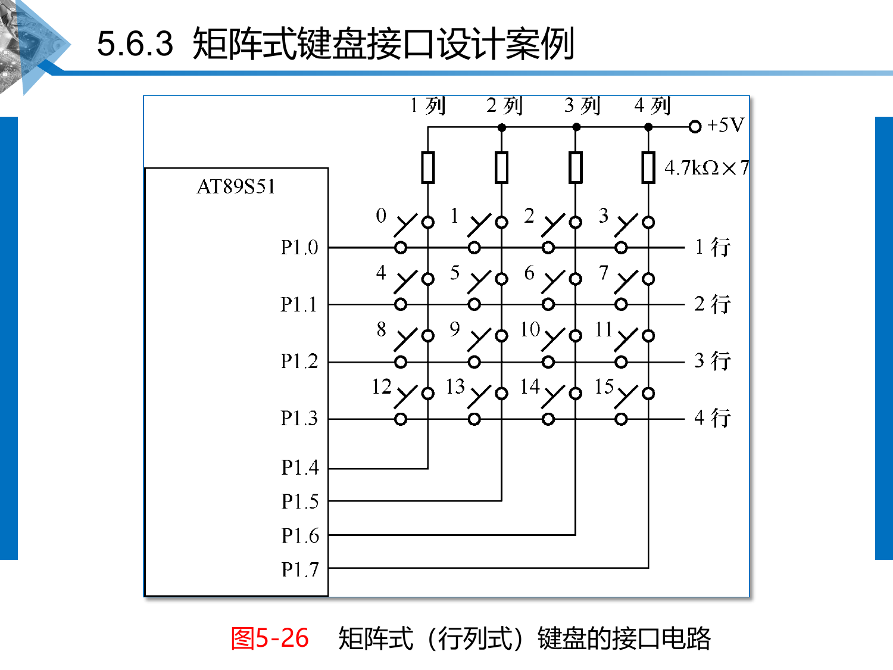

独立按键：

| 特点 | 说明 |
|---|---|
| 一个键占一根 I/O 线 | 电路简单 |
| 键少时适合 | 如 4 个功能键 |
| 常用低电平有效 | 按下读 0 |
| 需要消抖 | 机械触点会抖动 |

独立按键扫描模板：

```c
sbit KEY1 = P1^0;
sbit LED  = P2^0;

void delay_ms(unsigned int ms);

void key_scan(void)
{
    if (KEY1 == 0) {
        delay_ms(10);       // 消抖
        if (KEY1 == 0) {
            LED = ~LED;
            while (KEY1 == 0); // 等待松手
        }
    }
}
```

矩阵键盘人话版：

> 4x4 键盘不是 16 根线，而是 4 行 + 4 列 = 8 根线。扫描时让某一行输出 0，再读列线，哪一列变 0，就知道“第几行第几列”的键被按下。

4x4 矩阵键盘扫描模板：

```c
uchar key_scan_4x4(void)
{
    uchar row, col, temp;
    uchar code row_code[4] = {0xfe, 0xfd, 0xfb, 0xf7};

    P1 = 0xff;
    for (row = 0; row < 4; row++) {
        P1 = row_code[row];       // 逐行拉低
        temp = P1 & 0xf0;         // 假设高 4 位接列
        if (temp != 0xf0) {
            delay_ms(10);
            temp = P1 & 0xf0;
            if (temp != 0xf0) {
                switch (temp) {
                    case 0xe0: col = 0; break;
                    case 0xd0: col = 1; break;
                    case 0xb0: col = 2; break;
                    case 0x70: col = 3; break;
                    default: return 0xff;
                }
                while ((P1 & 0xf0) != 0xf0);
                return row * 4 + col;
            }
        }
    }
    return 0xff; // 无按键
}
```

## 5. 第 6 章：中断系统

### 5.1 中断是什么

人话版：

> 中断就是 CPU 正在干主程序，外设突然说“我有急事”，CPU 暂停主程序，保存断点，跳去处理中断服务程序，处理完再回到原来的地方继续执行。

简答模板：

> 中断技术用于实时监测和控制。当中断源提出请求且满足允许条件时，CPU 暂停当前程序，保护断点，转入对应中断服务程序；服务结束后执行 RETI 返回断点继续执行。中断可以减少查询等待，提高 CPU 利用率和实时响应能力。

### 5.2 AT89S51 的 5 个中断源

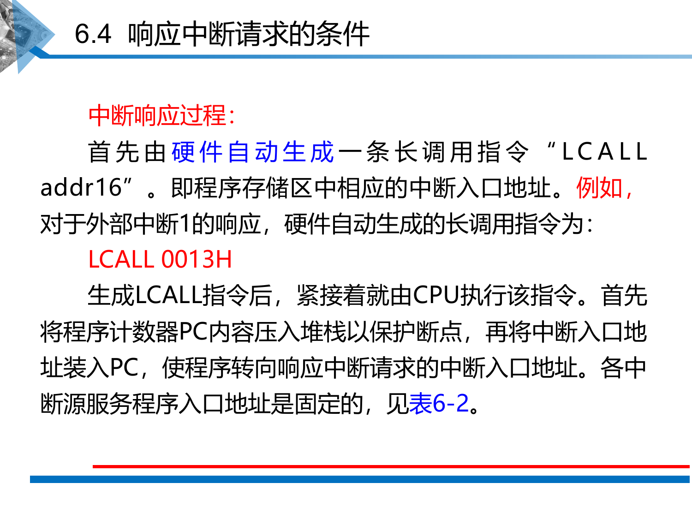

| 中断源 | 引脚/标志 | 中断号 | 入口地址 | 允许位 | 优先级位 |
|---|---|---:|---:|---|---|
| 外部中断 0 | INT0/P3.2，IE0 | 0 | 0003H | EX0 | PX0 |
| 定时器 0 | TF0 | 1 | 000BH | ET0 | PT0 |
| 外部中断 1 | INT1/P3.3，IE1 | 2 | 0013H | EX1 | PX1 |
| 定时器 1 | TF1 | 3 | 001BH | ET1 | PT1 |
| 串行口 | RI/TI | 4 | 0023H | ES | PS |

同级默认查询顺序：

> 外部中断 0 -> 定时器 0 -> 外部中断 1 -> 定时器 1 -> 串行口

### 5.3 IE 中断允许寄存器

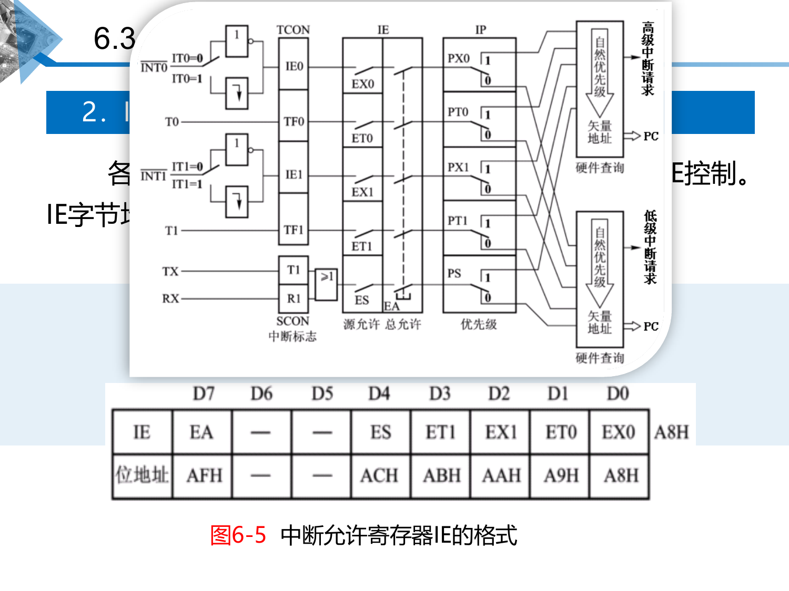

IE 位格式：

| 位 | 名称 | 作用 |
|---:|---|---|
| IE.7 | EA | 中断总允许 |
| IE.4 | ES | 串口中断允许 |
| IE.3 | ET1 | T1 中断允许 |
| IE.2 | EX1 | 外部中断 1 允许 |
| IE.1 | ET0 | T0 中断允许 |
| IE.0 | EX0 | 外部中断 0 允许 |

开 T0 中断模板：

```c
EA = 1;   // 开总中断
ET0 = 1;  // 开 T0 中断
```

> 易错：只写 `ET0=1` 不够，必须 `EA=1`。

### 5.4 IP 中断优先级

| 位 | 名称 | 作用 |
|---:|---|---|
| IP.4 | PS | 串口中断优先级 |
| IP.3 | PT1 | T1 中断优先级 |
| IP.2 | PX1 | 外部中断 1 优先级 |
| IP.1 | PT0 | T0 中断优先级 |
| IP.0 | PX0 | 外部中断 0 优先级 |

规则：

1. 低优先级可以被高优先级中断打断。
2. 高优先级不能被低优先级打断。
3. 同级之间不能互相打断。
4. 复位后所有中断默认低优先级。

### 5.5 TCON 中的外部中断位

TCON 位格式：

| 位 | 名称 | 作用 |
|---:|---|---|
| TCON.7 | TF1 | T1 溢出标志 |
| TCON.6 | TR1 | T1 启动控制 |
| TCON.5 | TF0 | T0 溢出标志 |
| TCON.4 | TR0 | T0 启动控制 |
| TCON.3 | IE1 | 外部中断 1 请求标志 |
| TCON.2 | IT1 | 外部中断 1 触发方式 |
| TCON.1 | IE0 | 外部中断 0 请求标志 |
| TCON.0 | IT0 | 外部中断 0 触发方式 |

`ITx`：

| 值 | 触发方式 | 适合场景 |
|---:|---|---|
| 0 | 低电平触发 | 中断信号能在 ISR 里撤销 |
| 1 | 下降沿触发 | 按键、脉冲类信号，常用 |

外部中断 0 模板：

```c
#include <reg51.h>

sbit LED = P1^0;

void main(void)
{
    IT0 = 1;  // INT0 下降沿触发
    EX0 = 1;  // 允许外部中断0
    EA = 1;   // 总中断允许

    while (1);
}

void int0_isr(void) interrupt 0 using 1
{
    LED = ~LED;
}
```

### 5.6 中断请求撤销

| 中断 | 标志如何清除 |
|---|---|
| T0/T1 中断 | 中断响应后 TF0/TF1 通常由硬件自动清 0 |
| 外部边沿中断 | 响应后 IE0/IE1 硬件自动清 0 |
| 外部电平中断 | 标志可硬件清，但外部低电平必须撤销，否则会再次请求 |
| 串口中断 | TI/RI 必须软件清 0 |

串口中断常见写法：

```c
void serial_isr(void) interrupt 4
{
    if (RI) {
        RI = 0;
        // 读取 SBUF
    }
    if (TI) {
        TI = 0;
        // 发送结束处理
    }
}
```

## 6. 第 7 章：定时器/计数器

### 6.1 定时器和计数器的本质

AT89S51 有 T0 和 T1 两个 16 位定时/计数器。

| 模式 | 计数脉冲来源 | 用途 |
|---|---|---|
| 定时器 | 内部机器周期脉冲 | 延时、方波、秒表、刷新显示 |
| 计数器 | T0/P3.4 或 T1/P3.5 外部负跳变 | 数外部事件次数 |

人话版：

> 定时器也是计数器，只是它数的是内部时钟；计数器数的是外部脉冲。

### 6.2 TMOD 工作方式寄存器

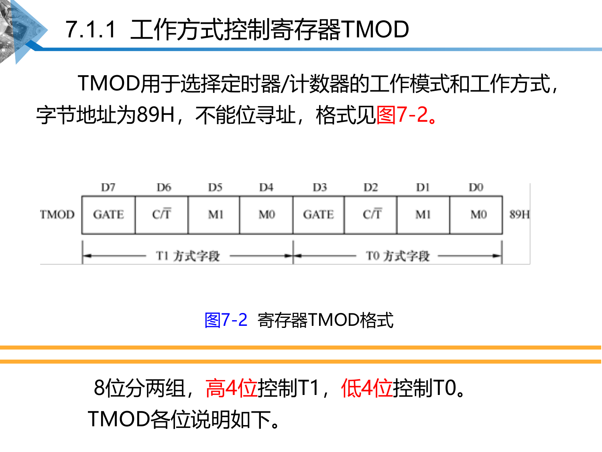

TMOD 高 4 位控制 T1，低 4 位控制 T0：

| 位组 | 含义 |
|---|---|
| GATE | 门控位，0 时只由 TRx 控制；1 时由 TRx 和 INTx 共同控制 |
| C/T | 0 为定时器，1 为计数器 |
| M1 M0 | 工作方式选择 |

工作方式：

| M1 M0 | 方式 | 说明 |
|---|---|---|
| 00 | 方式 0 | 13 位定时/计数 |
| 01 | 方式 1 | 16 位定时/计数，最常考 |
| 10 | 方式 2 | 8 位自动重装，常用于串口波特率 |
| 11 | 方式 3 | T0 分成两个 8 位计数器 |

常见控制字：

| 目标 | TMOD |
|---|---:|
| T0 方式 1 定时 | `0x01` |
| T1 方式 1 定时 | `0x10` |
| T1 方式 2 定时，作串口波特率 | `0x20` |
| T1 方式 1 计数 | `0x50` |
| T1 GATE=1，方式 1 定时 | `0x90` |

### 6.3 TCON 中的定时器位

| 位 | 名称 | 作用 |
|---:|---|---|
| TCON.7 | TF1 | T1 溢出标志 |
| TCON.6 | TR1 | T1 启动/停止 |
| TCON.5 | TF0 | T0 溢出标志 |
| TCON.4 | TR0 | T0 启动/停止 |

启动 T0：

```c
TR0 = 1;
```

停止 T0：

```c
TR0 = 0;
```

### 6.4 定时器初值计算

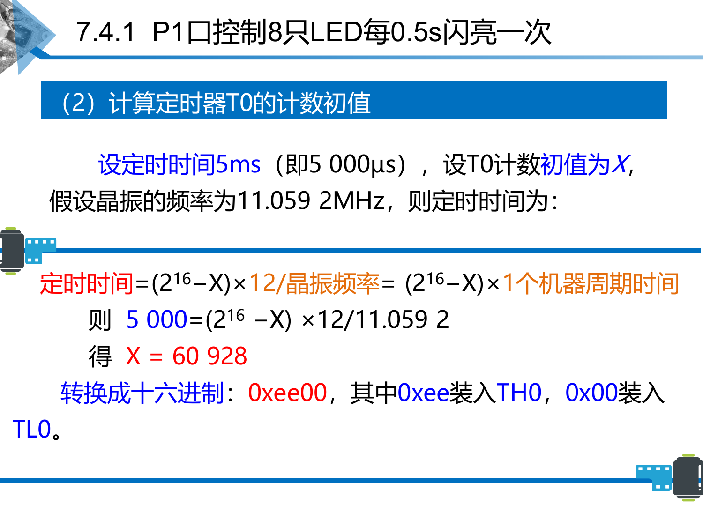

通用步骤：

1. 算机器周期：`Tcy = 12 / fosc`。
2. 算需要计数次数：`N = 定时时间 / Tcy`。
3. 方式 1 初值：`X = 65536 - N`。
4. 高 8 位：`THx = X / 256`。
5. 低 8 位：`TLx = X % 256`。

12MHz 常用：

| 目标定时 | N | X | TH/TL |
|---:|---:|---:|---|
| 1ms | 1000 | 64536 = 0xFC18 | TH=0xFC, TL=0x18 |
| 5ms | 5000 | 60536 = 0xEC78 | TH=0xEC, TL=0x78 |
| 50ms | 50000 | 15536 = 0x3CB0 | TH=0x3C, TL=0xB0 |

注意：PPT 中有 11.0592MHz 的例子，5ms 初值为 `0xEE00`。

### 6.5 T0 方式 1 定时中断模板

```c
#include <reg51.h>
typedef unsigned char uchar;
typedef unsigned int uint;

sbit LED = P1^0;

void timer0_init_1ms(void)
{
    TMOD &= 0xf0;   // 清 T0 控制位
    TMOD |= 0x01;   // T0 方式1定时
    TH0 = 0xfc;     // 12MHz，1ms
    TL0 = 0x18;
    ET0 = 1;        // 允许 T0 中断
    EA = 1;         // 总中断
    TR0 = 1;        // 启动 T0
}

void main(void)
{
    timer0_init_1ms();
    while (1);
}

void timer0_isr(void) interrupt 1
{
    static uint cnt = 0;
    TH0 = 0xfc;
    TL0 = 0x18;

    cnt++;
    if (cnt >= 500) { // 500ms 翻转一次
        cnt = 0;
        LED = ~LED;
    }
}
```

### 6.6 产生 2ms 周期方波

题目说“P1.0 输出周期 2ms 的方波”，方波翻转一次是半周期，所以定时器要定 1ms。

```c
void timer0_isr(void) interrupt 1
{
    TH0 = 0xfc; // 12MHz, 1ms
    TL0 = 0x18;
    P1_0 = ~P1_0;
}
```

> 易错：周期 2ms，不是定时 2ms 翻转。翻转间隔 = 周期 / 2 = 1ms。

### 6.7 计数器应用

T1 方式 1 计数，计 4 次溢出：

1. 计数器最大 65536。
2. 想数 4 个脉冲后溢出：初值 `65536 - 4 = 65532 = 0xFFFC`。
3. `TH1=0xff; TL1=0xfc;`
4. `TMOD=0x50;` 表示 T1 方式 1 计数。

```c
TMOD = 0x50; // T1，C/T=1，方式1
TH1 = 0xff;
TL1 = 0xfc;
EA = 1;
ET1 = 1;
TR1 = 1;
```

## 7. 第 8 章：串行口

### 7.1 串口结构

AT89S51 串口有：

| 名称 | 作用 |
|---|---|
| SBUF | 串行数据缓冲寄存器。写 SBUF 发送，读 SBUF 接收 |
| SCON | 串口控制寄存器 |
| PCON | 电源控制寄存器，最高位 SMOD 影响波特率 |
| TXD/P3.1 | 发送引脚 |
| RXD/P3.0 | 接收引脚 |

> 易错：发送 SBUF 和接收 SBUF 地址相同，但物理上是两个缓冲器。写 SBUF 是发，读 SBUF 是收。

### 7.2 SCON 寄存器

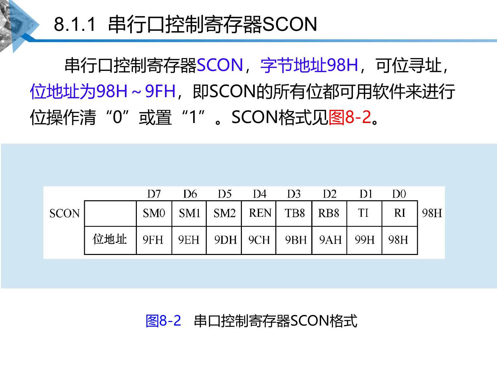

| 位 | 名称 | 作用 |
|---:|---|---|
| SCON.7 | SM0 | 工作方式选择 |
| SCON.6 | SM1 | 工作方式选择 |
| SCON.5 | SM2 | 多机通信控制 |
| SCON.4 | REN | 允许接收 |
| SCON.3 | TB8 | 发送第 9 位 |
| SCON.2 | RB8 | 接收第 9 位 |
| SCON.1 | TI | 发送中断标志 |
| SCON.0 | RI | 接收中断标志 |

串口方式：

| SM0 SM1 | 方式 | 帧格式 | 波特率 |
|---|---|---|---|
| 00 | 方式 0 | 同步移位寄存器，8 位 | 固定 `fosc/12` |
| 01 | 方式 1 | 10 位：起始位 + 8 数据位 + 停止位 | 可变，常用 |
| 10 | 方式 2 | 11 位：起始位 + 8 数据位 + 第 9 位 + 停止位 | 固定 |
| 11 | 方式 3 | 11 位，类似方式 2 | 可变 |

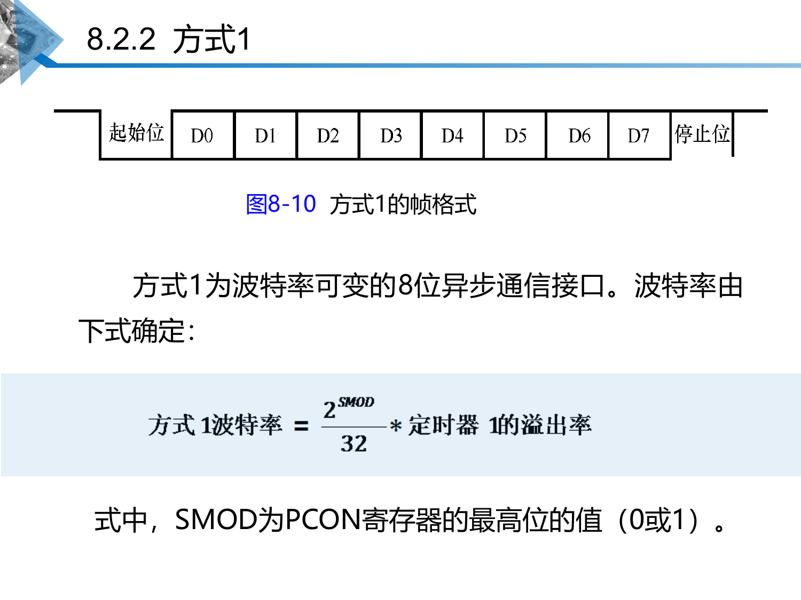

### 7.3 波特率

波特率：串口每秒传输的二进制位数，单位 bit/s。

方式 1/3 常用 T1 方式 2 自动重装产生波特率：

```text
Baud = (2^SMOD / 32) * (T1 溢出率)
T1 溢出率 = fosc / [12 * (256 - TH1)]
所以：
Baud = (2^SMOD * fosc) / [384 * (256 - TH1)]
```

常用初值：

| 晶振 | 波特率 | SMOD | TH1/TL1 |
|---:|---:|---:|---:|
| 11.0592MHz | 9600 | 0 | 0xFD |
| 11.0592MHz | 2400 | 0 | 0xF4 |

> 为什么常用 11.0592MHz？因为它能整除常见波特率，误差小。

### 7.4 串口方式 1 初始化

只发送：

```c
void uart_init_tx_9600(void)
{
    TMOD = 0x20;  // T1 方式2
    TH1 = 0xfd;   // 11.0592MHz, 9600
    TL1 = 0xfd;
    PCON = 0x00;  // SMOD=0
    SCON = 0x40;  // 方式1，只发送
    TR1 = 1;
}
```

发送 + 接收：

```c
void uart_init_9600(void)
{
    TMOD = 0x20;
    TH1 = 0xfd;
    TL1 = 0xfd;
    PCON = 0x00;
    SCON = 0x50;  // 0101 0000B，方式1，REN=1
    TR1 = 1;
}
```

### 7.5 查询方式发送/接收

```c
void uart_send(uchar dat)
{
    SBUF = dat;
    while (TI == 0);
    TI = 0;
}

uchar uart_recv(void)
{
    uchar dat;
    while (RI == 0);
    RI = 0;
    dat = SBUF;
    return dat;
}
```

### 7.6 串口中断模板

```c
volatile uchar rx_data;
volatile bit rx_flag = 0;

void uart_init_interrupt(void)
{
    TMOD = 0x20;
    TH1 = 0xfd;
    TL1 = 0xfd;
    SCON = 0x50;
    PCON = 0x00;
    TR1 = 1;
    ES = 1;
    EA = 1;
}

void uart_isr(void) interrupt 4
{
    if (RI) {
        RI = 0;
        rx_data = SBUF;
        rx_flag = 1;
    }

    if (TI) {
        TI = 0;
    }
}
```

> 程序填空爱考：`SCON=0x50`、`TMOD=0x20`、`TH1=0xfd`、`TR1=1`、`while(TI==0)`、`TI=0`、`while(RI==0)`、`RI=0`、`SBUF`。

## 8. 第 11 章：DAC 和 ADC

### 8.1 DAC 和 ADC 是什么

| 名称 | 全称 | 人话解释 |
|---|---|---|
| DAC | Digital to Analog Converter | 数字量转模拟量，例如单片机输出电压控制电机速度 |
| ADC | Analog to Digital Converter | 模拟量转数字量，例如读取电位器、电压、传感器 |

单片机本身主要处理数字量。现实世界很多量是模拟量，所以要 ADC/DAC 做桥梁。

### 8.2 分辨率

分辨率就是“最小能分辨/改变多少”。

DAC：

```text
1 LSB = 满量程输出 / 2^n
```

ADC：

```text
1 LSB = 输入量程 / 2^n
```

例子：

| 位数 | 0-5V 量程下 1 LSB 约等于 |
|---:|---:|
| 8 位 | 5V / 256 = 19.53mV |
| 10 位 | 5V / 1024 = 4.88mV |
| 12 位 | 5V / 4096 = 1.22mV |

> 易错：分辨率和精度不是完全一回事。位数越高，理论分辨率越高；但实际精度还受基准电压、电源、噪声、器件误差影响。

### 8.3 DAC0832

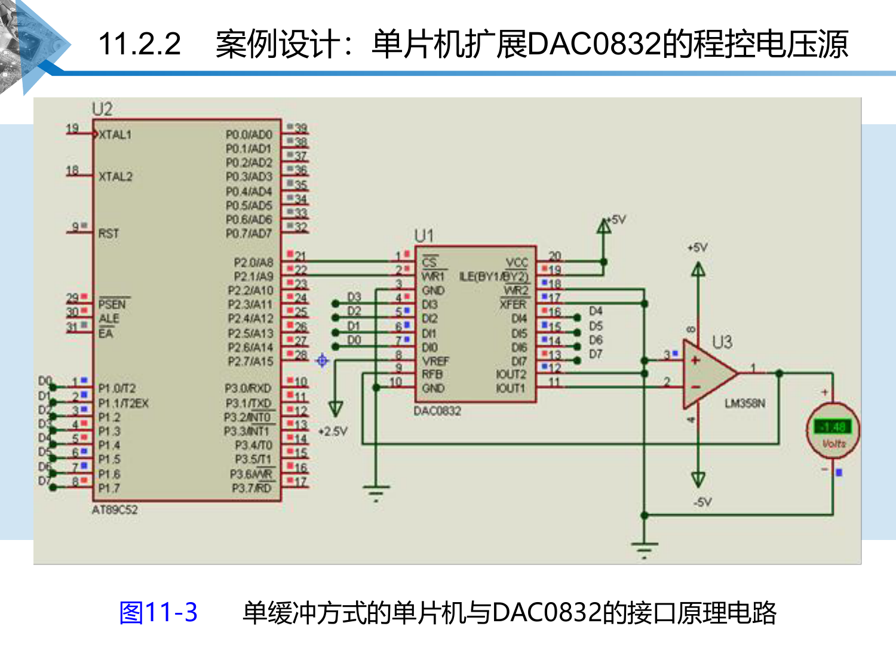

DAC0832 特点：

| 项目 | 内容 |
|---|---|
| 位数 | 8 位 |
| 输出 | 电流输出，通常外接运放做 I/V 转换 |
| 输入 | 8 位并行数据 |
| 寄存结构 | 两级输入寄存器 |
| 控制线 | `CS`、`WR1`、`XFER`、`WR2`、`ILE` 等 |

单缓冲方式人话版：

> 如果只有一路 DAC 输出，不要求多路同步，就把第二级寄存器直通，只控制第一级锁存。单片机把 8 位数字量送到数据口，再给 CS/WR 一个写脉冲，DAC 输出就改变。

DAC0832 写数据模板：

```c
#include <reg51.h>
typedef unsigned char uchar;

sbit DAC_CS = P2^0;
sbit DAC_WR = P2^1;

void dac0832_write(uchar dat)
{
    P1 = dat;        // P1 接 DAC0832 DI0-DI7
    DAC_CS = 0;
    DAC_WR = 0;      // 写入脉冲
    DAC_WR = 1;
    DAC_CS = 1;
}

void main(void)
{
    uchar value = 0;
    while (1) {
        dac0832_write(value++); // 锯齿波
    }
}
```

输出关系：

```text
Vo 与输入数字量 B 成正比。
若采用反相 I/V 电路，输出可能为负，符号由电路决定。
```

### 8.4 用 DAC0832 产生波形

| 波形 | 做法 |
|---|---|
| 锯齿波 | 从 0 递增到 255，再回到 0 |
| 三角波 | 从 0 增到 255，再从 255 减到 0 |
| 方波 | 反复输出 0x00 和 0xff |
| 正弦波 | 查 256 点正弦表，循环输出 |

三角波模板：

```c
void triangle_wave(void)
{
    uchar i;

    for (i = 0; i < 255; i++) {
        dac0832_write(i);
    }

    for (i = 255; i > 0; i--) {
        dac0832_write(i);
    }
}
```

### 8.5 ADC0809

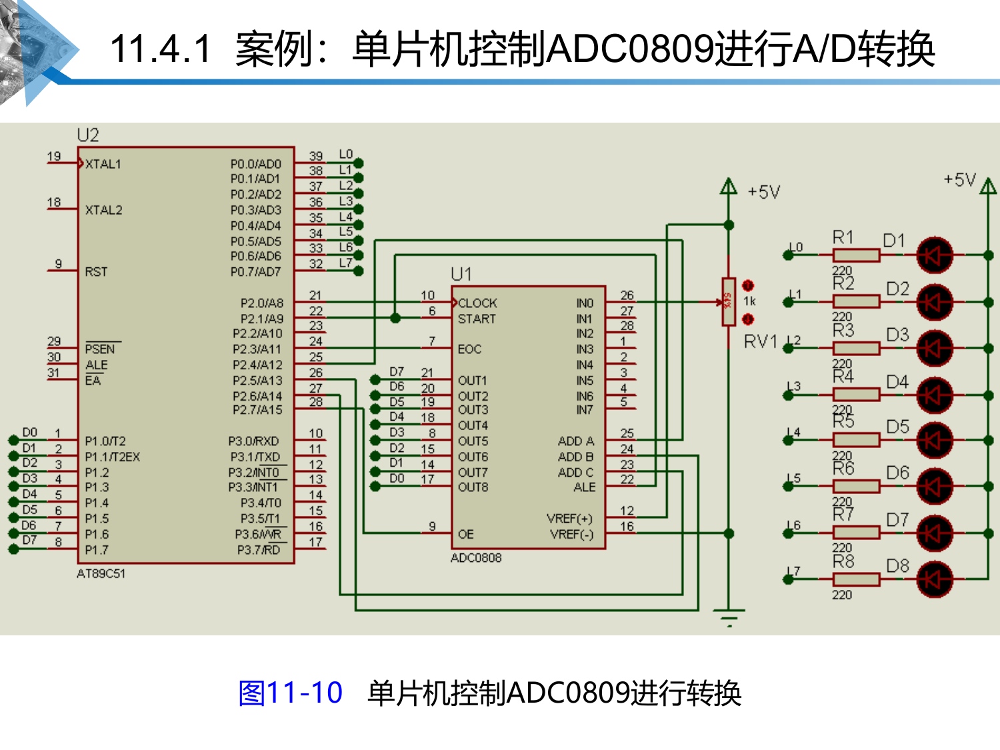

ADC0809 特点：

| 项目 | 内容 |
|---|---|
| 类型 | 8 位逐次比较型 ADC |
| 通道 | 8 路模拟输入 |
| 输出 | 8 位并行数字量 D0-D7 |
| 输入范围 | 常见 0-5V |
| 通道选择 | A、B、C 三根地址线 |
| 关键控制线 | ALE、START、EOC、OE、CLK |

控制流程必背：

1. 通过 A/B/C 选择通道。
2. 给 ALE 锁存通道地址。
3. 给 START 启动转换。
4. 等 EOC 变为转换结束状态。
5. 置 OE=1，读 D0-D7。
6. OE=0，关闭输出。

ADC0809 查询方式模板：

```c
#include <reg51.h>
typedef unsigned char uchar;

#define ADC_DATA P1
#define LED_DATA P0

sbit ADD_A = P2^0;
sbit ADD_B = P2^1;
sbit ADD_C = P2^2;
sbit ALE   = P2^3;
sbit START = P2^4;
sbit EOC   = P2^5;
sbit OE    = P2^6;

uchar adc0809_read_ch0(void)
{
    uchar dat;

    ADD_A = 0;
    ADD_B = 0;
    ADD_C = 0;     // 选择 IN0

    ALE = 1;       // 锁存地址
    ALE = 0;

    START = 1;     // 启动转换
    START = 0;

    while (EOC == 0); // 等待转换结束，具体高/低有效按电路和芯片时序

    OE = 1;
    dat = ADC_DATA;
    OE = 0;

    return dat;
}

void main(void)
{
    uchar val;
    while (1) {
        val = adc0809_read_ch0();
        LED_DATA = val;
    }
}
```

ADC0809 电压换算：

```text
数字量 N = Vin / Vref * 255
Vin = N * Vref / 255
```

例：Vref=5V，读数 N=128，则 Vin 约为 `128 * 5 / 255 = 2.51V`。

### 8.6 查询方式 vs 中断方式读 ADC

| 方式 | 做法 | 优点 | 缺点 |
|---|---|---|---|
| 查询方式 | CPU 一直等 EOC | 简单 | 浪费 CPU 时间 |
| 中断方式 | EOC 接外部中断，转换完再通知 CPU | 效率高 | 电路和程序稍复杂 |

简答模板：

> ADC0809 转换结束后 EOC 输出转换结束信号。查询方式由单片机循环检测 EOC 状态，转换完成后打开 OE 读取结果；中断方式则把 EOC 经过适当电路接到外部中断脚，转换完成后触发中断，在中断服务程序中读取结果。中断方式效率更高，适合转换时间较长或主程序任务较多的系统。

## 9. 现代嵌入式系统总览

这一章来自 `单片机与嵌入式系统.pptx`。它不是替代 51，而是告诉你：51 是经典入门基石，现代嵌入式会继续往 32 位 MCU、RTOS、无线通信、边缘 AI 方向发展。

### 9.1 嵌入式系统是什么

嵌入式系统是“嵌”在具体设备里的专用计算机系统。它通常围绕某个固定任务设计，比如测温控温、机器人避障、智能门锁联网、工业电机控制。

标准答法：

> 嵌入式系统是以应用为中心、以计算机技术为基础，软硬件可裁剪，适用于特定功能、可靠性、成本、体积和功耗要求的专用计算机系统。

和通用电脑相比：

| 对比点 | 通用计算机 | 嵌入式系统 |
|---|---|---|
| 目标 | 通用办公、娱乐、计算 | 面向特定任务 |
| 资源 | CPU/内存/存储较充足 | 资源有限，强调成本和功耗 |
| 实时性 | 通常不要求确定响应 | 常要求固定时间内响应 |
| 可靠性 | 出问题可重启/维护 | 常长期无人值守运行 |
| 形态 | 独立设备 | 藏在产品内部 |

### 9.2 嵌入式系统组成


| 层次 | 内容 | 人话解释 |
|---|---|---|
| 硬件层 | MCU/MPU、存储器、传感器、执行器、电源、通信接口 | 能感知、能计算、能输出动作 |
| 驱动/BSP 层 | 板级支持包、外设驱动、启动代码 | 让芯片和板子“能被软件使用” |
| 系统层 | 裸机程序或 RTOS | 决定程序怎么调度、怎么管理资源 |
| 应用层 | 业务逻辑、通信协议、UI、控制算法 | 真正实现产品功能 |

常见硬件接口：

| 接口 | 典型用途 | 关键词 |
|---|---|---|
| UART | 调试串口、GPS、蓝牙串口模块 | 异步、TX/RX、波特率 |
| SPI | Flash、TFT 屏、SD 卡、高速传感器 | 同步、全双工、SCK/MOSI/MISO/CS |
| I2C | OLED、EEPROM、温湿度传感器 | 两根线、SDA/SCL、多从机 |
| CAN/TWAI | 汽车电子、工业控制 | 抗干扰、多节点、差分总线 |
| PWM | 电机、舵机、LED 调光 | 频率、占空比 |
| ADC | 电位器、光敏、模拟传感器 | 模拟量转数字量 |

### 9.3 嵌入式系统核心特点

| 特点 | 怎么写简答 |
|---|---|
| 专用性 | 针对某个具体任务设计，不追求通用功能 |
| 可裁剪性 | 根据需求裁剪硬件和软件，控制成本、体积和功耗 |
| 实时性 | 必须在规定时间内响应事件，尤其是工业控制、汽车电子 |
| 可靠性 | 长时间稳定运行，能适应温度、电磁干扰等环境 |
| 资源受限 | 内存、Flash、算力、电池都有限，需要优化 |
| 低功耗 | 通过休眠、唤醒、降频等方式延长续航 |

### 9.4 MCU、MPU、SoC 区别

| 名称 | 人话解释 | 典型例子 | 适合场景 |
|---|---|---|---|
| MCU | 单片机，把 CPU、存储、外设集成在一颗芯片里 | 8051、STM32、ESP32-S3 | 控制、传感器、低功耗设备 |
| MPU | 微处理器，通常需要外接 RAM/Flash，跑复杂系统 | ARM Cortex-A、树莓派 SoC | Linux、图像、复杂 UI |
| SoC | 系统级芯片，把 CPU、外设、通信/AI/图像等模块高度集成 | ESP32-S3、手机芯片 | 高集成产品、AIoT |

考试常见一句话：

> MCU 更像“控制器”，强调实时控制和低功耗；MPU 更像“处理器”，强调高性能和复杂操作系统；SoC 强调把多个系统功能集成到一颗芯片中。

### 9.5 主流架构对比

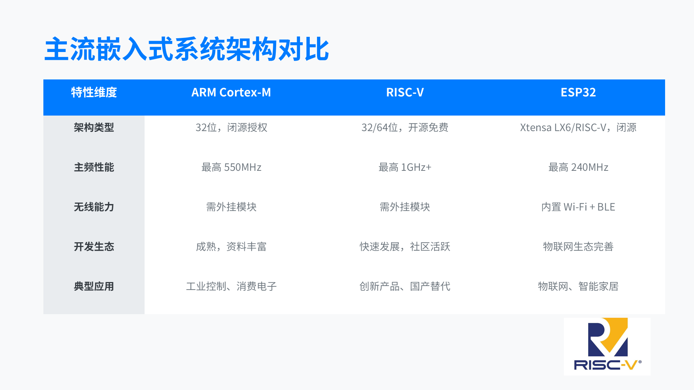

| 架构/平台 | 特点 | 优势 | 典型应用 |
|---|---|---|---|
| 8051/C51 | 8 位经典架构，资源少，寄存器控制明显 | 入门简单，适合学底层 | 基础控制、教学实验 |
| ARM Cortex-M | 32 位 MCU 主流架构 | 性能强、外设丰富、工业生态成熟 | 工业控制、消费电子 |
| RISC-V | 开源指令集架构 | 授权自由，生态快速发展 | 国产替代、创新芯片 |
| ESP32 | 集成 Wi-Fi/BLE 的 MCU/SoC | 无线能力强，适合物联网 | 智能家居、传感器节点 |

开发板选型口诀：

| 需求 | 推荐 |
|---|---|
| 只想快速入门、点灯、读按键 | Arduino UNO |
| 想学 C/C++、双核、低成本 | 树莓派 Pico |
| 要工业级控制、外设多、实时性强 | STM32 |
| 要 Wi-Fi/BLE、物联网、云端通信 | ESP32 系列 |

### 9.6 裸机程序 vs RTOS

| 项目 | 裸机程序 | RTOS 程序 |
|---|---|---|
| 结构 | 一个 `while(1)` 主循环，加中断 | 多个任务并发运行 |
| 优点 | 简单、开销小、好理解 | 模块清晰，适合复杂业务 |
| 缺点 | 任务多了容易乱，响应难管理 | 有调度开销，需要理解同步 |
| 适合 | 点灯、按键、简单采集 | 网络通信、音频、显示、传感器并行 |

人话版：

> 裸机像一个人按清单轮流干活；RTOS 像一个小型调度员，让多个任务按优先级和状态轮流使用 CPU。

### 9.7 边缘计算与 TinyML


边缘计算：把计算放到靠近数据产生的位置，例如摄像头、本地网关、智能音箱，而不是全部上传云端。

| 优势 | 解释 |
|---|---|
| 低延迟 | 本地处理，响应更快 |
| 省带宽 | 不必把所有原始数据上传 |
| 隐私更好 | 敏感数据可以留在本地 |
| 可离线 | 网络断开时仍能完成部分功能 |

TinyML：在资源受限的 MCU 上跑轻量机器学习模型。

| 技术 | 作用 |
|---|---|
| 模型量化 | 用 int8 等低位宽减少模型体积 |
| 剪枝 | 去掉不重要的连接/通道 |
| 知识蒸馏 | 用大模型教小模型 |
| 轻量网络 | MobileNet、EfficientNet-Lite 等 |
| 硬件加速 | 使用 SIMD、NPU、DSP 指令加速推理 |

## 10. ESP32-S3 技术与应用专项

这一章来自 `ESP32-S3技术与应用.pptx`，适合把“现代 32 位 MCU + AIoT 开发”串起来复习。

### 10.1 ESP32-S3 是什么

ESP32-S3 是乐鑫推出的低功耗 Wi-Fi + Bluetooth LE MCU/SoC，面向 AIoT、语音交互、智能家居、传感器节点等场景。

一句话背诵：

> ESP32-S3 集成双核 32 位 Xtensa LX7 处理器、2.4GHz Wi-Fi、Bluetooth 5 LE、丰富 GPIO 与外设接口，并提供向量指令、FPU、安全启动、Flash 加密等能力，适合低功耗 AIoT 终端开发。

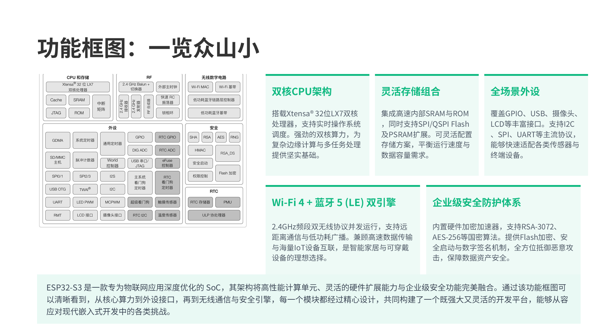

### 10.2 ESP32-S3 核心资源速记

| 项目 | 重点 |
|---|---|
| CPU | Xtensa 32 位 LX7，双核，最高 240MHz |
| 浮点/SIMD | 单精度 FPU + 向量指令，适合信号处理和轻量 AI |
| 低功耗 | ULP RISC-V 协处理器可在深睡眠场景低功耗采集/唤醒 |
| 片上存储 | 384KB ROM、512KB SRAM、16KB RTC SRAM |
| 外部存储 | 支持外接 SPI/QSPI/Octal SPI Flash 和 PSRAM |
| 无线 | 2.4GHz 802.11 b/g/n Wi-Fi，Bluetooth 5 LE |
| GPIO | 最多 45 个可编程 GPIO，支持复用功能 |
| 安全 | 安全启动、Flash 加密、数字签名、硬件加密加速 |

> 易错：ESP32-S3 的 Wi-Fi 按 802.11 b/g/n 记，即 Wi-Fi 4；不要写成 Wi-Fi 6。

### 10.3 51 单片机 vs ESP32-S3

| 对比 | AT89S51 | ESP32-S3 |
|---|---|---|
| 位宽 | 8 位 | 32 位 |
| 主频 | 常见 12MHz 左右 | 最高 240MHz |
| 内存 | 128B RAM、4KB Flash 级别 | 512KB SRAM，外接 MB 级 Flash/PSRAM |
| 通信 | 串口为主，无无线 | 内置 Wi-Fi + Bluetooth LE |
| 编程模型 | 裸机 + SFR 控制 | Arduino/ESP-IDF + FreeRTOS |
| 典型题型 | 寄存器、定时器、中断、接口 | 无线、RTOS、多任务、AIoT |
| 应用 | 基础控制、教学实验 | 智能终端、联网设备、语音/视觉边缘应用 |

人话版：

> 51 让你理解“单片机怎么直接控制硬件”；ESP32-S3 让你理解“现代单片机怎么联网、并发、跑轻量 AI”。

### 10.4 外设接口总表

| 外设 | ESP32-S3 重点 | 常见用途 |
|---|---|---|
| UART | 3 路异步串口，常用于下载、日志、模块通信 | 调试、GPS、串口屏 |
| I2C | 2 路控制器，SDA/SCL 两根线 | OLED、EEPROM、传感器 |
| SPI | 多路高速同步接口 | Flash、SD 卡、TFT 屏 |
| I2S | 2 路音频总线 | 数字麦克风、音频功放 |
| USB OTG | 支持 USB 设备/主机模式 | 下载、CDC 串口、U 盘/键鼠扩展 |
| TWAI/CAN | 兼容 CAN 2.0 | 汽车电子、工业总线 |
| ADC | 2 个 12 位 SAR ADC，多个通道 | 电位器、光敏、电压采样 |
| Touch | 电容式触摸 GPIO | 触摸按键、滑条、唤醒 |
| LED PWM | 多路 PWM | 呼吸灯、调光、舵机 |
| MCPWM | 电机控制 PWM | 电机、机器人、云台 |
| RMT | 可编程脉冲收发 | 红外遥控、精确定时波形 |
| LCD/DVP | 并口屏/摄像头接口 | 显示、视觉采集 |

### 10.5 开发板与引脚

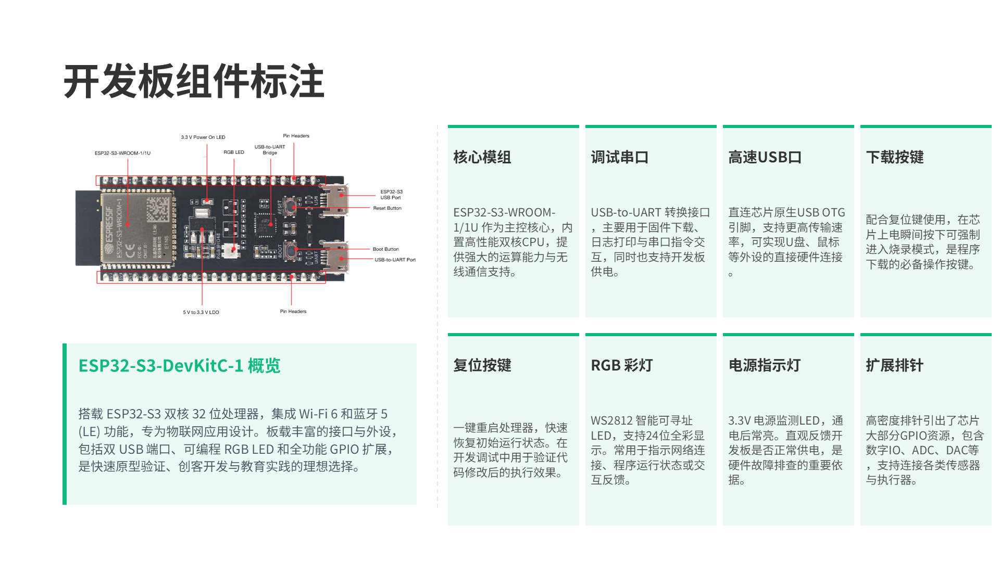

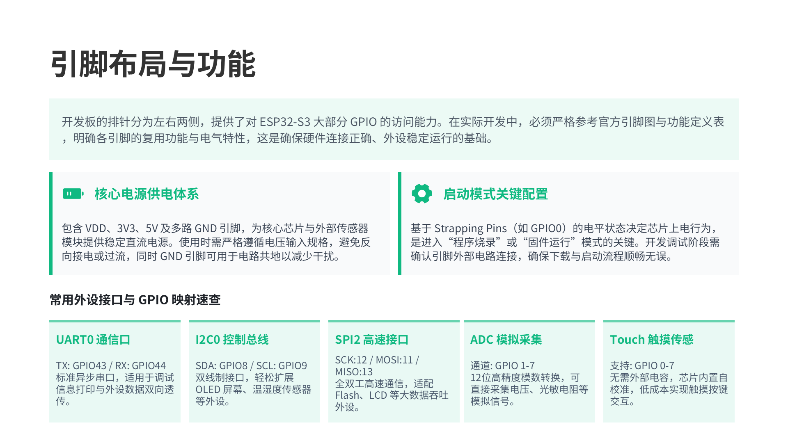

ESP32-S3-DevKitC-1 常见板载资源：

| 模块 | 作用 |
|---|---|
| ESP32-S3-WROOM 模组 | 主控，带 Wi-Fi/BLE，常见型号带 Flash/PSRAM |
| USB-to-UART | 下载固件、串口日志 |
| USB OTG 口 | 直连芯片原生 USB |
| BOOT/下载按键 | 上电/复位时配合进入下载模式 |
| RESET/复位按键 | 重启芯片 |
| RGB LED | 状态指示、彩灯实验 |
| 3.3V/5V/GND | 供电与共地 |
| 双排针 | 引出 GPIO、ADC、I2C、SPI、UART 等 |

常用映射按 PPT 速记：

| 功能 | 常见引脚 |
|---|---|
| UART0 | TX: GPIO43，RX: GPIO44 |
| I2C0 | SDA: GPIO8，SCL: GPIO9 |
| SPI2 | SCK: GPIO12，MOSI: GPIO11，MISO: GPIO13 |
| ADC | GPIO1-GPIO7 等通道 |
| Touch | GPIO0-GPIO7 |

> 注意：ESP32-S3 引脚复用很灵活，不同开发板接法可能不同。考试按 PPT 记；实际做项目一定查开发板原理图和官方引脚表。

### 10.6 Arduino IDE 开发流程

ESP32-S3 可以用 Arduino IDE 快速上手。流程：

1. 安装 Arduino IDE。
2. 在“附加开发板管理器网址”里添加 ESP32 开发板索引。
3. 在开发板管理器中搜索并安装 `esp32`。
4. 选择开发板，例如 `ESP32S3 Dev Module`。
5. 选择正确串口 COM。
6. 编写、编译、上传程序。

常见排错：

| 问题 | 处理 |
|---|---|
| 找不到端口 | 换数据线、装 USB 驱动、换 USB 口 |
| 上传失败 | 按住 BOOT 再点上传，或上传时按一下 RESET |
| 程序没反应 | 检查开发板型号、串口波特率、GPIO 是否接错 |
| 串口乱码 | 串口监视器波特率要和 `Serial.begin()` 一致 |

### 10.7 Arduino 基础代码模板

LED 闪烁：

```cpp
const int ledPin = 48;

void setup()
{
    pinMode(ledPin, OUTPUT);
}

void loop()
{
    digitalWrite(ledPin, HIGH);
    delay(1000);
    digitalWrite(ledPin, LOW);
    delay(1000);
}
```

Wi-Fi 连接：

```cpp
#include <WiFi.h>

const char *ssid = "your_SSID";
const char *password = "your_PASSWORD";

void setup()
{
    Serial.begin(115200);
    WiFi.begin(ssid, password);

    while (WiFi.status() != WL_CONNECTED) {
        delay(500);
        Serial.print(".");
    }

    Serial.println();
    Serial.print("WiFi connected, IP: ");
    Serial.println(WiFi.localIP());
}

void loop()
{
}
```

读取电位器：

```cpp
const int potPin = 1;

void setup()
{
    Serial.begin(115200);
}

void loop()
{
    int potValue = analogRead(potPin);
    Serial.print("Potentiometer: ");
    Serial.println(potValue);
    delay(100);
}
```

ESP32-S3 的 ADC 常按 12 位理解：

```text
analogRead() 约为 0-4095
0 对应 0V
4095 对应 3.3V 附近
Vin ≈ 读数 * 3.3 / 4095
```

### 10.8 常用模块接口

| 模块 | 接口 | 接线/用途 |
|---|---|---|
| DHT11/DHT22 | 单总线 | 只需一根数据线，读温湿度 |
| SSD1306 OLED | I2C | SDA/SCL 两根线显示文字/图形 |
| HC-SR04 | Trig/Echo GPIO | 超声波测距 |
| SD 卡模块 | SPI | 数据记录、文件系统 |
| OV2640 摄像头 | DVP | 图像采集、视觉识别 |
| INMP441 麦克风 | I2S | 数字音频采集、语音识别 |
| MAX98357A 功放 | I2S | 数字音频输出、语音播放 |

### 10.9 FreeRTOS 是什么

FreeRTOS 是面向微控制器的轻量级实时操作系统。它把复杂应用拆成多个任务，通过调度器安排任务运行。

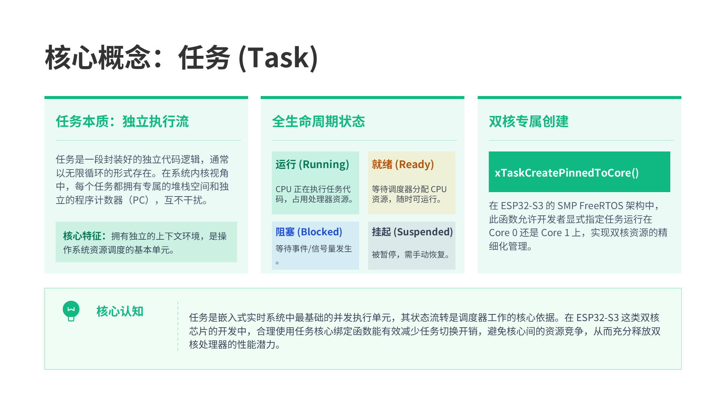

| 概念 | 人话解释 |
|---|---|
| Task 任务 | 一段独立运行的代码，通常内部有无限循环 |
| Priority 优先级 | 优先级高的任务更容易先运行 |
| Stack 栈 | 每个任务自己的局部变量和调用空间 |
| Running | 正在 CPU 上运行 |
| Ready | 已准备好，等调度 |
| Blocked | 等延时、队列、信号量等事件 |
| Suspended | 被挂起，需手动恢复 |

ESP32-S3 双核里常见函数：

```cpp
xTaskCreatePinnedToCore(
    taskFunction,   // 任务函数
    "taskName",     // 任务名
    10000,          // 栈大小
    NULL,           // 参数
    1,              // 优先级
    &taskHandle,    // 任务句柄
    0               // 绑定核心：0 或 1
);
```

双任务模板：

```cpp
TaskHandle_t task1Handle;
TaskHandle_t task2Handle;

void task1(void *p)
{
    for (;;) {
        Serial.println("Core 0: task1");
        vTaskDelay(pdMS_TO_TICKS(1000));
    }
}

void task2(void *p)
{
    for (;;) {
        Serial.println("Core 1: task2");
        vTaskDelay(pdMS_TO_TICKS(1500));
    }
}

void setup()
{
    Serial.begin(115200);
    xTaskCreatePinnedToCore(task1, "T1", 4096, NULL, 1, &task1Handle, 0);
    xTaskCreatePinnedToCore(task2, "T2", 4096, NULL, 1, &task2Handle, 1);
}

void loop()
{
    vTaskDelay(pdMS_TO_TICKS(1000));
}
```

### 10.10 队列和信号量

队列用于任务间传数据：

| API | 作用 |
|---|---|
| `xQueueCreate(len, itemSize)` | 创建队列 |
| `xQueueSend(queue, &data, wait)` | 发送数据 |
| `xQueueReceive(queue, &data, wait)` | 接收数据 |

队列人话版：

> 一个任务生产数据，另一个任务消费数据，中间用 FIFO 队列缓存，避免两个任务直接互相卡住。

信号量用于同步或互斥：

| API | 作用 |
|---|---|
| `xSemaphoreCreateBinary()` | 创建二进制信号量 |
| `xSemaphoreTake(sem, wait)` | 获取信号量，相当于加锁/等待事件 |
| `xSemaphoreGive(sem)` | 释放信号量，相当于解锁/通知 |
| `xSemaphoreGiveFromISR()` | 中断服务函数里释放信号量 |

信号量人话版：

> 信号量像一把钥匙。拿到钥匙的任务可以进入临界区，用完必须归还；否则另一个任务会等不到资源。

### 10.11 小智 AI 在 ESP32-S3 上怎么跑

“小智 AI”这类项目的典型结构：

| 部分 | 作用 |
|---|---|
| ESP32-S3 主控 | 负责音频采集、联网、任务调度、外设控制 |
| INMP441 麦克风 | 通过 I2S 采集语音 |
| MAX98357A 功放 | 通过 I2S 播放 TTS 语音 |
| OLED/RGB LED | 显示状态、反馈唤醒/连接/响应 |
| ESP-SR | 本地唤醒词识别 |
| Wi-Fi/WebSocket/MQTT | 与云端服务实时通信 |
| ASR/LLM/TTS | 云端完成语音识别、语义理解、语音合成 |

语音控制闭环：

1. 用户说唤醒词，例如“你好小智”。
2. ESP32-S3 本地唤醒，点亮 RGB 或显示状态。
3. 麦克风采集用户指令。
4. 音频通过 Wi-Fi 上传云端。
5. 云端 ASR 转文字，LLM 理解意图。
6. 云端生成控制指令或回答。
7. ESP32-S3 执行 GPIO/电机/灯光等动作。
8. TTS 语音或屏幕文字反馈结果。

简答模板：

> 小智 AI 体现的是端云协同。ESP32-S3 在端侧完成唤醒、音频采集、状态显示和硬件执行，云端负责 ASR、LLM 推理和 TTS。这样既保留了端侧低延迟控制，又利用云端大模型增强自然语言理解能力。

### 10.12 MCP 协议

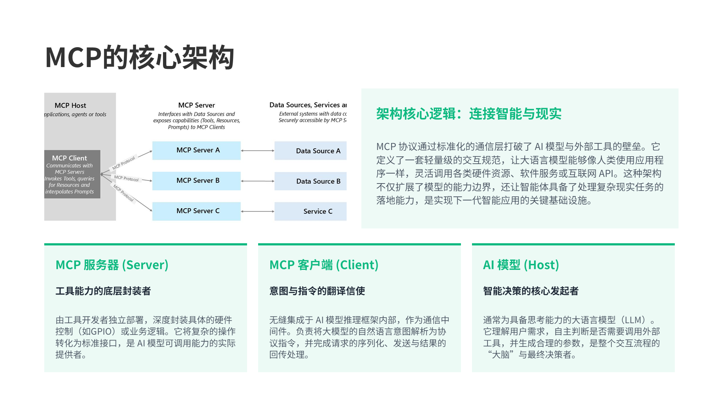

MCP 全称 Model Context Protocol，模型上下文协议。它的作用是统一大模型调用外部工具、数据源和硬件能力的方式。

| 角色 | 作用 | 类比 |
|---|---|---|
| Host | AI 应用/大模型所在环境，负责理解用户意图 | 大脑 |
| Client | 连接 Host 和 Server 的协议客户端 | 翻译/信使 |
| Server | 封装工具、数据源或硬件能力 | 工具箱 |
| Tool | 可被模型调用的具体能力 | 开灯、读温度、查数据库 |

在 ESP32-S3 项目中的用法：

| 端 | 做什么 |
|---|---|
| ESP32-S3 端 | 把 GPIO、传感器、电机、灯光封装为 MCP 工具 |
| 云端 AI 端 | 根据用户意图通过 MCP 调用工具 |
| 协议层 | 用统一 JSON/接口描述工具名、参数、返回值 |
| 安全层 | 加 Token、权限范围、操作审计，避免危险调用 |

简答模板：

> MCP 让大模型与硬件能力解耦。ESP32-S3 可以把 GPIO 控制、传感器采集等底层功能封装成标准工具，云端 AI 通过 MCP 客户端发起调用，不需要了解具体硬件细节。这样能提高可扩展性、复用性和安全可控性。

### 10.13 ESP32-S3 考点速记

| 问题 | 答案 |
|---|---|
| ESP32-S3 适合什么场景？ | AIoT、智能家居、语音交互、低功耗传感器、无线控制 |
| 它比 51 强在哪里？ | 32 位双核、高主频、大内存、无线通信、RTOS、AI 加速 |
| Wi-Fi 和蓝牙怎么记？ | 2.4GHz 802.11 b/g/n Wi-Fi + Bluetooth 5 LE |
| 为什么适合边缘 AI？ | SIMD/FPU、PSRAM 扩展、I2S 音频、摄像头接口、FreeRTOS |
| Arduino 开发两个核心函数？ | `setup()` 只运行一次，`loop()` 循环运行 |
| FreeRTOS 三个高频概念？ | 任务、队列、信号量 |
| 队列解决什么？ | 任务间安全传递数据 |
| 信号量解决什么？ | 同步、互斥、资源保护 |
| MCP 解决什么？ | 大模型调用外部工具/硬件能力的标准化 |

## 11. 综合应用答题套路

### 11.1 程序题通用骨架

```c
#include <reg51.h>
typedef unsigned char uchar;
typedef unsigned int uint;

// 1. 定义硬件引脚
sbit KEY = P3^2;
sbit LED = P1^0;

// 2. 延时函数
void delay_ms(uint ms)
{
    uint i, j;
    for (i = 0; i < ms; i++)
        for (j = 0; j < 120; j++);
}

// 3. 初始化函数
void init(void)
{
    // 配定时器/串口/中断/端口
}

// 4. 主函数
void main(void)
{
    init();
    while (1) {
        // 查询按键、刷新显示、处理标志位
    }
}

// 5. 中断函数，若题目需要
void timer0_isr(void) interrupt 1
{
    // 重装初值，处理定时任务
}
```

### 11.2 “5 秒反转流水灯”思路

如果题目要求每 5 秒改变流水方向：

1. 用 T0 定时 50ms。
2. 中断 100 次 = 5s。
3. 到 5s 后翻转方向标志 `dir = ~dir`。
4. 主循环根据 `dir` 输出正向或反向流水灯。

核心代码：

```c
uchar led_index = 0;
bit dir = 0;

void timer0_isr(void) interrupt 1
{
    static uchar cnt50ms = 0;

    TH0 = 0x3c; // 12MHz, 50ms
    TL0 = 0xb0;

    cnt50ms++;
    if (cnt50ms >= 100) {
        cnt50ms = 0;
        dir = ~dir;
    }
}

void led_flow_step(void)
{
    uchar code tab[] = {0xfe,0xfd,0xfb,0xf7,0xef,0xdf,0xbf,0x7f};
    P1 = tab[led_index];

    if (dir == 0) {
        led_index++;
        if (led_index >= 8) led_index = 0;
    } else {
        if (led_index == 0) led_index = 7;
        else led_index--;
    }
}
```

### 11.3 程序填空常见空

| 题目语境 | 常填内容 |
|---|---|
| T0 方式 1 定时 | `TMOD=0x01` |
| T1 方式 2 波特率 | `TMOD=0x20` |
| 9600 波特率，11.0592MHz | `TH1=0xfd; TL1=0xfd;` |
| 开总中断 | `EA=1` |
| 开 T0 中断 | `ET0=1` |
| 启动 T0 | `TR0=1` |
| 串口方式 1 接收 | `SCON=0x50` |
| 发送数据 | `SBUF=dat` |
| 等待发送完成 | `while(TI==0); TI=0;` |
| 等待接收完成 | `while(RI==0); RI=0; dat=SBUF;` |
| 外部中断 0 下降沿 | `IT0=1; EX0=1; EA=1;` |
| 中断函数 | `void xxx(void) interrupt n using m` |
| 端口输入前 | `P1=0xff` |

## 12. 简答题背诵模板

### 12.1 什么是单片机

单片机是把 CPU、程序存储器、数据存储器、I/O 接口、定时器/计数器、中断系统、串行口和时钟电路等集成在一块芯片上的微型计算机。它体积小、成本低、可靠性高、易嵌入设备，常用于工业控制、智能仪表、家电、汽车电子等场合。

### 12.2 P0 口为什么特殊

P0 口与 P1、P2、P3 不同，它内部没有上拉电阻。作为普通 I/O 输出高电平时，需要外接上拉电阻；扩展外部存储器时，P0 还复用为低 8 位地址和 8 位数据总线，即 AD0-AD7。

### 12.3 中断的作用

中断使 CPU 不必一直查询外设状态。当外设有请求时，CPU 暂停主程序，保存断点，转去执行中断服务程序，结束后再返回主程序。它能提高 CPU 利用率和系统实时性，适合处理按键、定时、串口收发等事件。

### 12.4 定时器初值怎么求

先根据晶振求机器周期 `Tcy=12/fosc`，再根据定时时间求需要计数次数 `N=定时时间/Tcy`。如果使用 16 位方式 1，初值 `X=65536-N`，然后将高 8 位送入 THx，低 8 位送入 TLx。若晶振为 12MHz，则机器周期为 1us。

### 12.5 数码管动态显示原理

动态显示把多个数码管的段码线并联，共用一个段码输出口，再用位选线轮流选通每一位。任一瞬间只有一位点亮，但由于扫描速度快和人眼视觉暂留，看起来像多位同时显示。优点是节省 I/O 口，缺点是程序要不断扫描，占用 CPU 时间。

### 12.6 键盘为什么要消抖

机械按键按下或松开瞬间，触点会在很短时间内多次接通和断开，造成电平抖动。如果不处理，单片机可能把一次按键误判成多次。常用软件消抖方法是在检测到按键有效后延时约 10ms，再次确认按键状态，并等待按键释放。

### 12.7 ADC 和 DAC 的区别

ADC 是模数转换器，把模拟电压转换成数字量，单片机用它读取传感器、电位器、电压等模拟信号。DAC 是数模转换器，把数字量转换成模拟电压或电流，单片机用它输出可变电压、波形或控制模拟设备。二者都要关注位数、分辨率、转换速度和精度。

### 12.8 嵌入式系统由哪些部分组成

嵌入式系统由硬件和软件共同组成。硬件包括 MCU/MPU、存储器、传感器、执行器、电源和 UART/SPI/I2C/CAN 等通信接口；软件包括 BSP、驱动程序、裸机程序或 RTOS，以及上层业务应用。它的特点是专用、可裁剪、实时性强、可靠性高、资源受限和低功耗。

### 12.9 RTOS 相比裸机程序有什么优势

裸机程序通常依靠主循环和中断轮询处理事件，结构简单但复杂项目中容易混乱。RTOS 引入任务、优先级、调度、队列、信号量等机制，可以把复杂应用拆成多个独立任务，提高实时响应能力、模块化程度和可维护性，适合网络通信、显示、音频、传感器采集等并行任务较多的系统。

### 12.10 ESP32-S3 为什么适合 AIoT

ESP32-S3 具有双核 32 位 Xtensa LX7 处理器、最高 240MHz 主频、较大的 SRAM，并支持外接 Flash/PSRAM；它内置 2.4GHz Wi-Fi 和 Bluetooth 5 LE，适合联网；同时提供 I2S、DVP 摄像头、LCD、ADC、触摸、USB OTG 等丰富外设，并带有向量指令和 FPU，适合语音、图像和传感器类边缘智能应用。

### 12.11 边缘计算有什么优势

边缘计算把数据处理放在靠近数据产生的位置，例如智能摄像头、网关或 ESP32-S3 终端。它能降低网络延迟、减少带宽占用、提升隐私保护，并在网络不稳定甚至离线时保持部分功能运行。它适合工业质检、智能安防、智慧医疗、语音控制等对实时性和隐私有要求的场景。

### 12.12 MCP 在 ESP32-S3 项目中有什么作用

MCP 是模型上下文协议，用来标准化大模型调用外部工具、数据源和硬件能力的方式。在 ESP32-S3 项目中，可以把 GPIO 控制、传感器采集、电机驱动等能力封装成 MCP 工具，云端 AI 通过统一协议调用这些工具。这样实现了模型决策和硬件执行的解耦，提高扩展性、复用性和安全可控性。

## 13. 考前 30 分钟清单

### 13.1 必背寄存器

| 寄存器 | 必背内容 |
|---|---|
| IE | EA、ES、ET1、EX1、ET0、EX0 |
| IP | PS、PT1、PX1、PT0、PX0 |
| TCON | TF1、TR1、TF0、TR0、IE1、IT1、IE0、IT0 |
| TMOD | GATE、C/T、M1、M0；高 4 位 T1，低 4 位 T0 |
| SCON | SM0、SM1、SM2、REN、TB8、RB8、TI、RI |
| PCON | SMOD 位使串口波特率加倍 |

### 13.2 必背控制字

| 功能 | 控制字 |
|---|---|
| T0 方式 1 定时 | `TMOD=0x01` |
| T1 方式 1 定时 | `TMOD=0x10` |
| T1 方式 2 波特率 | `TMOD=0x20` |
| 串口方式 1 只发送 | `SCON=0x40` |
| 串口方式 1 接收允许 | `SCON=0x50` |
| 11.0592MHz，9600 | `TH1=0xfd` |
| 11.0592MHz，2400 | `TH1=0xf4` |

### 13.3 必背中断号

| 中断源 | interrupt |
|---|---:|
| INT0 | 0 |
| T0 | 1 |
| INT1 | 2 |
| T1 | 3 |
| 串口 | 4 |

### 13.4 必背公式

```text
Tosc = 1 / fosc
Tcy = 12 / fosc

方式1定时初值：
X = 65536 - 定时时间 / Tcy
THx = X / 256
TLx = X % 256

方式2定时初值：
X = 256 - 定时时间 / Tcy
THx = X
TLx = X

串口方式1/3波特率：
Baud = (2^SMOD * fosc) / [384 * (256 - TH1)]

DAC/ADC分辨率：
1 LSB = 满量程 / 2^n

8位ADC电压换算：
Vin = N * Vref / 255

ESP32-S3 12位ADC近似换算：
Vin = N * 3.3 / 4095
```

### 13.5 ESP32-S3 必背速记

| 内容 | 必背点 |
|---|---|
| CPU | 双核 Xtensa 32 位 LX7，最高 240MHz |
| 无线 | 2.4GHz 802.11 b/g/n Wi-Fi + Bluetooth 5 LE |
| 存储 | 384KB ROM、512KB SRAM、16KB RTC SRAM，支持外接 Flash/PSRAM |
| 常用接口 | GPIO、UART、I2C、SPI、I2S、USB OTG、TWAI/CAN、ADC、Touch、PWM |
| Arduino 入口 | `setup()` 初始化一次，`loop()` 循环执行 |
| FreeRTOS | Task、Queue、Semaphore、Mutex、Software Timer |
| 队列 | `xQueueCreate`、`xQueueSend`、`xQueueReceive` |
| 信号量 | `xSemaphoreCreateBinary`、`xSemaphoreTake`、`xSemaphoreGive` |
| MCP | Host、Client、Server、Tool |

## 14. 自测题

### 14.1 AT89S51 的 P0 口为什么作普通 I/O 时常要外接上拉电阻？

答案：
P0 口内部没有上拉电阻，输出高电平能力依赖外部上拉。作为普通 I/O 输出高电平时需外接上拉；扩展存储器时 P0 复用为地址/数据总线。

### 14.2 EA 引脚和 IE 寄存器里的 EA 位有什么区别？

答案：
EA 引脚控制程序存储器选择：EA=1 优先片内程序存储器，EA=0 全部访问片外程序存储器。IE 寄存器里的 EA 位是中断总允许位，EA=1 才允许各中断源在对应允许位打开时响应。

### 14.3 12MHz 晶振下，用 T0 方式 1 定时 1ms，TH0/TL0 应是多少？

答案：
12MHz 下机器周期为 1us，1ms 需要计数 1000 次。初值 X=65536-1000=64536=0xFC18，所以 TH0=0xFC，TL0=0x18。

### 14.4 为什么串口中断服务程序里要手动清 RI/TI？

答案：
串口中断响应后硬件不会自动清 RI/TI，因为 CPU 还需要判断到底是接收完成还是发送完成。所以必须在中断服务程序中通过软件清 0。

### 14.5 数码管动态显示为什么能看起来“同时亮”？

答案：
因为扫描速度足够快，加上 LED 余辉和人眼视觉暂留。虽然任一瞬间只点亮一位，但人眼会把快速轮流点亮看成多位同时显示。

### 14.6 ADC0809 查询方式转换流程是什么？

答案：
先用 A/B/C 选择通道，再用 ALE 锁存地址，随后 START 启动转换，循环查询 EOC 判断转换结束，结束后置 OE=1 读 D0-D7，读完再 OE=0。

### 14.7 嵌入式系统的软件层通常包括哪些？

答案：
通常包括 BSP/启动代码、外设驱动、裸机程序或 RTOS、上层应用程序。BSP 和驱动负责屏蔽硬件细节，RTOS 或裸机框架负责程序执行方式，应用层实现具体业务功能。

### 14.8 ESP32-S3 的 Wi-Fi 和蓝牙规格怎么记？

答案：
ESP32-S3 支持 2.4GHz 802.11 b/g/n Wi-Fi，也就是 Wi-Fi 4；蓝牙为 Bluetooth 5 LE。不要把它写成 Wi-Fi 6。

### 14.9 FreeRTOS 中队列和信号量分别解决什么问题？

答案：
队列用于任务间安全传递数据，典型模式是生产者任务发送、消费者任务接收；信号量用于任务同步或共享资源互斥，防止多个任务同时访问同一临界资源造成竞态。

### 14.10 为什么 ESP32-S3 适合做小智 AI 语音终端？

答案：
ESP32-S3 有双核处理器、Wi-Fi/BLE、I2S 音频接口、较大内存和 FreeRTOS 多任务能力，可以在端侧完成唤醒、音频采集、网络传输、状态显示和硬件执行；云端负责 ASR、LLM 和 TTS，形成低成本端云协同语音交互系统。

### 14.11 MCP 协议在 AI 硬件控制中有什么价值？

答案：
MCP 把硬件控制、传感器读取等能力封装成标准工具，让大模型通过统一协议调用，不必了解底层硬件细节。它能降低适配成本，提高工具复用性，并通过权限、鉴权和审计提高安全可控性。

## 15. 最后一页：程序填空救命版

```c
// T0 方式1，12MHz，1ms 中断
TMOD = 0x01;
TH0 = 0xfc;
TL0 = 0x18;
ET0 = 1;
EA = 1;
TR0 = 1;

void timer0_isr(void) interrupt 1
{
    TH0 = 0xfc;
    TL0 = 0x18;
}
```

```c
// 串口方式1，11.0592MHz，9600
TMOD = 0x20;
TH1 = 0xfd;
TL1 = 0xfd;
SCON = 0x50;
PCON = 0x00;
TR1 = 1;

SBUF = dat;
while (TI == 0);
TI = 0;

while (RI == 0);
RI = 0;
dat = SBUF;
```

```c
// 外部中断0，下降沿触发
IT0 = 1;
EX0 = 1;
EA = 1;

void int0_isr(void) interrupt 0
{
    // 处理中断
}
```

```c
// 按键输入
P1 = 0xff;
if (P1_0 == 0) {
    delay_ms(10);
    if (P1_0 == 0) {
        while (P1_0 == 0);
    }
}
```

```c
// ADC0809
ALE = 1;
ALE = 0;
START = 1;
START = 0;
while (EOC == 0);
OE = 1;
dat = P1;
OE = 0;
```

```c
// DAC0832
P1 = dat;
DAC_CS = 0;
DAC_WR = 0;
DAC_WR = 1;
DAC_CS = 1;
```

```cpp
// ESP32-S3 Arduino 点灯
const int ledPin = 48;

void setup()
{
    pinMode(ledPin, OUTPUT);
}

void loop()
{
    digitalWrite(ledPin, HIGH);
    delay(1000);
    digitalWrite(ledPin, LOW);
    delay(1000);
}
```

```cpp
// ESP32-S3 Wi-Fi 连接
#include <WiFi.h>

WiFi.begin(ssid, password);
while (WiFi.status() != WL_CONNECTED) {
    delay(500);
}
Serial.println(WiFi.localIP());
```

```cpp
// ESP32-S3 ADC 读取
int value = analogRead(1);       // GPIO1
float voltage = value * 3.3 / 4095.0;
```

```cpp
// ESP32-S3 FreeRTOS 双核任务
xTaskCreatePinnedToCore(task1, "T1", 4096, NULL, 1, &task1Handle, 0);
xTaskCreatePinnedToCore(task2, "T2", 4096, NULL, 1, &task2Handle, 1);

void task1(void *p)
{
    for (;;) {
        vTaskDelay(pdMS_TO_TICKS(1000));
    }
}
```

```cpp
// FreeRTOS 队列/信号量关键 API
QueueHandle_t q = xQueueCreate(5, sizeof(int));
xQueueSend(q, &data, 0);
xQueueReceive(q, &data, portMAX_DELAY);

SemaphoreHandle_t sem = xSemaphoreCreateBinary();
xSemaphoreGive(sem);
xSemaphoreTake(sem, portMAX_DELAY);
```
