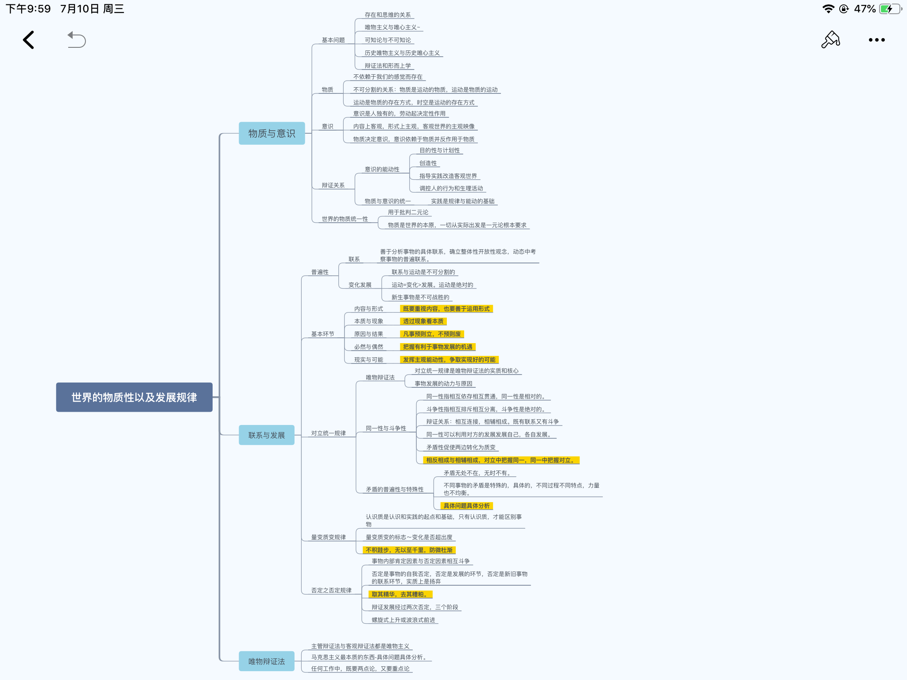
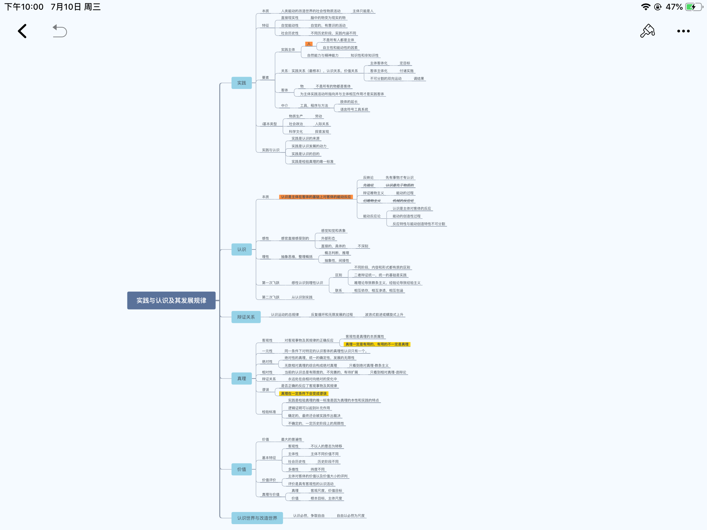
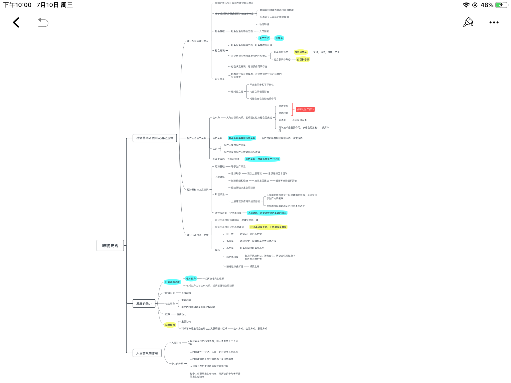
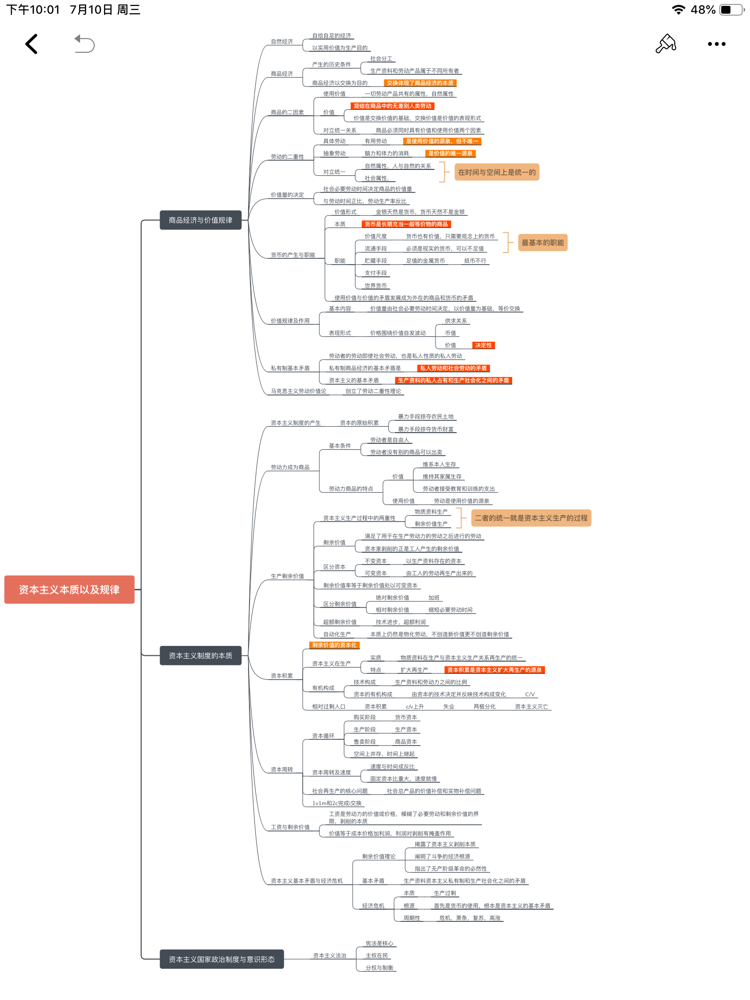
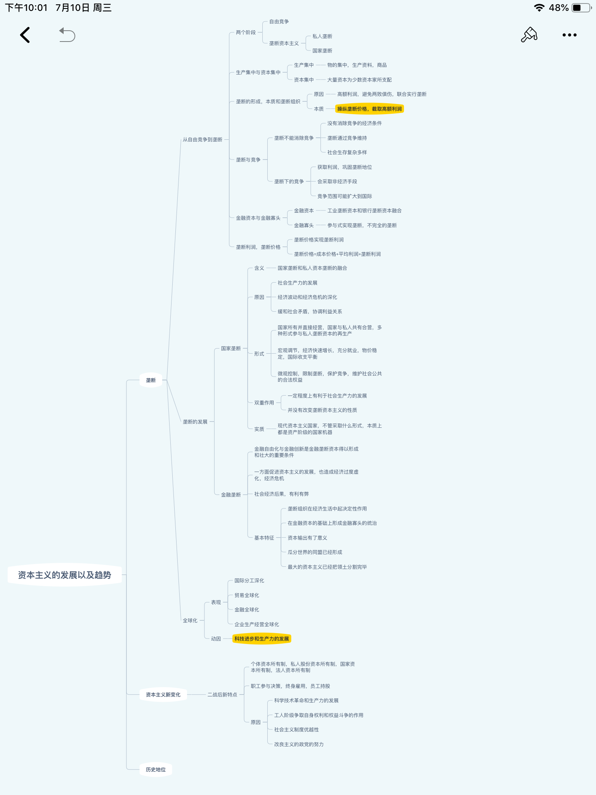
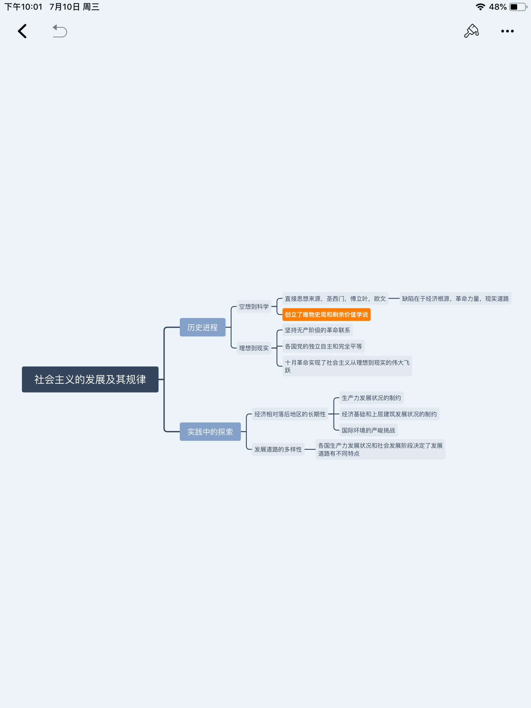
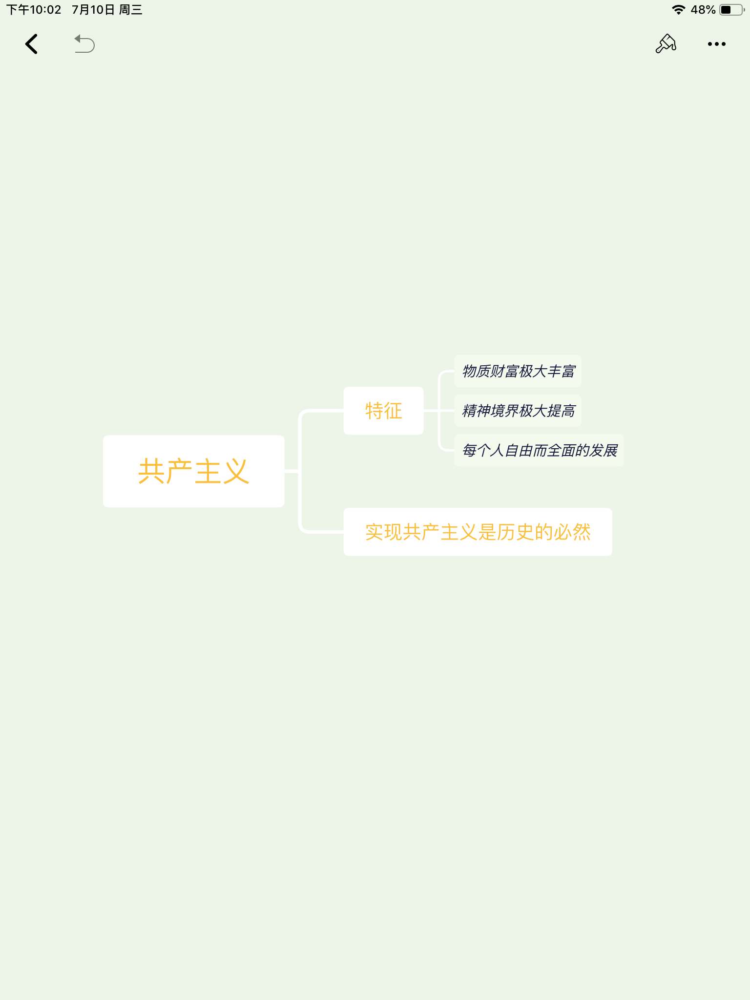

# 马原主观题预测与完整答案

> 适用目标：本学期主观题复习，重点覆盖 2 道论述题和 2 道材料分析题。  
> 使用原则：严格按老师给出的章节边界答题。材料分析题尤其不要跨章乱套原理。

## 0. 资料甄选结果

### 0.1 最优先资料

| 优先级 | 资料 | 用法 |
|---|---|---|
| S | 9 个课堂专题 PPT | 命题边界。老师讲过、PPT 出现过的材料和设问优先级最高 |
| S | 你提供的考试导读 | 直接决定主观题分布：第 1、4 章材料分析，第 2、3 章论述 |
| A | `马克思主义基本原理概论【主观题汇总】（16页）.pdf` | 答案骨架和标准表述来源 |
| A | `《马原》精简知识点【考试】（28页）.pdf` | 补充高频概念、易错表述 |
| A | `马原期末题目知识点总结.pdf` | 补充资本主义、社会主义、共产主义大题模板 |
| B | `2023《马原》题库（含答案）（58页）.pdf` | 主要用来查漏概念，不按选择题逐题背 |
| B | `《马克思主义基本原理》（2023年版）笔记和课后习题详解.pdf` | 内容太全，作为校对与扩展，不作为考前主线 |
| B | 思维导图图片 | 每章放入本文，用于考前快速回忆结构 |

### 0.2 不建议主背的资料

| 资料 | 原因 |
|---|---|
| 大部头课后习题详解 | 页数多，适合查漏，不适合最后阶段全背 |
| 题库 PDF | 选择题/概念题多，容易分散主观题精力 |
| 过于简略的 `马原.pdf` | 信息密度不足，只能做目录参考 |

## 1. 已知考试结构

| 题型 | 数量 | 对应章节 | 复习动作 |
|---|---:|---|---|
| 材料分析题 | 1 | 第 1 章 | 用哲学原理分析中国式现代化、和平发展、普遍性与特殊性、辩证否定等 |
| 论述题 | 1 | 第 2 章 | 重点背实践与认识、真理、价值、思想路线 |
| 论述题 | 1 | 第 3 章 | 重点背社会基本矛盾、生产力生产关系、经济基础上层建筑、人民群众 |
| 材料分析题 | 1 | 第 4 章 | 用劳动价值论、剩余价值论、自由竞争与垄断分析资本主义经济现象 |

> 纠错提醒：你听到的“生育价值”应为“剩余价值”。第 4 章答题必须使用政治经济学概念，不要把第 1 章的哲学原理硬套进去。

## 2. 七章导图总览

### 2.1 第 1 章：世界的物质性及发展规律



本章大题最可能考：物质与意识、规律客观性与主观能动性、矛盾分析法、矛盾普遍性与特殊性、辩证否定观、量变质变、主次矛盾与两点论重点论。

### 2.2 第 2 章：实践与认识及其发展规律



本章论述题最可能考：实践是认识的基础、认识运动的反复性和无限性、真理的绝对性与相对性、真理与价值、党的思想路线。

### 2.3 第 3 章：人类社会及其发展规律



本章论述题最可能考：社会存在与社会意识、生产力与生产关系、经济基础与上层建筑、社会基本矛盾、社会发展动力、人民群众是历史创造者。

### 2.4 第 4 章：资本主义的本质及规律



本章材料分析题最可能考：商品二因素、劳动二重性、价值规律、劳动力成为商品、剩余价值、不变资本与可变资本、资本积累、资本主义基本矛盾和经济危机。

### 2.5 第 5 章：资本主义的发展及趋势



防守题：自由竞争到垄断、垄断利润、国家垄断资本主义、经济全球化、当代资本主义新变化及其实质。

### 2.6 第 6 章：社会主义的发展及规律



防守题：科学社会主义一般原则、社会主义发展道路多样性、社会主义在曲折中前进。

### 2.7 第 7 章：共产主义崇高理想



防守题：共产主义基本特征、实现共产主义的长期性、远大理想和共同理想的关系。

## 3. 高概率材料分析题

### 3.1 材料分析题 1：用第 1 章哲学原理分析中国式现代化

**押题等级：S 级。**  
对应老师提示：第 1 章材料分析题，材料可能是习近平总书记关于中国式现代化的一段讲话。

#### 完整材料

材料一：

中国式现代化是走和平发展道路的现代化。我国不走一些国家通过战争、殖民、掠夺等方式实现现代化的老路，那种损人利己、充满血腥罪恶的老路给广大发展中国家人民带来深重苦难。我们坚定站在历史正确的一边、站在人类文明进步的一边，高举和平、发展、合作、共赢旗帜，在坚定维护世界和平与发展中谋求自身发展，又以自身发展更好维护世界和平与发展。

材料二：

西方资本主义现代化早期往往伴随资本原始积累。资本原始积累是生产者与生产资料相分离、货币资本迅速集中到少数人手中的历史过程。其主要途径包括暴力剥夺农民土地、殖民掠夺、贩卖奴隶、海外战争、关税保护、国债和专卖制度等。马克思指出，资本来到世间，从头到脚，每个毛孔都滴着血和肮脏的东西。

#### 可能设问

1. 结合材料，说明中国式现代化与西方资本主义现代化道路的根本区别。
2. 运用第 1 章相关哲学原理，分析中国式现代化为什么必须坚持和平发展道路。
3. 结合材料，说明应如何正确借鉴西方现代化经验。

#### 完整回答

第一，中国式现代化和西方资本主义现代化的根本区别，在于发展目的、发展方式和价值立场不同。西方资本主义现代化在早期往往以资本原始积累为起点，通过殖民扩张、暴力掠夺和对劳动人民的剥夺实现资本集中，本质上服务于资本增殖。中国式现代化坚持以人民为中心，走和平发展道路，不通过战争、殖民、掠夺转嫁发展成本，而是在维护世界和平与发展中谋求自身发展。

第二，这体现了矛盾普遍性与特殊性辩证关系原理。现代化具有普遍性，各国都要发展生产力、提高人民生活水平、推进社会进步；但现代化道路又具有特殊性，不同国家的历史传统、现实国情、社会制度和发展条件不同，不能照搬同一种模式。中国式现代化把现代化的一般规律同中国具体实际相结合，体现了“普遍性寓于特殊性之中、特殊性包含普遍性”的辩证关系。方法论上要求具体问题具体分析，不能把西方现代化道路绝对化、唯一化。

第三，这体现了辩证否定观。辩证否定不是简单抛弃，也不是全盘照搬，而是“扬弃”，即既克服又保留。对西方现代化经验，应吸收其发展生产力、推进科技进步、加强社会管理等有益成果，同时批判和摒弃殖民掠夺、资本至上、两极分化等历史弊端。中国式现代化不是对西方模式的复制，而是在批判吸收人类文明成果基础上的自主创造。

第四，这体现了规律客观性与主观能动性的统一。现代化建设必须尊重社会发展规律，不能脱离生产力发展水平、国情条件和人民需要；同时也要发挥人的主观能动性，坚持正确道路和制度安排。中国式现代化立足社会主义制度优势，主动选择和平发展、合作共赢，说明人们能够在尊重客观规律的基础上能动地改造世界。

第五，这体现了两点论和重点论的统一。认识西方现代化，既要看到其推动工业化、科技发展和生产力进步的一面，也要看到其殖民扩张、资本掠夺和社会不平等的一面；其中本质和主流是资本主义现代化服务于资本增殖。认识中国式现代化，既要看到发展任务艰巨，也要抓住其以人民为中心、和平发展、共同富裕的本质特征。

总之，中国式现代化不是简单复制西方道路，而是在马克思主义指导下，把现代化一般规律同中国具体实际相结合的社会主义现代化道路。它坚持和平发展、独立自主、合作共赢，为广大发展中国家提供了不同于西方殖民掠夺式现代化的新选择。

#### 考场压缩版

答题按“四段法”写：区别 - 原理 - 材料 - 结论。  
可用原理优先级：矛盾普遍性与特殊性 > 辩证否定观 > 规律客观性与主观能动性 > 两点论重点论。

### 3.2 材料分析题 2：用第 4 章分析平台经济、AI 与资本逻辑

**押题等级：S 级。**  
对应老师提示：第 4 章材料分析题，使用劳动价值论、剩余价值论、自由竞争和垄断资本主义概念，不要写成哲学题。

#### 完整材料

材料一：

某平台企业通过算法系统连接商家、骑手和消费者。消费者支付配送费和商品价格，平台从订单中抽取佣金，并通过算法压缩配送时间、提高接单强度。骑手表面上可以自由选择接单，但为了获得更高收入，往往需要长时间在线、连续接单。平台同时掌握订单分配、评价、流量和规则解释权。

材料二：

随着人工智能和自动化生产线的发展，一些企业用机器人替代部分工人，单位时间内生产的商品更多，单个商品成本下降。企业因此获得更高利润，但也出现部分工人失业、劳动强度提高、收入分化等现象。有人认为：“既然机器能生产商品，机器人也能创造价值和剩余价值。”

材料三：

少数大型数字平台通过数据、算法、资本和用户规模形成市场优势，逐渐控制流量入口和交易规则。它们一方面提高了交易效率，另一方面也可能通过排他协议、差别定价、并购竞争对手等方式限制竞争，获得高额利润。

#### 可能设问

1. 运用劳动价值论说明商品价值的源泉。
2. 结合材料分析剩余价值的来源，说明机器人能否成为剩余价值的源泉。
3. 结合自由竞争和垄断关系，分析平台经济中的垄断现象及其实质。

#### 完整回答

第一，商品具有使用价值和价值两个因素。使用价值是商品能够满足人的某种需要的属性，价值是凝结在商品中的无差别的一般人类劳动。生产商品的劳动具有二重性：具体劳动创造使用价值，抽象劳动形成价值。因此，价值的唯一源泉是劳动，准确说是抽象劳动，而不是机器、算法、资本本身。

第二，劳动力成为商品是货币转化为资本的前提。劳动力商品的特殊使用价值在于，它不仅能创造自身价值，而且能创造超过自身价值的价值。资本家购买劳动力后，在生产过程中让劳动者劳动超过补偿劳动力价值所必需的时间，由此产生剩余价值。剩余价值是雇佣工人在剩余劳动时间内创造的、被资本家无偿占有的超过劳动力价值以上的那部分新价值。

第三，机器人和人工智能不能成为价值和剩余价值的源泉。机器、算法、平台系统属于生产资料，它们的价值只能通过具体劳动转移到新产品或服务中，不能自行创造新价值。人工智能可以提高劳动生产率、降低个别商品价值，使个别企业获得超额剩余价值，但这种超额剩余价值仍然来源于劳动者的剩余劳动。从全社会看，机器普遍使用会提高资本有机构成，减少可变资本比重，加剧资本主义就业矛盾和经济危机。

第四，平台经济中的平台规则、算法派单和评价体系，表面上是技术管理，实质上体现了资本对劳动过程的控制。骑手虽然形式上具有接单自由，但在平台规则、收入压力和评价机制下，其劳动过程被算法组织和强化。平台通过占有数据、流量、交易入口和规则制定权，获取佣金和利润，本质上仍然体现资本对劳动者剩余劳动的占有。

第五，自由竞争会引起生产集中和资本集中，生产集中发展到一定阶段就会形成垄断。垄断并不消灭竞争，而是在更高层次、更复杂形式上与竞争并存。平台企业通过规模效应、数据优势、资本并购和技术壁垒形成垄断地位，可以借助垄断高价、垄断低价、佣金规则和排他协议获得垄断利润。垄断利润归根到底仍来源于对劳动者的剥削、对非垄断企业利润的转移、对消费者和商家的控制，以及国家和社会资源再分配中的有利地位。

第六，当代资本主义的新变化没有改变资本主义制度的本质。数字技术、人工智能、平台经济提高了生产力，也改变了资本组织形式，但资本主义私人占有制、生产社会化与生产资料私人占有之间的基本矛盾仍然存在。只要生产目的仍是资本增殖，技术进步就可能同时带来效率提高和劳动者处境恶化。

总之，分析平台经济和人工智能，不能停留在技术表象上，而要看到背后的资本逻辑。劳动是价值的唯一源泉，剩余价值来源于雇佣劳动者的剩余劳动；垄断是资本集中发展的结果，平台垄断是当代资本主义垄断的新表现。

#### 考场压缩版

答题关键词：商品二因素 - 劳动二重性 - 劳动力商品 - 剩余价值 - 机器不创造新价值 - 超额剩余价值 - 自由竞争导致垄断 - 垄断利润 - 资本主义基本矛盾。

### 3.3 材料分析备选：资本原始积累与中国式现代化

**押题等级：A 级。**  
如果老师把“中国式现代化与西方现代化”放到第 4 章来考，就要少写哲学，多写资本主义经济制度。

#### 完整材料

西方资本主义生产关系的形成伴随资本原始积累。资本原始积累的主要途径包括用暴力剥夺农民土地，用殖民、奴隶贸易、战争、国债、专卖制度等方式掠夺货币财富。资本原始积累使大量劳动者同生产资料相分离，也使货币资本集中到少数人手中。与此不同，中国式现代化强调和平发展、合作共赢和共同富裕，不走殖民掠夺的老路。

#### 可能设问

1. 什么是资本原始积累？其主要途径是什么？
2. 为什么说资本主义所有制体现资本与雇佣劳动之间剥削与被剥削的关系？
3. 中国式现代化与西方资本主义现代化有何根本区别？

#### 完整回答

资本原始积累是生产者与生产资料相分离、货币资本迅速集中到少数人手中的历史过程。其主要途径是用暴力手段剥夺农民土地，以及用殖民掠夺、奴隶贸易、海外战争、关税保护、国债和专卖制度等方式掠夺货币财富。资本原始积累不是温和的财富积累，而是充满暴力和掠夺的历史过程。

资本原始积累为资本主义生产方式准备了两个基本条件：一方面，大量劳动者失去生产资料，只能出卖劳动力；另一方面，大量货币财富集中到少数人手中，转化为资本。劳动力成为商品，是货币转化为资本的前提。劳动力商品的特殊性在于其使用价值能够创造比自身价值更大的价值，这就是剩余价值的来源。

资本主义所有制的本质是生产资料归资本家私人占有。资本家占有生产资料，劳动者不占有生产资料，只能出卖劳动力。资本家通过购买劳动力并控制劳动过程，无偿占有工人在剩余劳动时间创造的剩余价值。因此，资本主义所有制体现的是资本家对雇佣工人的剥削关系。

西方资本主义现代化以资本原始积累和资本增殖为重要历史前提，往往伴随殖民扩张、战争掠夺和对劳动者的剥夺。中国式现代化坚持社会主义方向，坚持以人民为中心，强调和平发展、共同富裕和合作共赢，不通过掠夺他国和牺牲劳动人民利益来完成现代化。这是两种现代化道路在制度基础、价值目标和发展方式上的根本区别。

## 4. 高概率论述题：第 2 章

### 4.1 论述题 1：为什么说实践是认识的基础？

**押题等级：S 级。**

#### 题目

试述实践是认识的基础，并说明这一原理对坚持理论联系实际、反对教条主义和经验主义的意义。

#### 完整回答

实践是主体能动地改造和探索客体的客观物质活动。马克思主义认识论认为，实践是认识的基础，对认识具有决定作用。

第一，实践是认识的来源。人的认识内容归根到底来源于实践。无论是直接经验还是间接经验，最终都来自人类的社会实践。离开实践，认识就会成为无源之水、无本之木。

第二，实践是认识发展的动力。实践不断提出新的问题和需要，推动人们进行新的探索；实践的发展还提供新的工具、手段和条件，使人的认识不断扩展和深化。科学技术发展、社会变革和生产实践都会推动认识进步。

第三，实践是检验认识真理性的唯一标准。认识是否正确，不是由主观愿望、权威说法或书本规定来决定，而要看它能否在实践中达到预期效果、是否符合客观实际。实践具有直接现实性，能够把主观认识同客观结果联系起来。

第四，实践是认识的目的。认识世界的最终目的在于指导实践、改造世界。理论如果不能回到实践、服务实践，就失去了应有意义。

这一原理要求我们坚持理论联系实际。理论联系实际，就是把马克思主义基本原理同具体实际结合起来，用理论指导实践，又在实践中检验和发展理论。它要求反对两种错误倾向：一是教条主义，只重书本和抽象理论，脱离实际，生搬硬套；二是经验主义，只重局部经验和直接感受，轻视科学理论指导。

总之，实践观点是马克思主义认识论的首要和基本观点。坚持实践是认识的基础，才能做到一切从实际出发、实事求是，在实践中检验真理和发展真理。

### 4.2 论述题 2：真理的绝对性和相对性的辩证关系

**押题等级：A 级。**

#### 题目

试述真理的绝对性和相对性的辩证关系，并说明为什么必须在实践中坚持和发展真理。

#### 完整回答

真理是人们对客观事物及其规律的正确反映。真理既具有绝对性，又具有相对性，是绝对性和相对性的统一。

真理的绝对性有两层含义。第一，任何真理都包含不依赖于主体的客观内容，都是对客观事物及其规律的正确反映。第二，人类认识能够不断接近无限发展的客观世界，每一个真理性认识都是向绝对真理的接近。

真理的相对性也有两层含义。第一，任何真理性认识在广度上都是有限的，只能认识一定范围内的对象。第二，任何真理性认识在深度上也是有限的，受历史条件、实践水平和认识能力限制，不可能一次穷尽对象的全部本质。

真理的绝对性和相对性是辩证统一的。第一，二者相互依存。没有绝对性，相对真理就失去客观内容；没有相对性，人类认识就会变成一次完成的僵死体系。第二，二者相互包含、相互渗透。相对真理中包含绝对真理的颗粒，绝对真理通过无数相对真理表现出来。第三，相对真理在实践中不断发展，逐步向绝对真理转化。

这一原理要求我们既反对绝对主义，又反对相对主义。绝对主义把已有认识看成一成不变的终极真理，容易导致教条主义；相对主义否认真理中的客观内容，容易导致怀疑主义和诡辩论。正确态度是在实践中坚持真理，又随着实践发展不断丰富和发展真理。

马克思主义不是僵化教条，而是随着时代、实践和科学发展而不断发展的科学理论。坚持真理和发展真理统一，才能做到实事求是、与时俱进。

### 4.3 论述题 3：党的思想路线与马克思主义认识论

**押题等级：A 级。**

#### 题目

试述党的思想路线，并说明马克思主义认识论是党的思想路线的理论基础。

#### 完整回答

党的思想路线是：一切从实际出发，理论联系实际，实事求是，在实践中检验真理和发展真理。

第一，一切从实际出发体现了物质决定意识、实践决定认识的基本要求。认识和决策必须以客观实际为依据，不能从主观愿望、抽象原则或本本出发。

第二，理论联系实际体现了认识与实践的统一。科学理论来自实践，又必须回到实践中指导实际工作。脱离实际的理论会变成教条，没有理论指导的实践也容易陷入盲目经验。

第三，实事求是是党的思想路线的核心，也是马克思主义认识论的精髓。实事求是要求从客观存在的事物出发，探求事物的内部联系和发展规律，并按照规律办事。

第四，在实践中检验真理和发展真理，体现了实践是检验真理的唯一标准。一个认识是否正确，最终要由实践来检验；实践发展了，认识也要随之发展。

因此，马克思主义认识论为党的思想路线提供了理论基础。坚持党的思想路线，就是坚持实践第一、实事求是、理论联系实际和与时俱进。

## 5. 高概率论述题：第 3 章

### 5.1 论述题 1：社会基本矛盾及其运动规律

**押题等级：S 级。**

#### 题目

试述生产力与生产关系、经济基础与上层建筑的辩证关系，并说明社会基本矛盾在社会发展中的作用。

#### 完整回答

社会基本矛盾是生产力和生产关系、经济基础和上层建筑之间的矛盾。这两对矛盾贯穿人类社会发展始终，是推动社会发展的根本动力。

第一，生产力决定生产关系。生产力是人类改造自然、获取物质生活资料的能力，包括劳动者、劳动资料和劳动对象。生产力的性质决定生产关系的性质，生产力的发展要求生产关系作出相应调整。生产关系包括生产资料所有制、人们在生产中的地位和关系、产品分配方式，其中生产资料所有制是生产关系的基础。

第二，生产关系反作用于生产力。当生产关系适合生产力发展要求时，就促进生产力发展；当生产关系不适合生产力发展要求时，就阻碍生产力发展。生产力和生产关系的矛盾运动表现为由基本适合到基本不适合，再到新的基础上的基本适合。

第三，经济基础决定上层建筑。经济基础是一定社会中占统治地位的生产关系总和。上层建筑包括政治法律制度、国家政权以及社会意识形态。经济基础决定上层建筑的产生、性质和变化。

第四，上层建筑反作用于经济基础。当上层建筑适合经济基础要求，并为先进经济基础服务时，就促进社会发展；当它不适合经济基础要求，或者维护落后的经济基础时，就阻碍社会发展。

第五，社会基本矛盾是社会发展的根本动力。生产力与生产关系、经济基础与上层建筑之间的矛盾运动，推动社会形态更替和社会制度变革。在阶级社会中，社会基本矛盾往往通过阶级斗争表现出来；在社会主义社会中，则通过改革等方式不断调整生产关系和上层建筑中不适应生产力发展的方面。

现实意义在于，推进中国式现代化和全面深化改革，必须坚持解放和发展生产力，调整不适应生产力发展的体制机制，使生产关系和上层建筑更好适应经济基础和生产力发展要求。

### 5.2 论述题 2：人民群众是历史的创造者

**押题等级：A 级。**

#### 题目

试述人民群众是历史创造者的原理，并说明坚持群众观点和群众路线的意义。

#### 完整回答

人民群众是指推动历史发展的绝大多数社会成员。马克思主义唯物史观认为，人民群众是历史的创造者，是社会历史发展的决定力量。

第一，人民群众是社会物质财富的创造者。物质资料生产是人类社会存在和发展的基础，广大劳动群众是物质生产活动的主体。他们通过劳动创造衣食住行等物质财富，为社会发展提供基础。

第二，人民群众是社会精神财富的创造者。人民群众的实践活动为精神文化创造提供源泉和材料，人民群众的经验、智慧和需要推动科学、文化、艺术和思想的发展。杰出人物的创造也离不开人民群众的实践基础。

第三，人民群众是社会变革的决定力量。社会变革归根到底是人民群众推动的。人民群众在革命、改革和建设实践中推动生产关系和上层建筑变革，推动社会由低级向高级发展。

第四，承认人民群众创造历史，并不否认杰出人物的作用。杰出人物能够在一定历史条件下推动历史进程，但他们的作用不能脱离社会条件和人民群众实践。历史不是少数英雄任意创造的。

这一原理要求坚持群众观点和群众路线。群众观点包括相信人民群众自己解放自己、全心全意为人民服务、向人民群众负责、向人民群众学习。群众路线就是一切为了群众，一切依靠群众，从群众中来，到群众中去。坚持群众路线，是党的根本工作路线，也是推进中国特色社会主义事业的重要保证。

### 5.3 论述题 3：社会存在和社会意识

**押题等级：A 级。**

#### 题目

试述社会存在和社会意识的辩证关系，并说明发展社会主义先进文化的意义。

#### 完整回答

社会存在是社会生活的物质方面，主要包括地理环境、人口因素和生产方式，其中生产方式起决定作用。社会意识是社会生活的精神方面，包括政治法律思想、道德、艺术、宗教、哲学等。

第一，社会存在决定社会意识。社会意识的内容归根到底来源于社会存在，社会存在的变化发展决定社会意识的变化发展。不同社会的经济生活、生产方式和社会关系，会形成不同的思想观念和价值体系。

第二，社会意识具有相对独立性。社会意识的发展同社会存在的发展并不总是完全同步，可能落后于社会存在，也可能超前反映社会发展趋势。不同社会意识形式之间还会相互影响。

第三，社会意识反作用于社会存在。先进的社会意识能够正确反映社会发展规律，对社会发展起促进作用；落后的社会意识则会阻碍社会发展。

发展社会主义先进文化，就是发展面向现代化、面向世界、面向未来的，民族的科学的大众的社会主义文化。它能够培育民族精神和时代精神，形成共同理想信念，增强社会凝聚力，推动教育、科技和思想道德建设，为现代化建设提供精神动力和智力支持。

## 6. 第 4 章经济学高频论述备选

### 6.1 商品二因素和劳动二重性

#### 题目

试述商品二因素与劳动二重性的关系，说明马克思劳动价值论的意义。

#### 完整回答

商品是用来交换的劳动产品，具有使用价值和价值两个因素。使用价值是商品能够满足人的某种需要的属性，是商品的自然属性；价值是凝结在商品中的无差别的一般人类劳动，是商品的社会属性。商品是使用价值和价值的统一。

生产商品的劳动具有二重性：具体劳动和抽象劳动。具体劳动是在一定具体形式下进行的劳动，创造商品的使用价值；抽象劳动是撇开具体形式的一般人类劳动，形成商品的价值。劳动二重性决定商品二因素，是理解马克思劳动价值论的枢纽。

劳动价值论揭示了商品价值的源泉是劳动，揭示了商品经济运行的基本规律，为剩余价值理论奠定基础。只有明确价值由劳动创造，才能进一步说明资本主义利润、利息、地租等收入形式归根到底来源于劳动者创造的剩余价值。

### 6.2 价值规律及其作用

#### 题目

试述价值规律的内容、表现形式及作用。

#### 完整回答

价值规律是商品经济的基本规律。它的基本内容是：商品的价值量由生产商品的社会必要劳动时间决定，商品交换以价值量为基础，按照等价交换原则进行。

价值规律的表现形式是价格围绕价值上下波动。价格受供求关系影响，可能高于或低于价值，但从长期和整体看，价格仍以价值为基础。

价值规律的作用主要有三点。第一，自发调节生产资料和劳动力在社会各生产部门之间的分配。第二，刺激商品生产者改进技术、改善经营管理、提高劳动生产率。第三，引起商品生产者优胜劣汰和两极分化。

在私有制商品经济中，价值规律的作用具有自发性和盲目性，可能导致贫富分化和经济波动。在社会主义市场经济条件下，要利用价值规律的积极作用，同时加强宏观调控，防止市场失灵。

### 6.3 剩余价值生产

#### 题目

试述剩余价值的来源，说明资本主义生产过程为什么是劳动过程和价值增殖过程的统一。

#### 完整回答

剩余价值是雇佣工人在剩余劳动时间内创造的、被资本家无偿占有的超过劳动力价值以上的那部分新价值。剩余价值体现资本家和雇佣工人之间剥削与被剥削的关系。

劳动力成为商品是货币转化为资本的前提。劳动力商品具有特殊使用价值：它不仅能创造自身价值，而且能创造超过自身价值的价值。资本家购买劳动力，并在生产过程中让工人劳动超过补偿劳动力价值所必需的时间，由此产生剩余价值。

资本主义生产过程具有二重性。一方面，它是劳动过程，工人在资本家监督下使用生产资料生产使用价值。另一方面，它是价值增殖过程，工人的劳动不仅转移生产资料旧价值、创造补偿劳动力价值的新价值，而且创造剩余价值。资本主义生产的直接目的和决定性动机，就是无休止追求剩余价值。

区分不变资本和可变资本具有重要意义。不变资本以生产资料形式存在，在生产中只转移原有价值；可变资本用于购买劳动力，在生产中能够创造新价值和剩余价值。剩余价值的真正源泉是可变资本，即雇佣工人的剩余劳动。

## 7. 第 5-7 章防守题

### 7.1 垄断资本主义的基本经济特征

#### 题目

垄断资本主义的基本经济特征是什么？为什么说垄断没有消除竞争？

#### 完整回答

垄断资本主义的基本经济特征包括：垄断组织在经济生活中占统治地位；金融资本和金融寡头形成；资本输出具有特别重要意义；国际垄断同盟从经济上瓜分世界；主要资本主义国家从领土上瓜分和重新瓜分世界。

垄断没有消除竞争。首先，竞争是商品经济和市场经济存在发展的基本机制，只要商品经济存在，竞争就不会消失。其次，垄断资本主义社会中仍存在大量非垄断企业，它们之间以及它们同垄断组织之间存在竞争。再次，垄断组织之间也会围绕市场、原料、技术、资本输出和利润展开竞争。因此，垄断阶段的竞争不是消失，而是形式更复杂、范围更广、程度更激烈。

### 7.2 当代资本主义新变化及其实质

#### 题目

如何正确认识当代资本主义的新变化？

#### 完整回答

当代资本主义在生产力、生产关系和上层建筑方面都发生了一些新变化。生产力方面，科技革命推动劳动生产率提高和社会财富增长。生产关系方面，资本主义国家在所有制关系、劳资关系和分配关系方面进行了一些调整。上层建筑方面，资本主义国家建立了较成熟的政治法律制度，并加强国家干预和社会管理。

这些变化的原因包括：科学技术革命和生产力发展；工人阶级争取权利和利益的斗争；社会主义制度影响；改良主义政党和国家政策调节。

但这些新变化没有改变资本主义制度的本质。资本主义经济基础仍是生产资料私人占有制，资本主义生产社会化与生产资料私人占有之间的基本矛盾仍然存在，经济危机根源仍然存在。资本主义国家的社会改良没有改变资本主义生产关系的根本性质。

因此，对当代资本主义要坚持两点论：既看到其新变化和可借鉴的积极因素，也要看到这些变化没有改变资本主义剥削制度和基本矛盾。

### 7.3 科学社会主义一般原则

#### 题目

如何正确把握科学社会主义一般原则？

#### 完整回答

科学社会主义一般原则揭示了社会主义事业发展的基本规律，是马克思主义政党领导人民进行社会主义革命、建设、改革的基本遵循。

第一，必须始终坚持科学社会主义一般原则，反对背离这些原则的错误倾向。这些原则阐明资本主义必然灭亡、社会主义必然胜利的历史趋势，指明社会主义事业方向。

第二，要善于把科学社会主义一般原则同本国实际相结合。马克思主义不是教条，而是行动指南。各国国情、历史传统、文化条件和发展阶段不同，必须探索适合本国实际的社会主义道路。

第三，要紧跟时代和实践发展，在总结新鲜经验中丰富和发展科学社会主义一般原则。社会主义实践不是一成不变的，必须在理论创新和实践创新中推进马克思主义发展。

### 7.4 共产主义基本特征

#### 题目

共产主义社会的基本特征是什么？为什么说实现共产主义是长期过程？

#### 完整回答

共产主义社会的基本特征包括：社会生产力高度发展、物质财富极大丰富；生产资料社会公有并有计划地组织生产；个人消费品实行各尽所能、按需分配；全体社会成员精神境界极大提高；阶级彻底消灭，国家自行消亡；每个人自由而全面发展。

实现共产主义是长期过程。第一，从社会发展规律看，新旧社会制度更替都要经历长期历史过程。第二，从社会基本矛盾运动看，生产关系变革依赖生产力高度发展，而生产力发展不能超越历史阶段。第三，从新生事物成长规律看，社会主义和共产主义事业会经历曲折和反复，需要在实践中不断完善。社会主义是共产主义的低级阶段，是走向共产主义的必由之路，必须通过长期社会主义建设为共产主义创造条件。

## 8. 考场答题模板

### 8.1 材料分析题模板

```text
第一步：点题。
材料反映了……问题，应该用……原理分析。

第二步：写原理。
该原理认为：……

第三步：扣材料。
材料中……说明……；材料中……体现……。

第四步：下结论。
因此，我们应当……；这说明……
```

### 8.2 论述题模板

```text
第一，解释概念。
第二，展开基本关系或基本内容。
第三，说明方法论意义。
第四，联系现实或课程结论。
```

### 8.3 禁区

| 禁区 | 为什么危险 |
|---|---|
| 第 1 章材料只写政治口号 | 老师要求哲学原理支撑 |
| 第 4 章材料写矛盾分析法、群众史观 | 会被认为没有用政治经济学概念 |
| 把机器/AI 写成价值源泉 | 劳动价值论中价值源泉是劳动 |
| 把垄断写成竞争消失 | 垄断和竞争并存 |
| 只背结论不扣材料 | 材料分析题必须逐句回应材料 |

## 9. 最后 30 分钟背诵清单

### 9.1 第 1 章材料题

```text
矛盾普遍性与特殊性：现代化有共同规律，但各国道路不同；中国式现代化是普遍性与中国特殊性的统一。
辩证否定观：对西方现代化经验要扬弃，既吸收文明成果，又批判殖民掠夺和资本至上。
规律客观性与主观能动性：尊重现代化规律，发挥主体选择和平发展道路的能动性。
两点论重点论：既看西方现代化的生产力进步，也看其殖民掠夺本质；重点把握中国式现代化的人民性与和平性。
```

### 9.2 第 2 章论述题

```text
实践是认识的来源、动力、检验标准、目的。
认识运动：实践 - 认识 - 再实践 - 再认识，循环往复、无限发展。
真理：客观性、绝对性、相对性；坚持真理与发展真理统一。
党的思想路线：一切从实际出发，理论联系实际，实事求是，在实践中检验真理和发展真理。
```

### 9.3 第 3 章论述题

```text
社会存在决定社会意识，社会意识反作用于社会存在。
生产力决定生产关系，生产关系反作用于生产力。
经济基础决定上层建筑，上层建筑反作用于经济基础。
社会基本矛盾是社会发展的根本动力。
人民群众是物质财富、精神财富的创造者，是社会变革的决定力量。
```

### 9.4 第 4 章材料题

```text
商品二因素：使用价值和价值。
劳动二重性：具体劳动创造使用价值，抽象劳动形成价值。
价值规律：价值量由社会必要劳动时间决定，价格围绕价值波动。
劳动力成为商品是货币转化为资本的前提。
剩余价值来自雇佣工人的剩余劳动。
机器/AI不创造新价值，只转移旧价值；超额剩余价值仍来源于劳动。
自由竞争导致生产集中和资本集中，集中到一定程度形成垄断。
垄断没有消灭竞争，垄断利润最终仍来源于劳动人民创造的价值。
```
