# 《Python数学建模算法与应用》考前精简题册（含解题步骤）

> 来源目录：`O:/Source/数模/`
>
> 图片目录：`assets/math_test/`
>
> 这版已经删掉了“查一查/泛泛概念/数据不完整且不适合明天硬做”的题，只保留能练模型、公式、步骤和高频考点的题。每题都给出可直接照着写的解题步骤。

---

## 第一部分：机器学习与数据分析

### A01 线性回归：75 平米房价预测

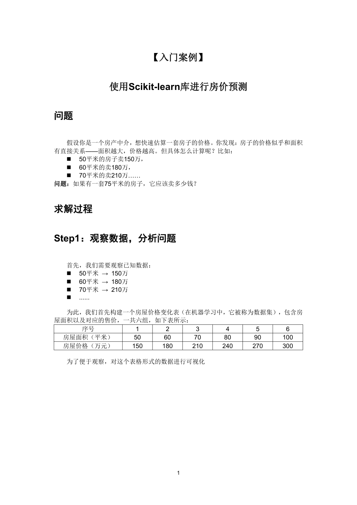

**题目：**已知 50、60、70、80、90、100 平米房价分别为 150、180、210、240、270、300 万元，预测 75 平米房价。

**解题步骤：**

1. 设自变量 $x$ 为房屋面积，因变量 $y$ 为房屋价格。
2. 建立一元线性回归模型：

$$
y=ax+b
$$

3. 观察数据：每增加 10 平米，价格增加 30 万元，所以斜率：

$$
a=\frac{30}{10}=3
$$

4. 代入点 $(50,150)$：

$$
150=3\times 50+b \Rightarrow b=0
$$

5. 预测 75 平米：

$$
y=3\times75=225
$$

**答案：**75 平米预测房价为 **225 万元**。

**易错点：**`X` 在 sklearn 里要写成二维，如 `[[75]]`，不是 `[75]`。

---

### A02 把线性回归写成最优化问题

**题目：**解释下面目标函数表达什么：

$$
\min_{a,b}\sum_i (y_i-ax_i-b)^2
$$

**解题步骤：**

1. $ax_i+b$ 是第 $i$ 个样本的预测值。
2. $y_i$ 是第 $i$ 个样本的真实值。
3. $y_i-ax_i-b$ 是预测误差。
4. 平方后变成平方误差，避免正负抵消。
5. 对所有样本求和，表示总误差。
6. 让总误差最小，就是找最合适的 $a,b$。

**一句话答案：**线性回归训练模型，本质就是找一条直线，让所有点到这条线的误差平方和最小。

---

### A03 KNN 水果分类计算题

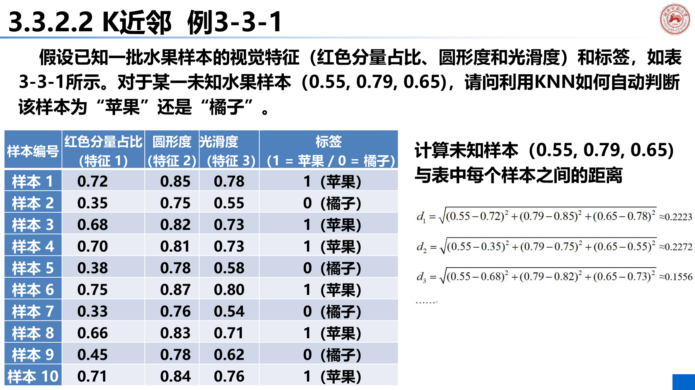

**题目：**未知水果样本为 $(0.55,0.79,0.65)$，根据已知样本，用 KNN 判断是苹果还是橘子。

**解题步骤：**

1. 选距离公式，通常用欧氏距离：

$$
d(x,z)=\sqrt{(x_1-z_1)^2+(x_2-z_2)^2+(x_3-z_3)^2}
$$

2. 分别计算未知样本到每个训练样本的距离。
3. 按距离从小到大排序。
4. 取最近的 $k$ 个样本。题中讲解取 $k=5$。
5. 看 5 个邻居里哪个类别多，多数投票。

**关键答案：**PDF 给出的最近 5 个样本是 3、4、5、8、9，其中苹果 3 个、橘子 2 个，所以判断为 **苹果**。

**易错点：**KNN 没有真正“训练出公式”，它是靠距离找邻居；$k$ 不能太小也不能太大。

---

### A04 混淆矩阵与分类指标

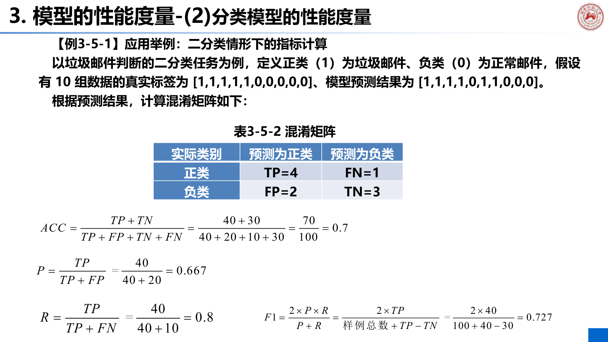

**题目：**真实标签为 `[1,1,1,1,1,0,0,0,0,0]`，预测为 `[1,1,1,1,0,1,1,0,0,0]`，正类为垃圾邮件。求混淆矩阵、Accuracy、Precision、Recall、F1。

**解题步骤：**

1. 逐个比较真实值和预测值。
2. 得到：

$$
TP=4,\quad FN=1,\quad FP=2,\quad TN=3
$$

3. 准确率：

$$
ACC=\frac{TP+TN}{TP+FP+TN+FN}=\frac{4+3}{10}=0.7
$$

4. 查准率：

$$
P=\frac{TP}{TP+FP}=\frac{4}{4+2}=0.667
$$

5. 查全率：

$$
R=\frac{TP}{TP+FN}=\frac{4}{4+1}=0.8
$$

6. F1：

$$
F1=\frac{2PR}{P+R}\approx 0.727
$$

**答案：**$ACC=0.7$，$P\approx0.667$，$R=0.8$，$F1\approx0.727$。

**易错点：**Precision 看“预测为正的里面有多少真正”，Recall 看“真实为正的里面找回多少”。

---

### A05 PCA：为什么取协方差矩阵的特征向量？

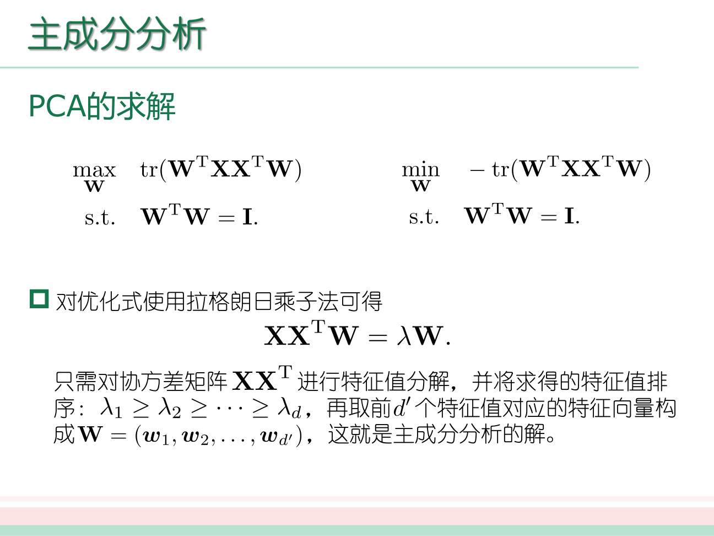

**题目：**说明 PCA 的求解步骤：为什么做协方差矩阵特征值分解，为什么取前几个特征向量。

**解题步骤：**

1. 先对数据中心化：每个变量减去均值。
2. 计算协方差矩阵 $S$，它描述变量之间一起变化的程度。
3. 对 $S$ 做特征值分解：

$$
S u_i=\lambda_i u_i
$$

4. 特征向量 $u_i$ 表示新的坐标轴方向。
5. 特征值 $\lambda_i$ 表示数据投影到该方向后的方差大小。
6. 方差越大，说明保留的信息越多，所以按特征值从大到小排序。
7. 取前 $k$ 个特征值对应的特征向量，组成投影矩阵。

**一句话答案：**PCA 就是换一组新坐标轴，优先保留数据最分散、信息最多的方向。

---

### A06 变量聚类：服装标准制定

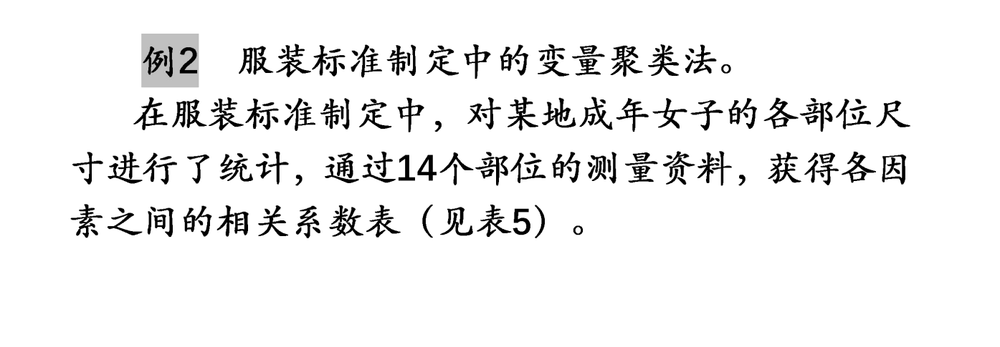

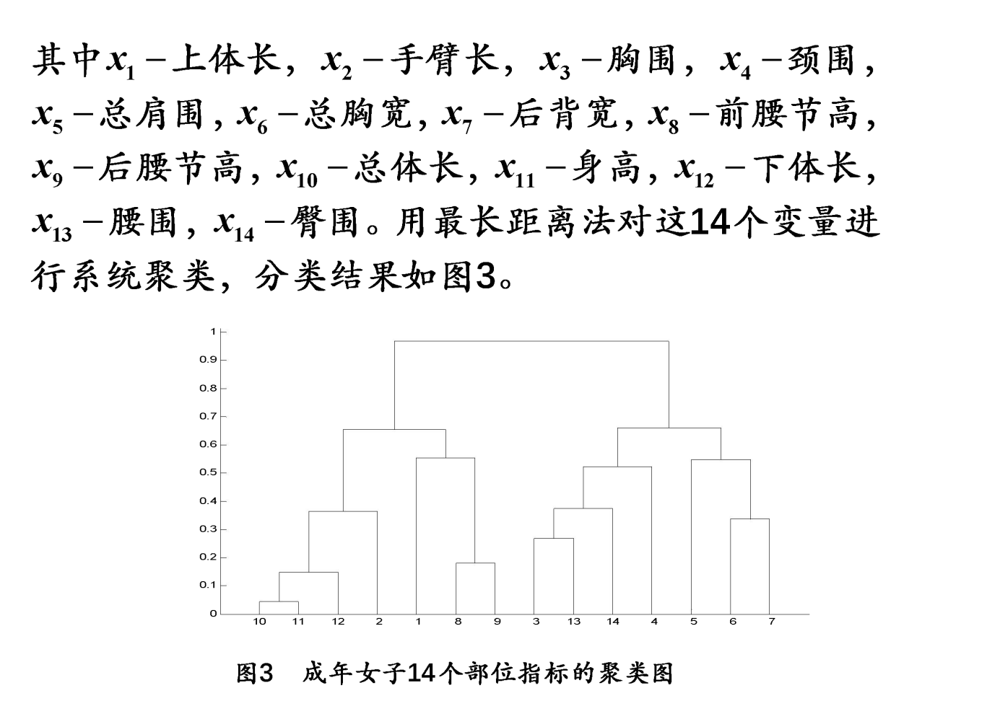

**题目：**根据 14 个身体部位指标的相关系数表，对变量做聚类。

**解题步骤：**

1. 注意这是 R 型聚类：聚的是“变量/指标”，不是“样本/人”。
2. 相关系数越大，说明两个变量越相似。
3. 可把距离定义为：

$$
d_{ij}=1-|r_{ij}|
$$

4. 从距离最小的两个变量开始合并。
5. 不断合并，直到得到聚类树。
6. 根据聚类图横向高度选择切割位置，得到若干类指标。

**考点：**R 型聚类、相关系数、系统聚类图。

**易错点：**Q 型聚类是聚样本，R 型聚类是聚变量。

---

## 第二部分：线性规划与整数规划

### B01 线性规划建模模板

**题目：**写出线性规划模型的一般形式，并说明各部分含义。

**解题步骤：**

1. 找决策变量：问题要你决定什么，就设什么为变量。
2. 写目标函数：最大利润或最小成本。
3. 写约束条件：资源、需求、容量、比例等限制。
4. 写非负约束或取值范围。

**标准形式：**

$$
\max / \min \quad z=c_1x_1+c_2x_2+\cdots+c_nx_n
$$

$$
\begin{cases}
a_{11}x_1+\cdots+a_{1n}x_n\le b_1\\
\cdots\\
a_{m1}x_1+\cdots+a_{mn}x_n\le b_m\\
x_i\ge 0
\end{cases}
$$

**易错点：**目标函数和约束都必须是线性的；出现“是否选择”通常要用 0-1 变量。

---

### B02 0-1 背包与普通背包

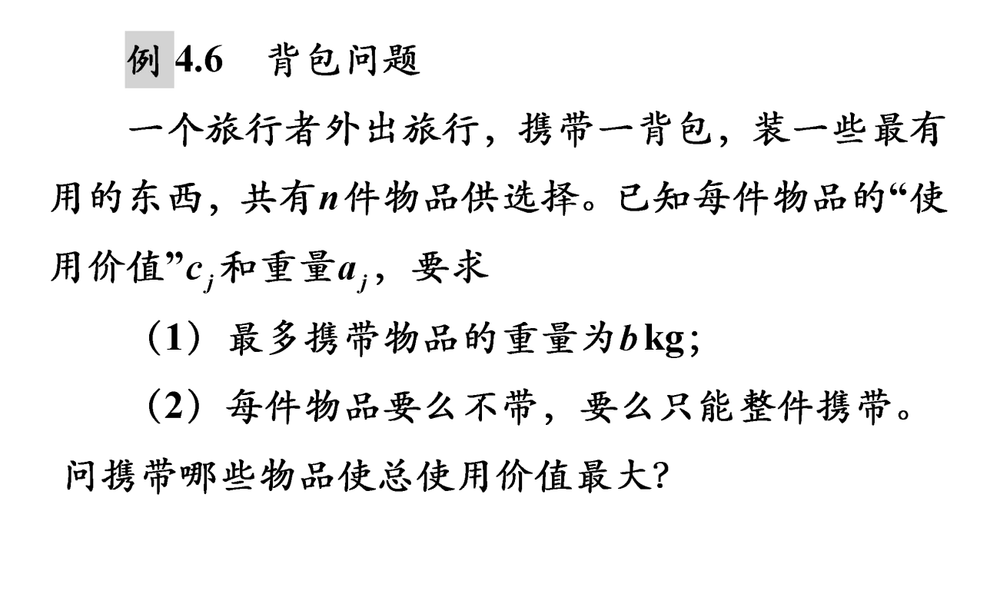

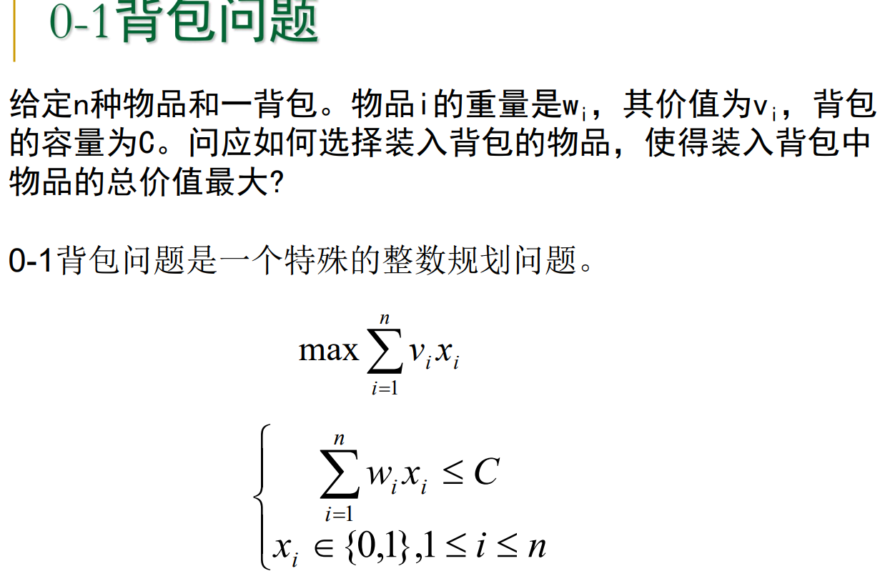

**题目：**有 $n$ 件物品，价值 $c_j$，重量 $a_j$，背包容量 $b$。每件物品要么不带，要么整件带，问总价值最大。

**解题步骤：**

1. 设变量：

$$
x_j=\begin{cases}1,&\text{带第 }j\text{ 件物品}\\0,&\text{不带}
\end{cases}
$$

2. 写目标函数：

$$
\max \sum_{j=1}^n c_jx_j
$$

3. 写容量约束：

$$
\sum_{j=1}^n a_jx_j\le b
$$

4. 写 0-1 约束：

$$
x_j\in\{0,1\}
$$

**普通背包区别：**如果物品可以带一部分，则 $0\le x_j\le1$，可以按单位价值 $c_j/a_j$ 贪心。

---

### B03 标准指派问题

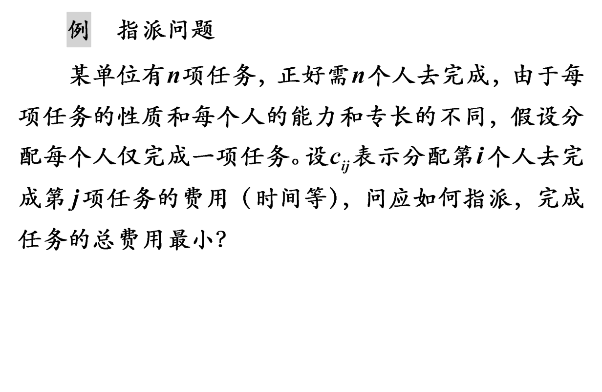

**题目：**$n$ 个人完成 $n$ 项任务，$c_{ij}$ 表示第 $i$ 个人做第 $j$ 项任务的费用，求总费用最小。

**解题步骤：**

1. 设 0-1 变量：

$$
x_{ij}=\begin{cases}1,&\text{第 }i\text{ 人做第 }j\text{ 任务}\\0,&\text{否则}
\end{cases}
$$

2. 目标函数：

$$
\min \sum_{i=1}^n\sum_{j=1}^n c_{ij}x_{ij}
$$

3. 每个人只做一项任务：

$$
\sum_{j=1}^n x_{ij}=1,\quad i=1,2,\ldots,n
$$

4. 每项任务只由一个人完成：

$$
\sum_{i=1}^n x_{ij}=1,\quad j=1,2,\ldots,n
$$

5. 变量为 0-1：

$$
x_{ij}\in\{0,1\}
$$

**易错点：**一个约束管“人”，一个约束管“任务”，别只写一个。

---

### B04 非标准指派问题：3 个门市部分 4 项任务

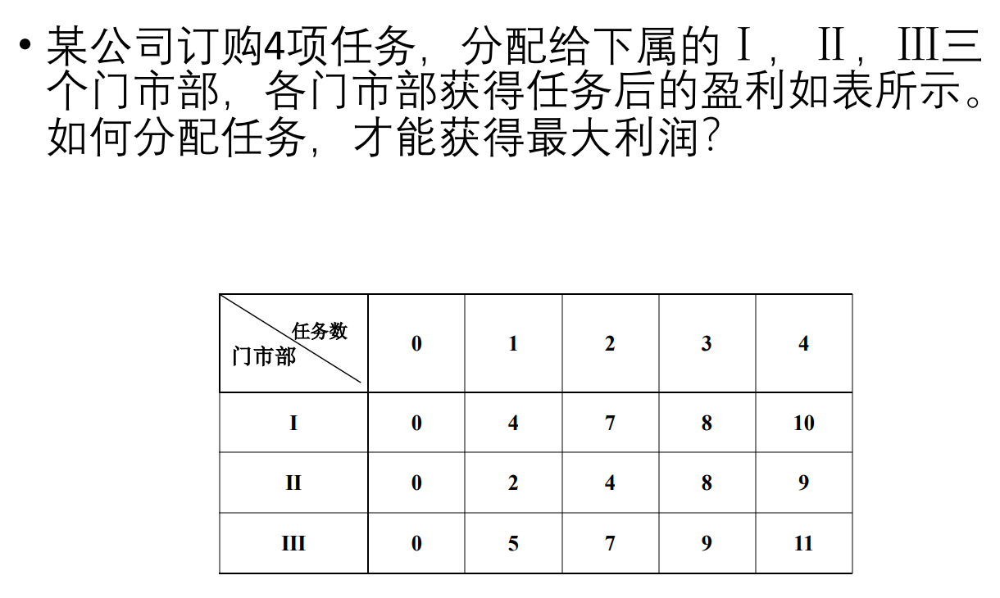

**题目：**4 项任务分配给 I、II、III 三个门市部，不同门市部分到不同任务数时盈利如表，求最大利润。

**解题步骤：**

1. 设 $x_1,x_2,x_3$ 分别为 I、II、III 获得的任务数。
2. 任务总数约束：

$$
x_1+x_2+x_3=4
$$

3. 变量取整数：

$$
x_i\in\{0,1,2,3,4\}
$$

4. 根据表查利润函数：

$$
\max f_1(x_1)+f_2(x_2)+f_3(x_3)
$$

5. 枚举所有 $x_1+x_2+x_3=4$ 的组合，查表求最大值。

**计算结果：**最大利润为 **14**。可取：

$$
(x_1,x_2,x_3)=(2,0,2)
$$

或

$$
(x_1,x_2,x_3)=(2,1,1)
$$

**易错点：**这不是标准“一人一任务”的指派，而是“任务数量分配”。

---

### B05 工人班次安排整数规划

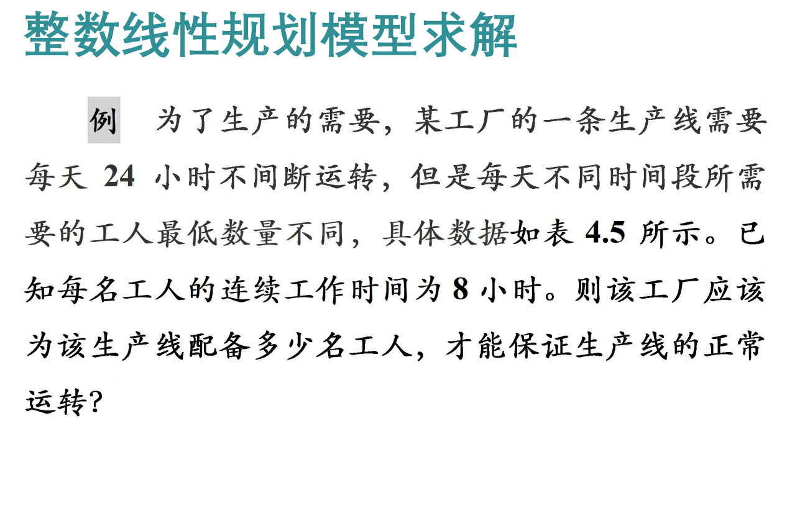

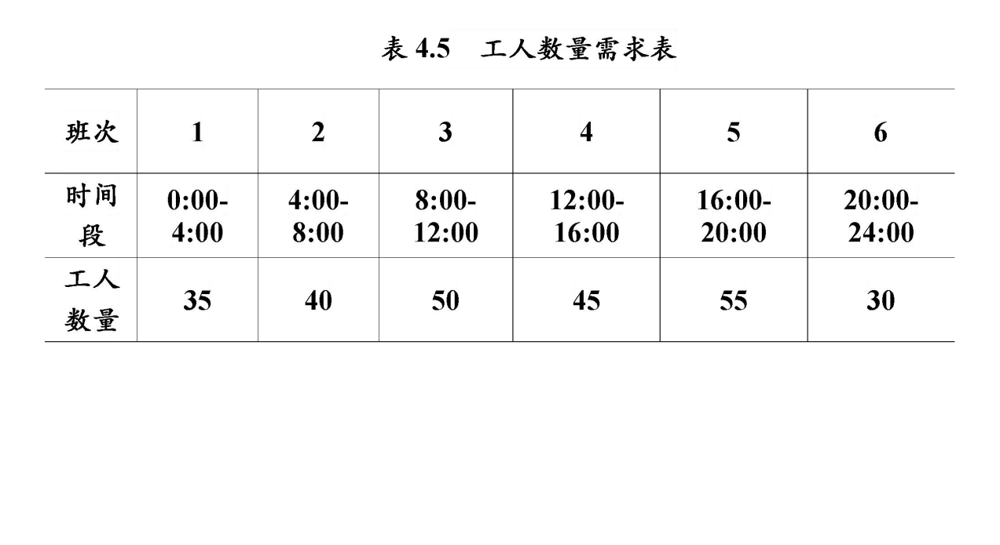

**题目：**一天分 6 个 4 小时时段，每名工人连续工作 8 小时，求最少工人数。

**解题步骤：**

1. 设 $x_i$ 表示从第 $i$ 个时间段开始上班的工人数。
2. 因为每人连续工作 8 小时，所以会覆盖两个连续时段。
3. 每个时段需求约束为：

$$
x_i+x_{i-1}\ge d_i
$$

其中下标按 6 个班次循环，例如第 1 段由 $x_1$ 和 $x_6$ 覆盖。

4. 目标函数：

$$
\min x_1+x_2+x_3+x_4+x_5+x_6
$$

5. 变量约束：

$$
x_i\ge0,\quad x_i\in \mathbb{Z}
$$

**一个最优解：**

$$
(x_1,x_2,x_3,x_4,x_5,x_6)=(0,40,10,35,20,35)
$$

总人数：

$$
0+40+10+35+20+35=140
$$

**易错点：**第 6 个班次会跨到第二天第 1 个班次，所以约束是循环的。

---

### B06 门店装修任务分配

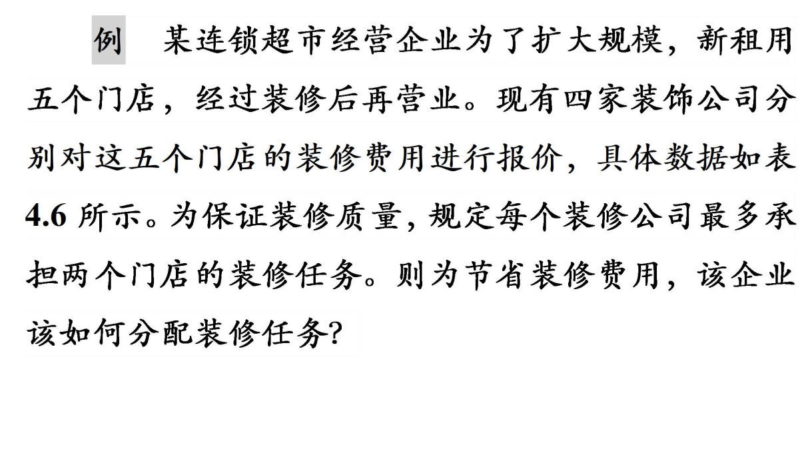

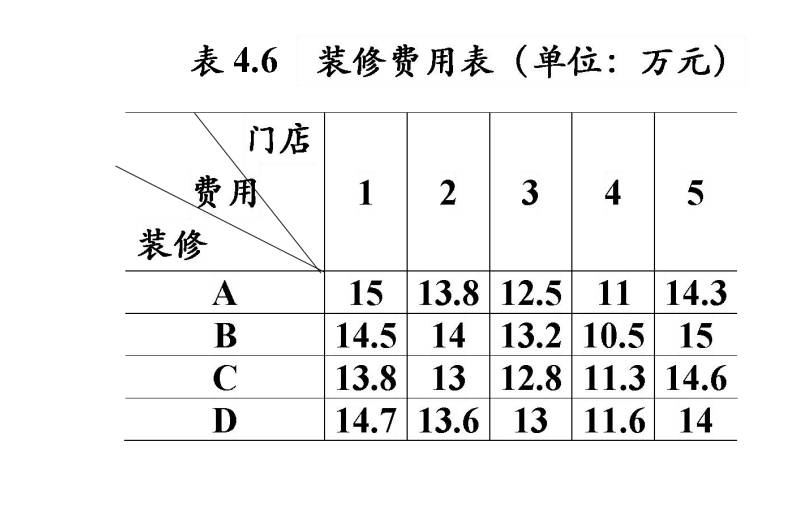

**题目：**4 家装修公司 A-D 装修 5 个门店，每家公司最多承担 2 个门店，求总费用最小。

**解题步骤：**

1. 设变量：

$$
x_{ij}=\begin{cases}1,&\text{公司 }i\text{ 装修门店 }j\\0,&\text{否则}
\end{cases}
$$

2. 目标函数：

$$
\min \sum_i\sum_j c_{ij}x_{ij}
$$

3. 每个门店恰好由一家装修公司装修：

$$
\sum_i x_{ij}=1
$$

4. 每家公司最多承担 2 个门店：

$$
\sum_j x_{ij}\le2
$$

5. $x_{ij}\in\{0,1\}$。

**计算结果：**最小费用为 **63.8 万元**，一种最优分配为：

| 门店 | 1 | 2 | 3 | 4 | 5 |
|---|---|---|---|---|---|
| 公司 | C | C | A | B | D |

费用：

$$
13.8+13+12.5+10.5+14=63.8
$$

---

### B07 最小二乘法推导

**题目：**多元线性回归如何用最小二乘法求参数？

**解题步骤：**

1. 设模型：

$$
y=X\beta+\varepsilon
$$

2. 平方误差目标：

$$
J(\beta)=\|y-X\beta\|^2=(y-X\beta)^T(y-X\beta)
$$

3. 对 $\beta$ 求导：

$$
\frac{\partial J}{\partial \beta}=-2X^T(y-X\beta)
$$

4. 令导数为 0：

$$
X^TX\beta=X^Ty
$$

5. 若 $X^TX$ 可逆：

$$
\beta=(X^TX)^{-1}X^Ty
$$

**易错点：**这是闭式解；实际 sklearn 中直接 `fit()`，底层帮你完成求解。

---

### B08 K-means 聚类：30 个西瓜分 3 类

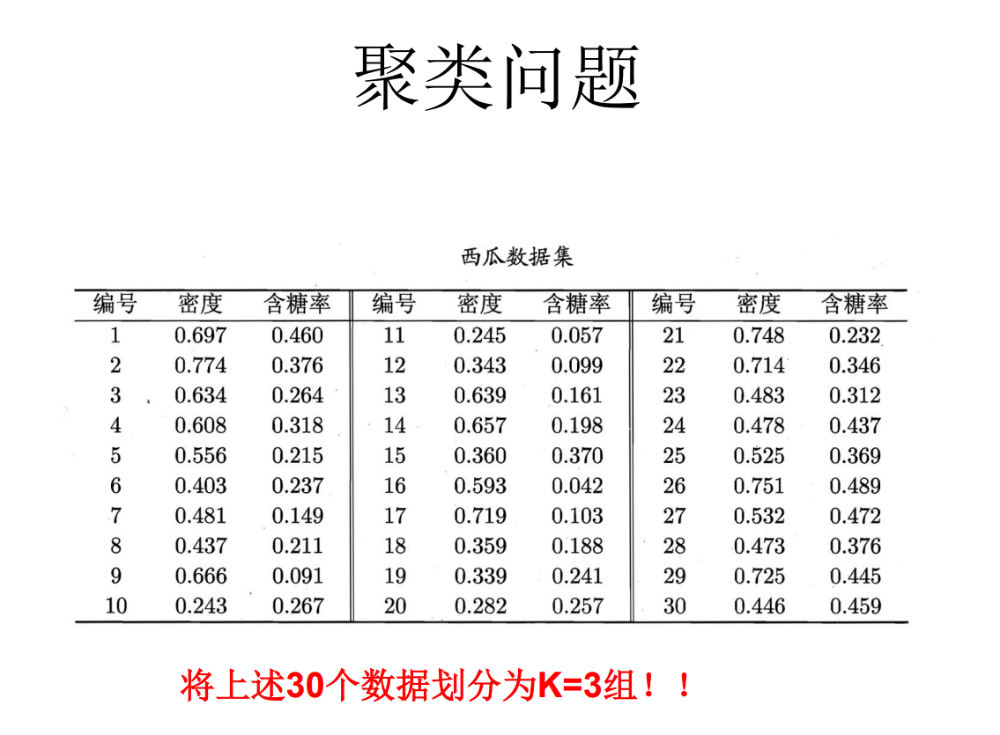

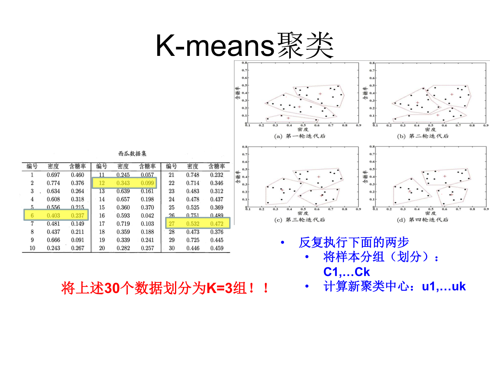

**题目：**将 30 个数据划分为 $K=3$ 组。

**解题步骤：**

1. 选定聚类数 $K=3$。
2. 初始化 3 个中心点 $u_1,u_2,u_3$。
3. 分配样本：每个样本分到距离最近的中心：

$$
C_i=\{x: i=\arg\min_j \|x-u_j\|^2\}
$$

4. 更新中心：每一类中心取该类所有样本均值：

$$
u_i=\frac{1}{|C_i|}\sum_{x\in C_i}x
$$

5. 重复“分配-更新”，直到类别不再明显变化。

**优化目标：**

$$
\min \sum_{i=1}^K\sum_{x\in C_i}\|x-u_i\|^2
$$

**易错点：**K-means 不保证全局最优，初始中心不同可能结果不同。

---

### B09 遗传算法：求 $y=x^2$ 最大值

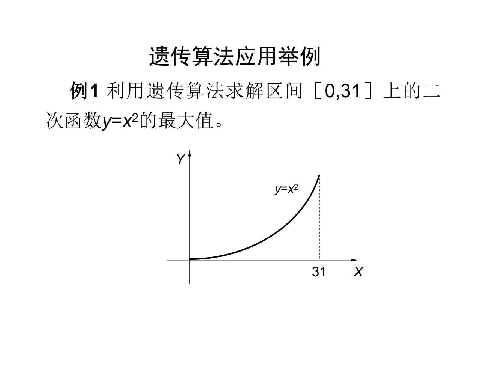

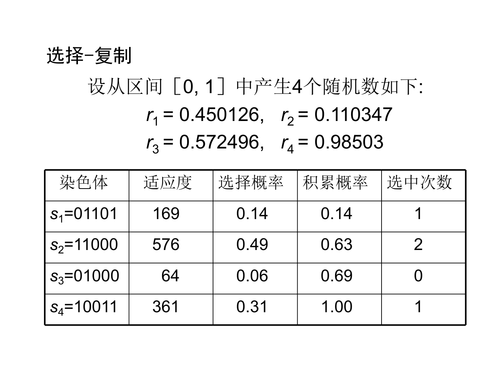

**题目：**用遗传算法求 $[0,31]$ 上 $y=x^2$ 的最大值。初始种群：13、24、8、19。

**解题步骤：**

1. 编码：$0\sim31$ 共 32 个整数，用 5 位二进制表示。
2. 初始种群：

```text
13 = 01101
24 = 11000
8  = 01000
19 = 10011
```

3. 适应度函数：

$$
f(x)=x^2
$$

4. 计算适应度：

$$
f(13)=169,\quad f(24)=576,\quad f(8)=64,\quad f(19)=361
$$

5. 选择概率：

$$
P(x_i)=\frac{f(x_i)}{\sum f(x_i)}
$$

6. 进行选择、交叉、变异，产生新种群。
7. 出现染色体 `11111` 时停止。
8. 解码：

$$
11111_2=31
$$

9. 最大值：

$$
y=31^2=961
$$

**易错点：**适应度越大，被选中的概率越大；变异率小，不一定每轮都有变异。

---

### B10 多目标优化：Pareto 前沿与拥挤度

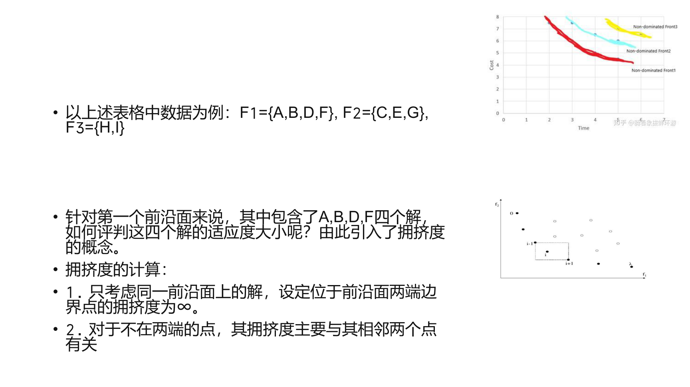

**题目：**解释多目标优化中如何判断解的优劣。

**解题步骤：**

1. 先判断 Pareto 支配关系。
2. 不被任何其他解支配的解构成第一前沿面 $F_1$。
3. 去掉 $F_1$ 后，再找第二前沿面 $F_2$，依此类推。
4. 前沿面编号越小，解越好。
5. 若两个解在同一前沿面，再比较拥挤度。
6. 拥挤度越大，说明周围越稀疏，越应该保留，以维持解的多样性。

**口诀：**先看前沿面，再看拥挤度。

---

## 第三部分：动态规划与贪心算法

### C01 动态规划四步

**题目：**默写动态规划算法步骤，并说明什么时候可以用动态规划。

**解题步骤模板：**

1. 找最优子结构：大问题的最优解能由小问题最优解组成。
2. 定义状态：例如 $dp[i]$、$dp[i][j]$ 表示什么。
3. 写状态转移方程。
4. 确定初始条件。
5. 按正确顺序填表。
6. 根据表构造最优解。

**两个关键词：**最优子结构、重叠子问题。

---

### C02 矩阵连乘

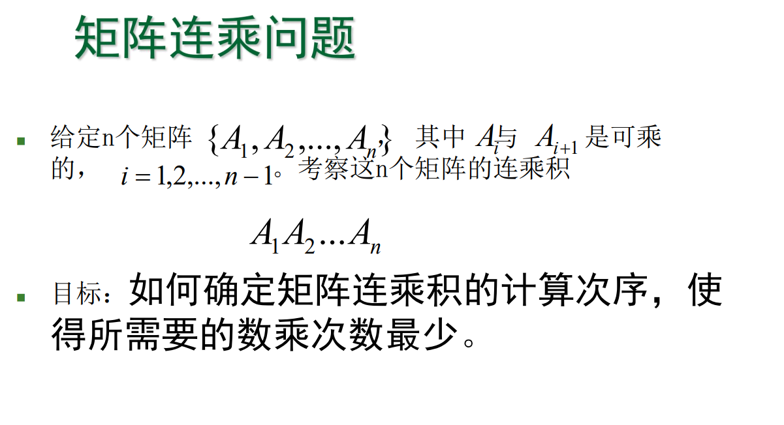

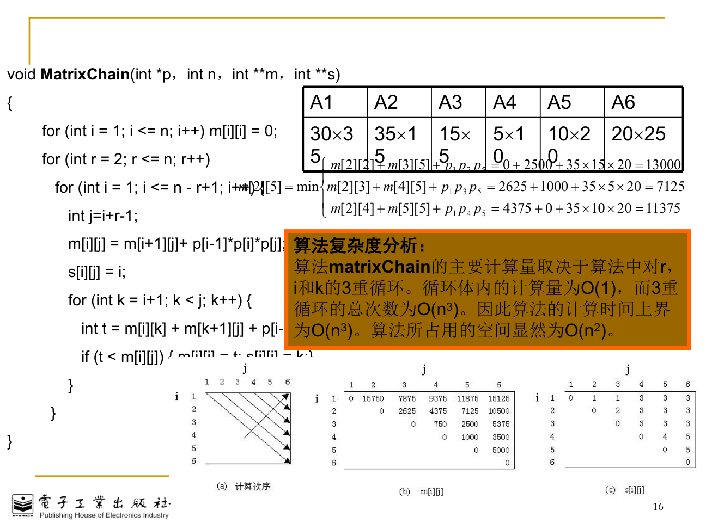

**题目：**给定矩阵链 $A_1A_2\cdots A_n$，确定加括号顺序，使数乘次数最少。

**解题步骤：**

1. 设 $A_i$ 维数为 $p_{i-1}\times p_i$。
2. 设 $m[i,j]$ 表示计算 $A_i\cdots A_j$ 的最少乘法次数。
3. 初始条件：

$$
m[i,i]=0
$$

4. 枚举断开位置 $k$：

$$
m[i,j]=\min_{i\le k<j}\{m[i,k]+m[k+1,j]+p_{i-1}p_kp_j\}
$$

5. 用 $s[i,j]$ 记录最优断点 $k$。
6. 根据 $s[i,j]$ 递归输出括号方案。

**易错点：**最后一项 $p_{i-1}p_kp_j$ 是左右两个矩阵相乘的代价。

---

### C03 最长公共子序列 LCS

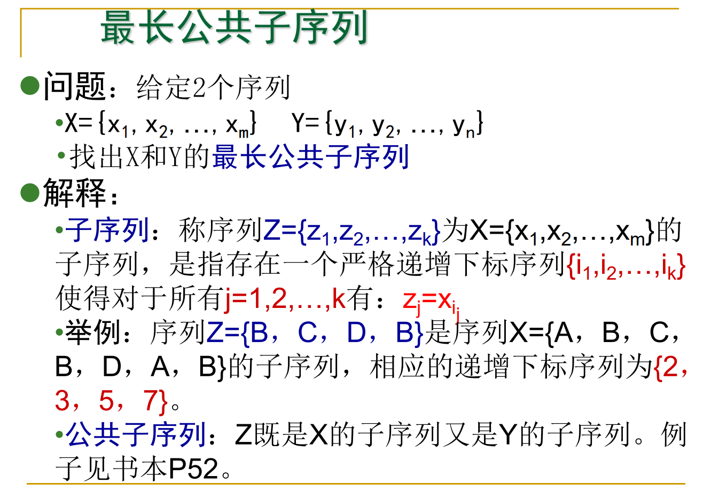

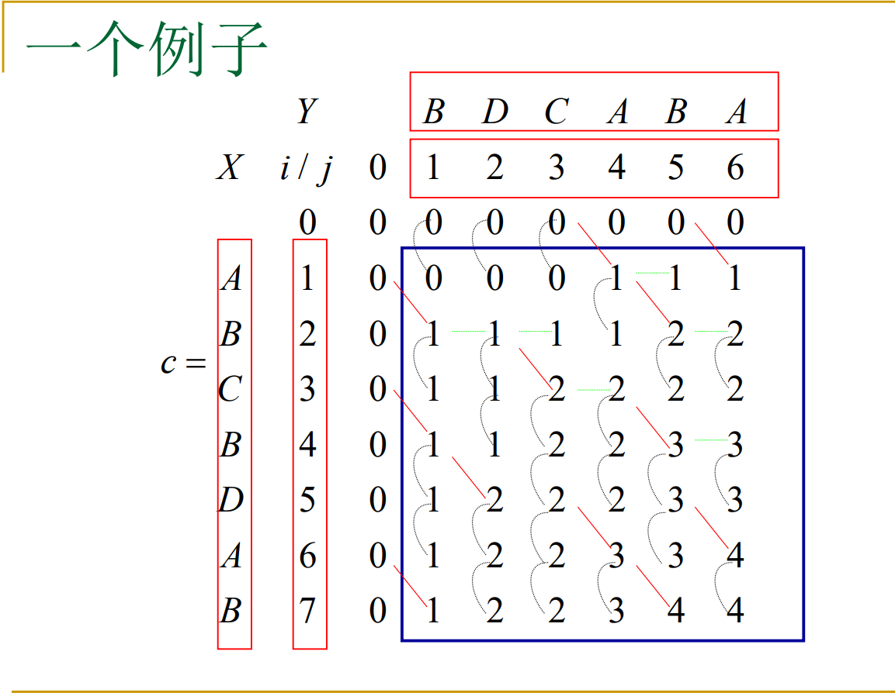

**题目：**求两个序列 $X$ 和 $Y$ 的最长公共子序列。

**解题步骤：**

1. 设 $c[i][j]$ 表示 $X$ 前 $i$ 个元素和 $Y$ 前 $j$ 个元素的 LCS 长度。
2. 初始条件：

$$
c[0][j]=0,\quad c[i][0]=0
$$

3. 若最后一个元素相同：

$$
X_i=Y_j \Rightarrow c[i][j]=c[i-1][j-1]+1
$$

4. 若最后一个元素不同：

$$
X_i\ne Y_j \Rightarrow c[i][j]=\max(c[i-1][j],c[i][j-1])
$$

5. 填表后，$c[m][n]$ 是最长长度。
6. 从右下角回溯，得到一个最长公共子序列。

**例子答案：**PDF 示例中长度为 4，可得到 `BCBA` 或 `BDAB` 等 LCS。

---

### C04 0-1 背包动态规划


**题目：**给定物品重量 $w_i$、价值 $v_i$、容量 $C$，每件物品只能选或不选，求最大价值。

**解题步骤：**

1. 设 $dp[i][j]$ 表示前 $i$ 件物品、容量为 $j$ 时的最大价值。
2. 初始条件：

$$
dp[0][j]=0,\quad dp[i][0]=0
$$

3. 若第 $i$ 件物品太重，不能选：

$$
w_i>j \Rightarrow dp[i][j]=dp[i-1][j]
$$

4. 若可以选，则比较选与不选：

$$
dp[i][j]=\max(dp[i-1][j],\ dp[i-1][j-w_i]+v_i)
$$

5. 最终答案为 $dp[n][C]$。

**易错点：**0-1 背包每件只能选一次，所以转移来自上一行 $i-1$。

---

### C05 租用游艇问题

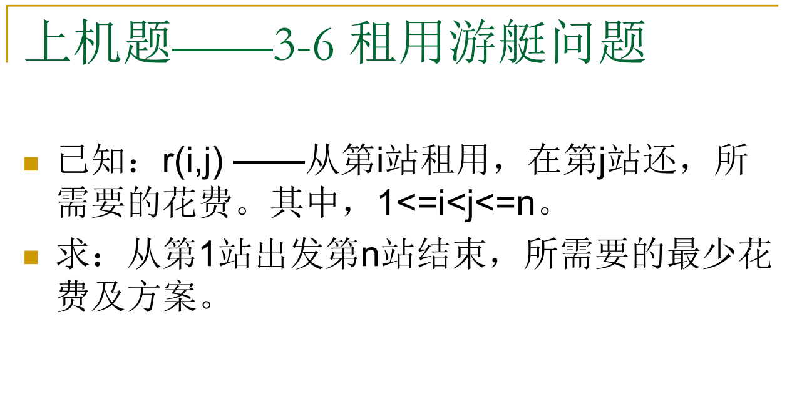

**题目：**$r(i,j)$ 表示从第 $i$ 站租用、在第 $j$ 站归还的花费，求第 1 站到第 $n$ 站最少费用。

**解题步骤：**

1. 设 $dp[j]$ 表示从第 1 站到第 $j$ 站的最小费用。
2. 初始条件：

$$
dp[1]=0
$$

3. 到达第 $j$ 站前，最后一次租船可能从第 $i$ 站租到第 $j$ 站：

$$
dp[j]=\min_{1\le i<j}\{dp[i]+r(i,j)\}
$$

4. 用 `pre[j]` 记录最优的 $i$，最后倒推路线。

**易错点：**这题本质是有向无环图最短路，也可以看成动态规划。

---

### C06 数塔问题

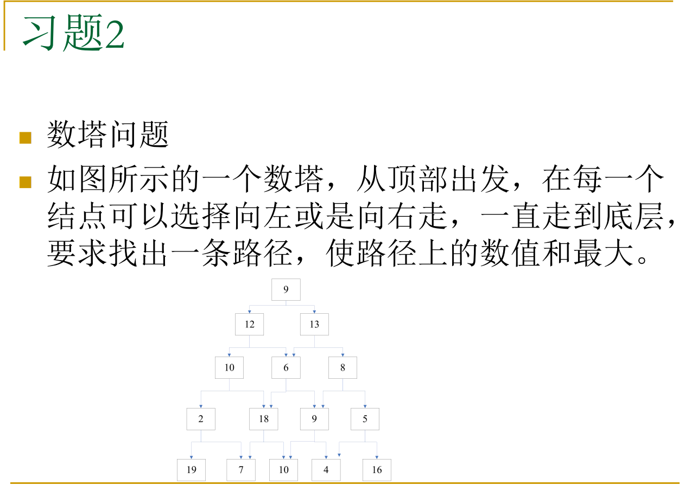

**题目：**从数塔顶部到底层，每次向左下或右下走，求路径数值和最大。

**解题步骤：**

1. 从底层开始往上算。
2. 设 $dp[i][j]$ 表示从位置 $(i,j)$ 走到底部能得到的最大和。
3. 底层：

$$
dp[\text{bottom}][j]=a[\text{bottom}][j]
$$

4. 递推：

$$
dp[i][j]=a[i][j]+\max(dp[i+1][j],dp[i+1][j+1])
$$

5. 最终答案是 $dp[1][1]$。

**易错点：**从上往下会分叉很多；从下往上每个点只算一次。

---

### C07 活动安排问题

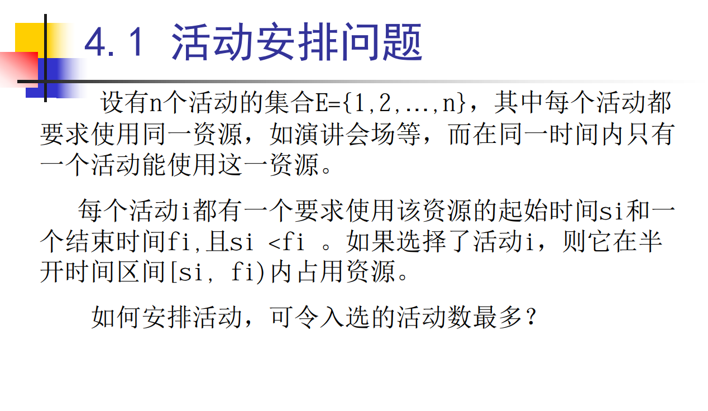

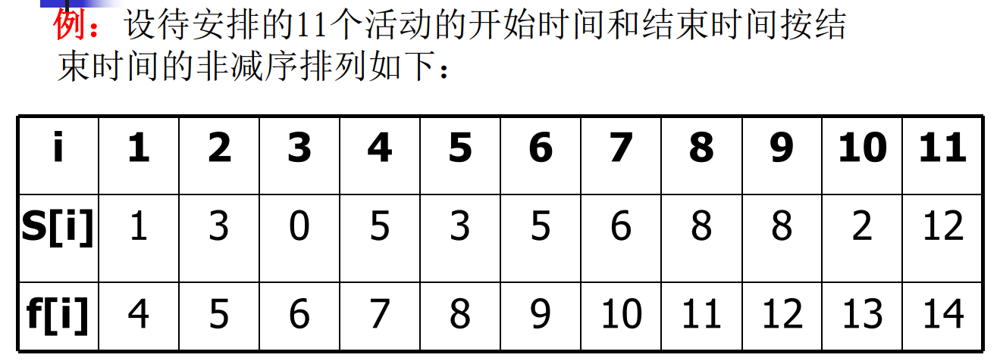

**题目：**给定 11 个活动的开始时间 $s_i$ 和结束时间 $f_i$，同一资源同一时间只能安排一个活动，求最多安排多少活动。

**解题步骤：**

1. 按结束时间 $f_i$ 从小到大排序。题表已经排好。
2. 先选结束最早的活动。
3. 记录当前最后结束时间 $t$。
4. 从前往后扫描，若活动开始时间 $s_i\ge t$，则选择该活动，并更新 $t=f_i$。
5. 直到扫描结束。

**对题表计算：**

- 选活动 1：$[1,4)$，当前结束 $t=4$。
- 活动 2、3、5 不行；活动 4：$[5,7)$ 可选。
- 活动 8：$[8,11)$ 可选。
- 活动 11：$[12,14)$ 可选。

**一个最优方案：**活动 $\{1,4,8,11\}$，最多 4 个。

**易错点：**贪心标准是“结束最早”，不是“开始最早”也不是“持续时间最短”。

---

### C08 Dijkstra 单源最短路径

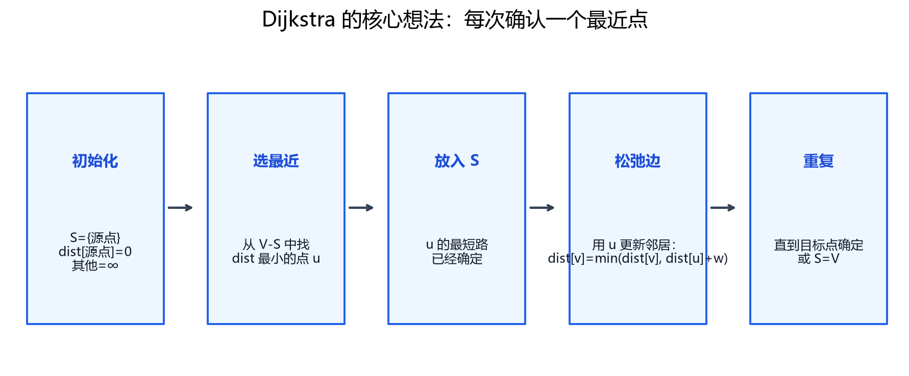

**题目：**给定非负权有向图，求源点到各点最短路。

**解题步骤：**

1. 初始化：源点距离为 0，其他点为 $\infty$。
2. $S$ 表示已经确定最短距离的点集合。
3. 每次从 $V-S$ 中选当前距离最小的点 $u$。
4. 把 $u$ 加入 $S$。
5. 用 $u$ 去更新它的邻居：

$$
dist[v]=\min(dist[v],dist[u]+w(u,v))
$$

6. 重复直到所有点确定，或目标点确定。

**易错点：**Dijkstra 要求边权非负。

---

### C09 多段图最短路径

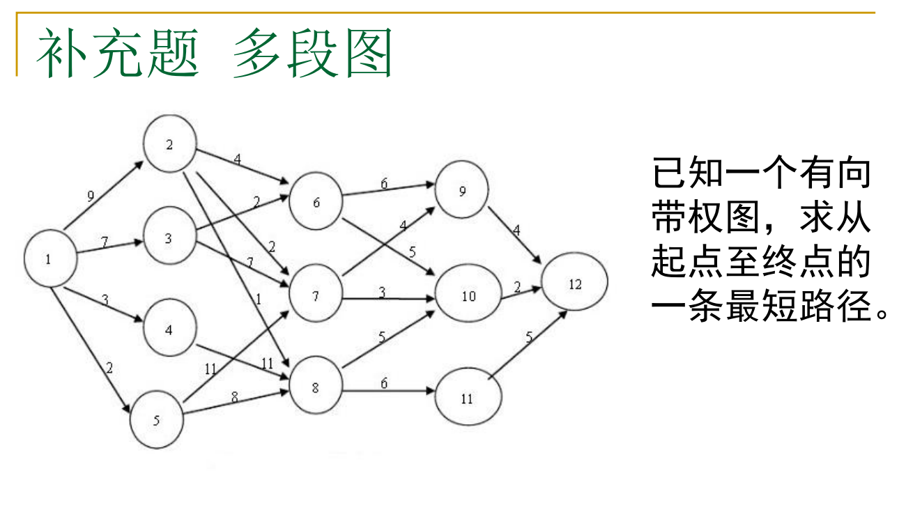

**题目：**有向带权多段图，求从起点到终点最短路径。

**解题步骤：**

1. 多段图的边只从前一层指向后一层，适合倒推。
2. 设 $f(v)$ 表示从点 $v$ 到终点的最短距离。
3. 终点：

$$
f(t)=0
$$

4. 倒推每个点：

$$
f(v)=\min_{(v,u)\in E}\{w(v,u)+f(u)\}
$$

5. 每个点记录使上式最小的后继点。
6. 从起点沿记录的后继点走，得到最短路径。

**易错点：**多段图常用“从后往前算”，不是从前乱试。

---

## 第四部分：图论模型与综合题

### D01 通信布线：最小生成树

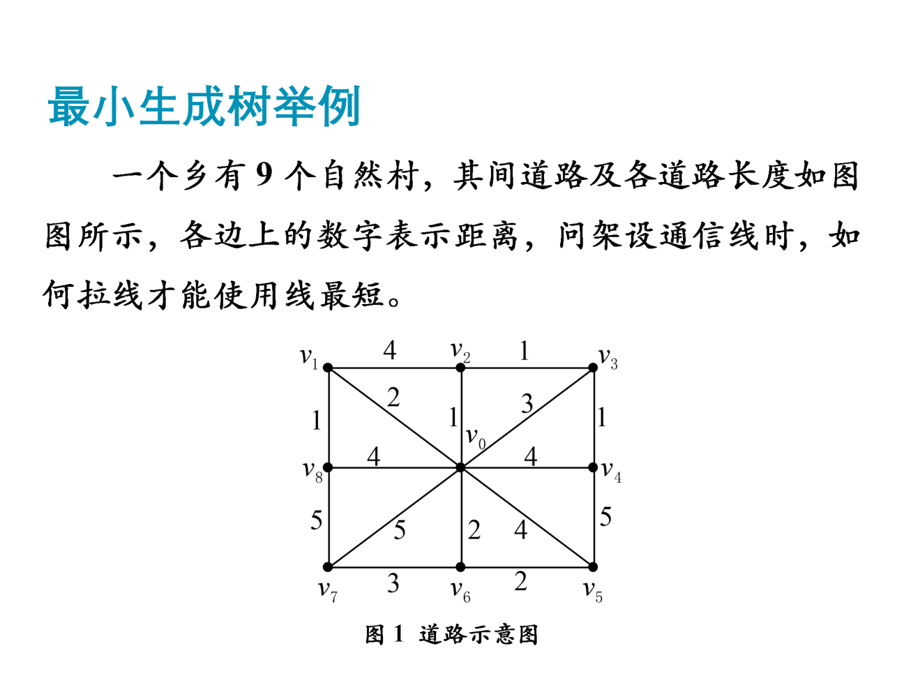

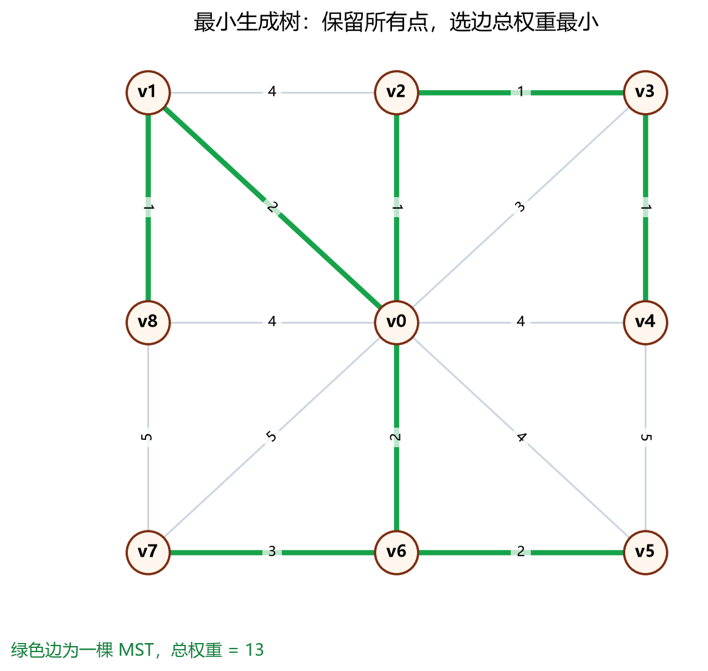

**题目：**9 个自然村之间道路长度如图，架设通信线，使所有村连通且总长度最短。

**解题步骤：**

1. 把自然村看成点，道路看成边，边权为道路长度。
2. 要求所有点连通。
3. 要求总边权最小。
4. 这就是最小生成树 MST。
5. Kruskal 思路：边按权值从小到大排序，依次选不成环的边，直到选够 $n-1$ 条。
6. Prim 思路：从一个点出发，每次选连接“已选点集”和“未选点集”的最短边。

**根据图计算的一棵 MST：**总权重为 **13**。

**易错点：**最小生成树不是求两点之间最短路，而是让所有点连起来且总成本最小。

---

### D02 Prim 和 Kruskal 怎么选

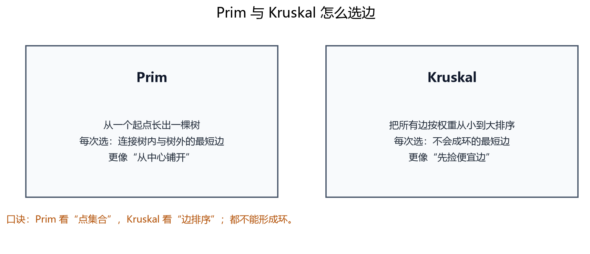

**题目：**比较 Prim 和 Kruskal 的适用场景。

**解题步骤：**

1. Prim：从一个点开始扩展，每次把最近的新点接进来。
2. Kruskal：把所有边排序，从小到大选不成环的边。
3. 稠密图边很多，Prim 常更方便。
4. 稀疏图边较少，Kruskal 常更直观。

**口诀：**Prim 看点集，Kruskal 看边排序；两者都不能成环。

---

### D03 最短路练习：$v_1$ 到 $v_8$

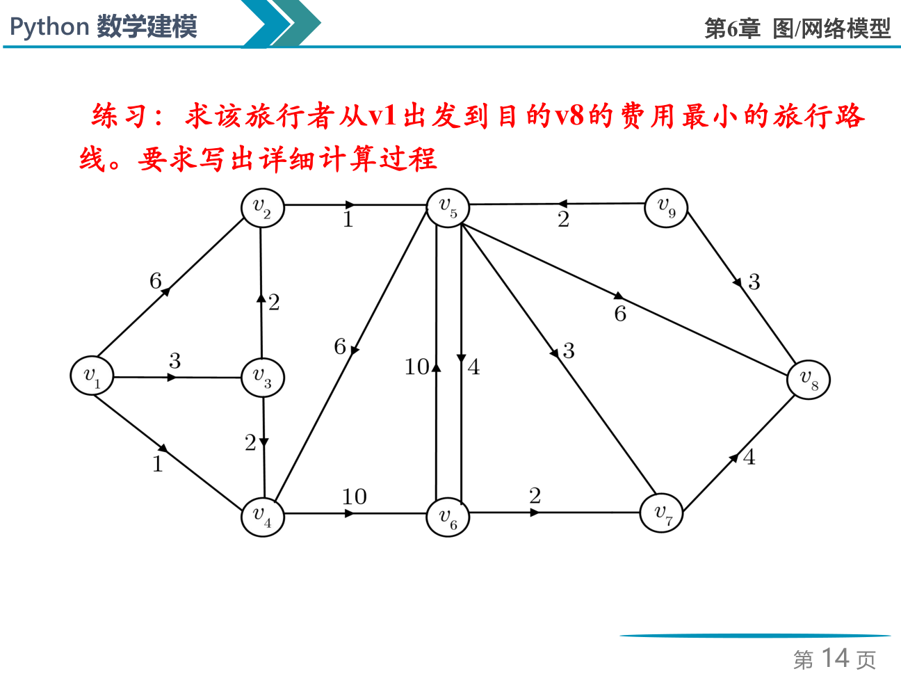

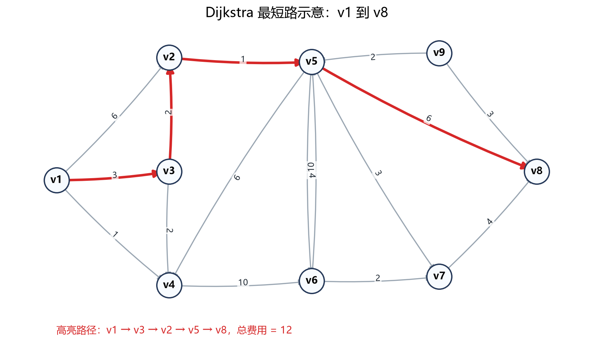

**题目：**求旅行者从 $v_1$ 到 $v_8$ 的费用最小路线。

**解题步骤：**

1. 用 Dijkstra，从 $v_1$ 开始。
2. 初始：$dist(v_1)=0$，其他为 $\infty$。
3. 不断选当前最小的未确定点，并更新邻居。
4. 直到 $v_8$ 被确定。

**计算结果：**

$$
v_1\to v_3\to v_2\to v_5\to v_8
$$

总费用：

$$
3+2+1+6=12
$$

**易错点：**不要看到 $v_1\to v_4$ 权重 1 就一路贪下去；Dijkstra 是全局维护当前最短估计。

---

### D04 Floyd：所有点对最短路

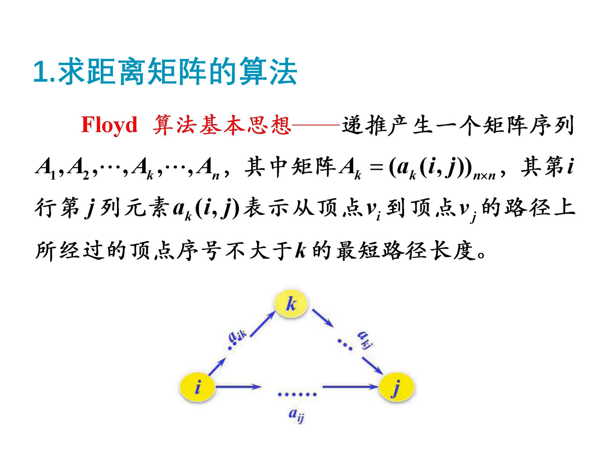

**题目：**求图中任意两点之间的最短路。

**解题步骤：**

1. 建立初始距离矩阵 $D$：有边填边权，无边填 $\infty$，自己到自己为 0。
2. 依次允许每个点 $k$ 作为中转点。
3. 更新公式：

$$
D[i][j]=\min(D[i][j],D[i][k]+D[k][j])
$$

4. 三重循环结束后，$D[i][j]$ 就是任意两点间最短距离。

**易错点：**Dijkstra 是单源最短路；Floyd 是所有点对最短路。

---

### D05 最短路的 0-1 整数规划模型

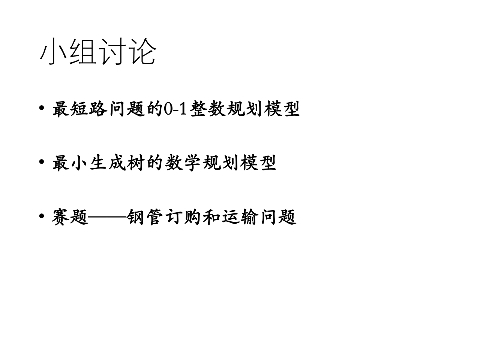

**题目：**写出从源点 $s$ 到终点 $t$ 的最短路 0-1 整数规划模型。

**解题步骤：**

1. 设变量：

$$
x_{ij}=\begin{cases}1,&\text{路径选择边 }(i,j)\\0,&\text{否则}
\end{cases}
$$

2. 目标函数：

$$
\min \sum_{(i,j)\in E} c_{ij}x_{ij}
$$

3. 流量平衡约束：

源点：

$$
\sum_j x_{sj}-\sum_i x_{is}=1
$$

终点：

$$
\sum_j x_{tj}-\sum_i x_{it}=-1
$$

中间点：

$$
\sum_j x_{kj}-\sum_i x_{ik}=0
$$

4. 变量约束：

$$
x_{ij}\in\{0,1\}
$$

**易错点：**中间点是“进多少出多少”，源点多出 1，终点多进 1。

---

### D06 旅行商问题 TSP

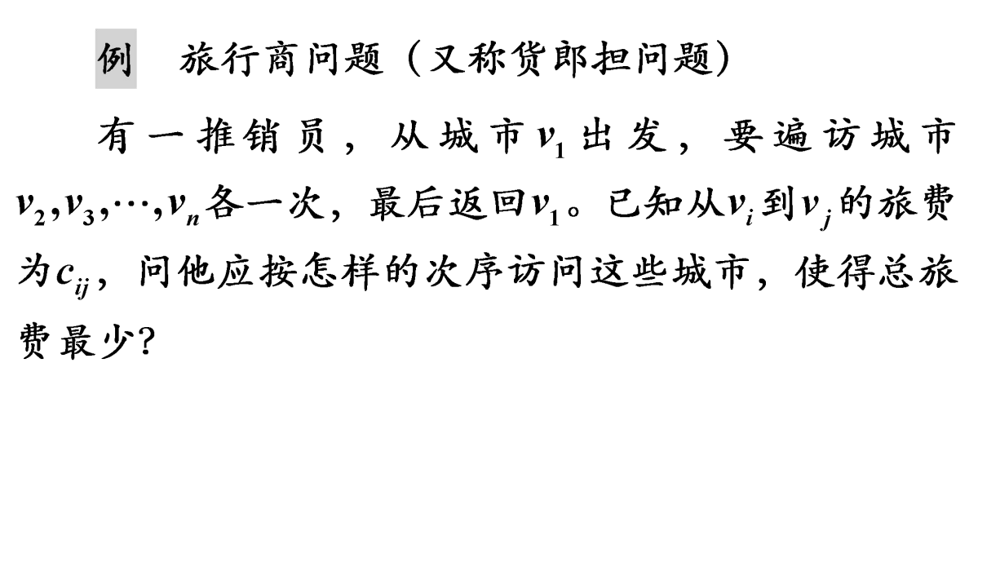

**题目：**推销员从 $v_1$ 出发，访问每个城市一次，最后回到 $v_1$，总费用最小。

**解题步骤：**

1. 把城市看成点，城市间费用看成边权。
2. 设 0-1 变量：

$$
x_{ij}=1 \quad \text{表示从城市 }i\text{ 到城市 }j
$$

3. 每个城市必须出去一次：

$$
\sum_j x_{ij}=1
$$

4. 每个城市必须进入一次：

$$
\sum_i x_{ij}=1
$$

5. 目标函数：

$$
\min \sum_i\sum_j c_{ij}x_{ij}
$$

6. 加上消除子回路约束，防止形成多个小圈。

**易错点：**TSP 是“所有点都访问一次并回到起点”；最短路只是“从一个点到另一个点”。

---

### D07 飞机巡航 100 个目标：TSP 应用

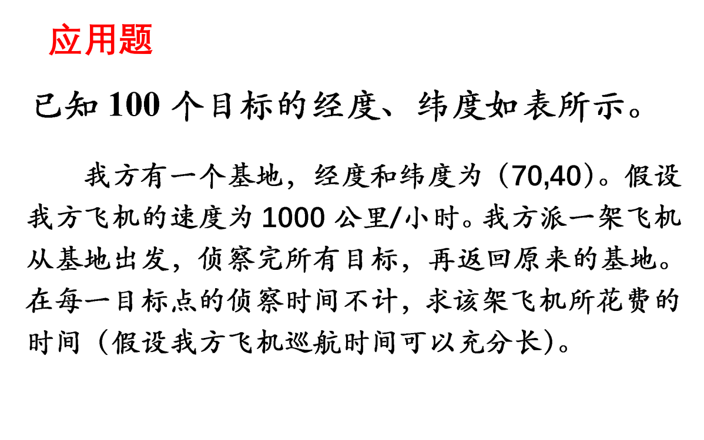

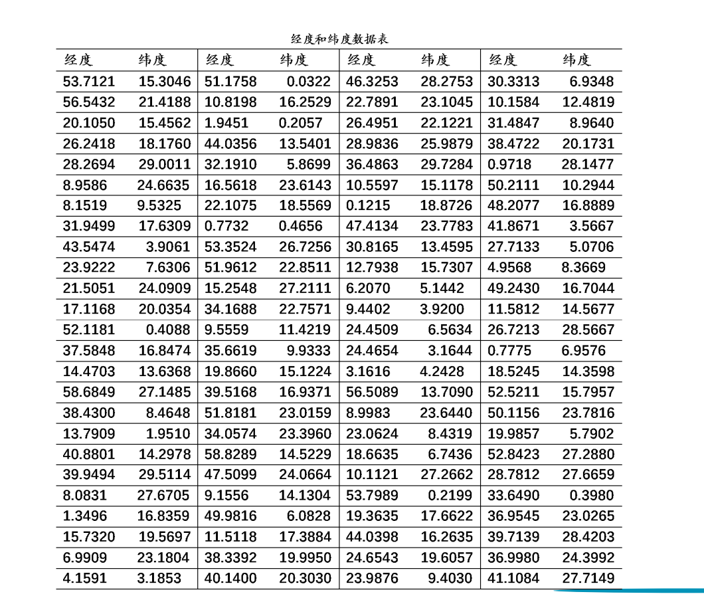

**题目：**基地坐标为 $(70,40)$，飞机速度 1000 km/h，侦察 100 个目标后回基地，求最短时间。

**解题步骤：**

1. 把基地和 100 个目标都看成点。
2. 由经纬度计算两点间距离，形成距离矩阵 $d_{ij}$。
3. 建立 TSP：从基地出发，访问每个目标一次，最后回基地。
4. 求最短总航程 $L$。
5. 计算时间：

$$
T=\frac{L}{1000}
$$

**考试写法：**如果不要求算出 100 点路线，重点写清楚“距离矩阵 + TSP + 时间换算”。

---

## 第五部分：考前只背这些模板

### E01 模型识别速查

- 预测连续值：回归。
- 判断类别：分类。
- 无标签分组：聚类。
- 降低维度：PCA。
- 利润最大/成本最小且变量连续：线性规划。
- 是否选择/是否分配：0-1 整数规划。
- 从一点到另一点最短：最短路。
- 所有点连通且总成本最小：最小生成树。
- 每个城市访问一次再回起点：TSP。
- 大问题拆小问题且重复：动态规划。
- 每一步局部最优能推出整体最优：贪心。

### E02 明天最值得刷的 18 题

1. A01 线性回归房价预测。
2. A03 KNN 水果分类。
3. A04 混淆矩阵指标。
4. A05 PCA 特征值分解。
5. B02 0-1 背包。
6. B03 标准指派。
7. B04 非标准指派。
8. B05 工人班次安排。
9. B06 门店装修分配。
10. B08 K-means。
11. C02 矩阵连乘。
12. C03 LCS。
13. C04 0-1 背包 DP。
14. C06 数塔。
15. C07 活动安排。
16. D01 最小生成树。
17. D03 Dijkstra 最短路。
18. D06 TSP。

### E03 被删掉的题型说明

删掉了这些不适合明天硬刷的内容：查资料型题、开放实践题、重复概念题、缺完整数据且不能手算的赛题、只问 sklearn 还有哪些方法的题。它们不是没用，而是不适合考前最后冲刺。
