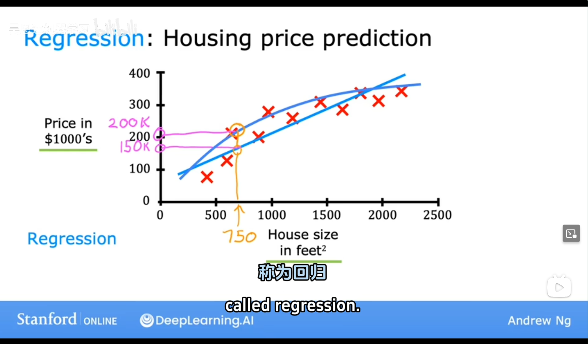
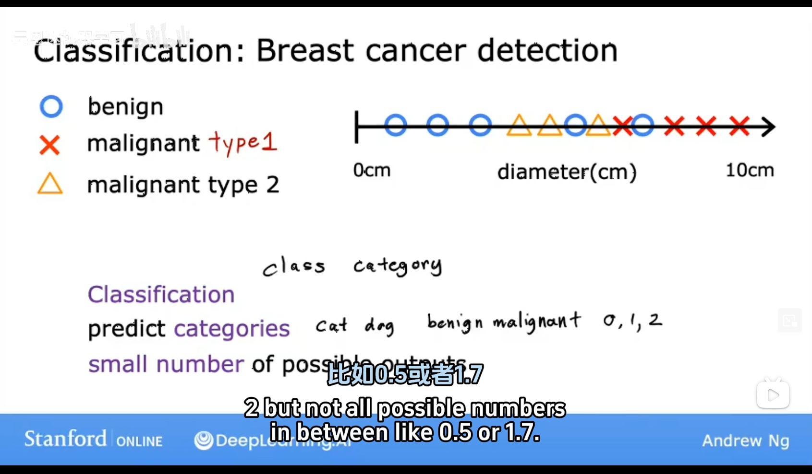

# Supervised Learning

## No.1 Essence of Supervised Learning

### It just a function that maps input to output based on a set of training examples

1. Input: A set of training examples, each consisting of an input vector and an output vector.
2. Output: A function that maps input vectors to output vectors.

The function is learned from the training examples by adjusting the parameters of the function to minimize the error between the predicted output and the actual output.

The error can be measured using a loss function, which is a function that takes the predicted output and the actual output as input and returns a scalar value indicating the error.

The goal of supervised learning is to learn a function that can map inputs to outputs based on a set of training examples.

## No.2 Types of Supervised Learning

1. **Classification(***one of the most common***)**: The output variable is categorical, such as "spam" or "not spam".

2. **Regression(***one of the most common***)**: The output variable is continuous, such as a number.

## No.3 Common Algorithms in Supervised Learning

1. Linear Regression: A simple algorithm that finds a line that best fits the data.

2. Logistic Regression: A binary classification algorithm that finds a line that separates the data into two classes.

3. Decision Trees: A non-parametric classification algorithm that recursively splits the data into smaller subsets based on a set of decision rules.

4. Random Forests: An ensemble learning algorithm that combines multiple decision trees to reduce the variance and improve the accuracy.

5. Support Vector Machines: A binary classification algorithm that finds a hyperplane that separates the data into two classes.

6. Neural Networks: A non-parametric classification algorithm that finds a non-linear decision boundary between the data.

7. K-Nearest Neighbors: A non-parametric classification algorithm that finds the k nearest examples to the input and assigns the output variable based on the majority vote.

8. Naive Bayes: A probabilistic classification algorithm that assumes independence between the input variables and calculates the probability of each class based on the input values.

9. K-Means Clustering: A non-parametric clustering algorithm that partitions the data into k clusters based on the similarity of the input values.

10. Hierarchical Clustering: A bottom-up clustering algorithm that recursively merges similar clusters until all data points are assigned to a single cluster.

11. Principal Component Analysis: A linear dimensionality reduction algorithm that finds the directions that maximize the variance of the data.

12. Singular Value Decomposition: A linear dimensionality reduction algorithm that finds the directions that maximize the variance of the data while minimizing the error.

13. Latent Dirichlet Allocation: A probabilistic topic modeling algorithm that discovers the topics in a collection of documents.

14. Reinforcement Learning: An algorithm that learns a policy that maximizes the expected reward over time.
