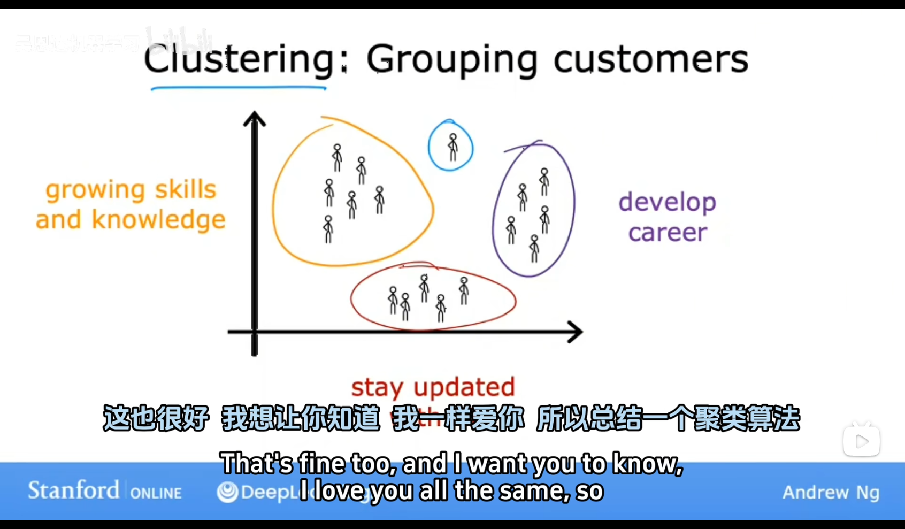

# Unsupervise Learning

## No.1 Essence of Unsupervised Learning

Unsupervised learning is a type of machine learning where the algorithm learns from unlabelled data. The algorithm is trained on a set of data without any prior knowledge of the target variable. The goal of unsupervised learning is to identify patterns and relationships in the data without any prior knowledge of the target variable. The algorithm learns to cluster, group, or classify the data based on its features.

## No.2 Types of Unsupervised Learning

1. **Clustering**: The goal is to **group similar examples together** based on their features. Common algorithms include K-Means, Hierarchical Clustering, and DBSCAN.

1. **Dimensionality Reduction**: The goal is to reduce the number of features in the data while preserving the most important ones. Common algorithms include Principal Component Analysis (PCA), Linear Discriminant Analysis (LDA), and t-Distributed Stochastic Neighbor Embedding (t-SNE).

2. **Anomaly Detection**: The goal is to identify examples that are different from the majority of the data. Common algorithms include Local Outlier Factor (LOF), One-Class SVM, and Isolation Forest.

3. **Association Rule Learning**: The goal is to identify patterns in the data that are likely to occur together. Common algorithms include Apriori, Eclat, and FP-Growth.

## No.3 Applications of Unsupervised Learning

Unsupervised learning is widely used in a variety of applications, including:

- Market segmentation: Unsupervised learning can be used to segment customers based on their purchase behavior. This can be useful for marketing campaigns, customer targeting, and product recommendation. Market segmentation can also be used to identify areas of high demand or low supply.